<div align="center">

<a href="https://evolink.ai/gpt-image-2-prompts?utm_source=github&utm_medium=banner&utm_campaign=gptimage2-x-seedance2"></a>

[](LICENSE)
[](https://github.com/EvoLinkAI/awesome-seedance-2.0-prompts)
[](https://github.com/EvoLinkAI/Seedance-2.0-Gateway-Service)
[](https://github.com/EvoLinkAI/awesome-seedance-2-guide)
[](https://github.com/EvoLinkAI/awesome-gpt-image-2-prompts)


[](README.md)
[](README_es.md)
[](README_pt.md)
[](README_ja.md)
[](README_ko.md)
[](README_de.md)
[](README_fr.md)
[](README_tr.md)
[](README_zh-TW.md)
[](README_zh-CN.md)
[](README_ru.md)

</div>


## 🎬 Introduction

Welcome to the GPT Image 2 × Seedance 2.0 workflow repository! 🤗

**We collect proven workflows, prompt templates, and real creator examples for combining GPT Image 2 and Seedance 2.0 to produce high-quality AI videos.**

GPT Image 2 handles the "what to draw" and visual consistency. Seedance 2.0 handles the "how to move" — animating those images into video. Together they form one of the most capable AI video pipelines available today.

Most cases in this repository are curated from X/Twitter creators, community experiments, and real production workflows.

Try it: [GPT Image 2 + Seedance 2.0](https://evolink.ai?utm_source=github&utm_medium=readme&utm_campaign=gptimage2-x-seedance2)

If you find this useful, consider giving it a star. ⭐


## 📰 News

- **April 25, 2026:** Added Case 10–12 (multi-frame storyboard, Japanese MV toolchain, Claude Code × character sheet), expanded Case 9 with ARPG simulation variants, added community showcase to Gallery
- **April 23, 2026:** Repository launched with 9 curated workflow cases

## 📑 Menu

- [🎬 Introduction](#-introduction)
- [📰 News](#-news)
- [📑 Menu](#-menu)
- [🎥 Storyboard Workflows](#-storyboard-workflows)
  - [Case 1: Standard Storyboard → Video (by @kiyoshi_shin)](#case-1-standard-storyboard--video-by-kiyoshi_shin)
  - [Case 2: 3×3 Grid Storyboard Method (by @servasyy_ai)](#case-2-33-grid-storyboard-method-by-servasyy_ai)
  - [Case 10: Multi-Frame Reference → Fast-Cut Video (by @heygentlewhale)](#case-10-multi-frame-reference--fast-cut-video-by-heygentlewhale)
- [🎨 Character & Animation](#-character--animation)
  - [Case 3: Character Sheet → Animation (by @YaReYaRu30Life)](#case-3-character-sheet--animation-by-yareyaru30life)
  - [Case 4: Anime OP Style Video (by @Toshi_nyaruo_AI)](#case-4-anime-op-style-video-by-toshi_nyaruo_ai)
  - [Case 12: Claude Code × Character Sheet → Animation (by @old_pgmrs_will)](#case-12-claude-code--character-sheet--animation-by-old_pgmrs_will)
- [📱 App & Product Demo](#-app--product-demo)
  - [Case 5: App MVP Demo Video (by @Shin_Engineer)](#case-5-app-mvp-demo-video-by-shin_engineer)
  - [Case 6: 15-Second Commercial (by @ai_mitosan)](#case-6-15-second-commercial-by-ai_mitosan)
- [🎵 Creative Combinations](#-creative-combinations)
  - [Case 7: Music Video with Suno (by @fukaborichannel)](#case-7-music-video-with-suno-by-fukaborichannel)
  - [Case 8: Cyberpunk Style Short Film (by @ponyodong)](#case-8-cyberpunk-style-short-film-by-ponyodong)
  - [Case 9: Game & Interactive Content (by @AbleGPT)](#case-9-game--interactive-content-by-ablegpt)
  - [Case 11: Japanese MV — Full AI Toolchain (by @Tz_2022)](#case-11-japanese-mv--full-ai-toolchain-by-tz_2022)
- [💡 Tips & Techniques](#-tips--techniques)
  - [Consistency Guide](#consistency-guide)
  - [Prompt Templates](#prompt-templates)
  - [Troubleshooting](#troubleshooting)
- [🚀 Try It on Evolink](#-try-it-on-evolink)
- [🙏 Acknowledge](#-acknowledge)

## 🎥 Storyboard Workflows

<!-- Case 1: Standard Storyboard → Video (by @kiyoshi_shin) -->
### Case 1: [Standard Storyboard → Video](https://x.com/kiyoshi_shin/status/2047133524403400847) (by [@kiyoshi_shin](https://x.com/kiyoshi_shin))

The most common workflow. Use GPT Image 2 to generate a storyboard panel, then animate it with Seedance 2.0. Best for promotional videos, short dramas, and animation OPs.

<table><tr>
<td align="center"><a href="https://evolink.ai/gpt-image-2-prompts?utm_source=github&utm_medium=picture&utm_campaign=gptimage2-x-seedance2">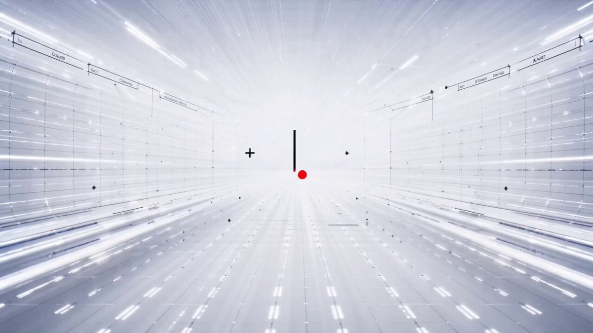</a></td>
<td align="center"><video src="https://github.com/user-attachments/assets/ac25fc3d-b6cb-4149-a8ba-e7e10c5b1faa" width="400" controls></video></td>
</tr></table>

**Steps:**

1. Describe your scene to GPT Image 2 and generate a storyboard image
2. Import the storyboard into Seedance 2.0 using Image-to-Video mode
3. Export each clip and assemble in your editing software

**GPT Image 2 Prompt:**

```
Create a 6-panel storyboard for a 15-second brand promotional video. Label each panel with a shot description.
Style: cinematic, cool color tone, widescreen 16:9.
Content: the journey of a product from factory to the customer's hands.
```

**Seedance 2.0 Prompt:**

```
Cinematic brand advertisement, slow camera push-in, product centered in frame, warm side lighting, soft background blur, no people, 3 seconds.
```

> [!NOTE]
> Output storyboard images in 16:9 to avoid Seedance auto-cropping. Set frame rate to 24fps to match film standards. Keep each storyboard panel simple — the simpler the content, the more accurate the motion output.

<!-- Case 2: 3×3 Grid Storyboard Method (by @servasyy_ai) -->
### Case 2: [3×3 Grid Storyboard Method](https://x.com/servasyy_ai/status/2047198012750143999) (by [@servasyy_ai](https://x.com/servasyy_ai))

A key technique discovered by the community: composing all storyboard panels into a single 3×3 grid image before importing to Seedance significantly reduces failure rate compared to importing frames one by one.

<table><tr>
<td align="center"><a href="https://evolink.ai/gpt-image-2-prompts?utm_source=github&utm_medium=picture&utm_campaign=gptimage2-x-seedance2">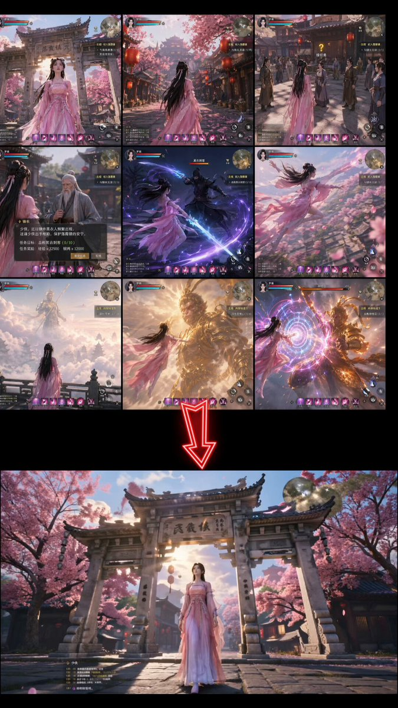</a></td>
<td align="center"><video src="https://github.com/user-attachments/assets/00f32388-a17b-4b9c-8da3-1956436ce91b" width="400" controls></video></td>
</tr></table>


**Steps:**

1. Ask GPT Image 2 to output all panels as a single 3×3 grid image
2. Import the entire grid as one image into Seedance 2.0
3. Seedance reads the grid as a motion sequence and generates a continuous video

**GPT Image 2 Prompt:**

```
Generate a single 3×3 storyboard grid image (9 panels total) showing the following continuous action:
[describe your scene here]
Requirements: each panel is clean and self-contained, character positions are consistent across panels, background is consistent, no text labels or annotations.
Output as a single image with all 9 panels arranged in a grid.
```

**Seedance 2.0 Prompt:**

```
[Describe the motion and style. Example: Japanese full-color animation, fast cuts, high frame count, 24fps, dark fantasy anime OP style, intense battle scenes.]
```

> [!NOTE]
> **Replace the content inside brackets before use.** This method works because Seedance analyzes motion intent from a single image. A grid provides directional reference and produces more coherent motion than separate images.

## 🎨 Character & Animation

<!-- Case 3: Character Sheet → Animation (by @YaReYaRu30Life) -->
### Case 3: [Character Sheet → Animation](https://x.com/YaReYaRu30Life/status/2047203375314571501) (by [@YaReYaRu30Life](https://x.com/YaReYaRu30Life))

Generate a character three-view sheet (front, side, back) with GPT Image 2, then use it as an anchor for animation in Seedance 2.0. Ideal for anime characters, game characters, and figure reveals.

<table><tr>
<td align="center"><a href="https://evolink.ai/gpt-image-2-prompts?utm_source=github&utm_medium=picture&utm_campaign=gptimage2-x-seedance2">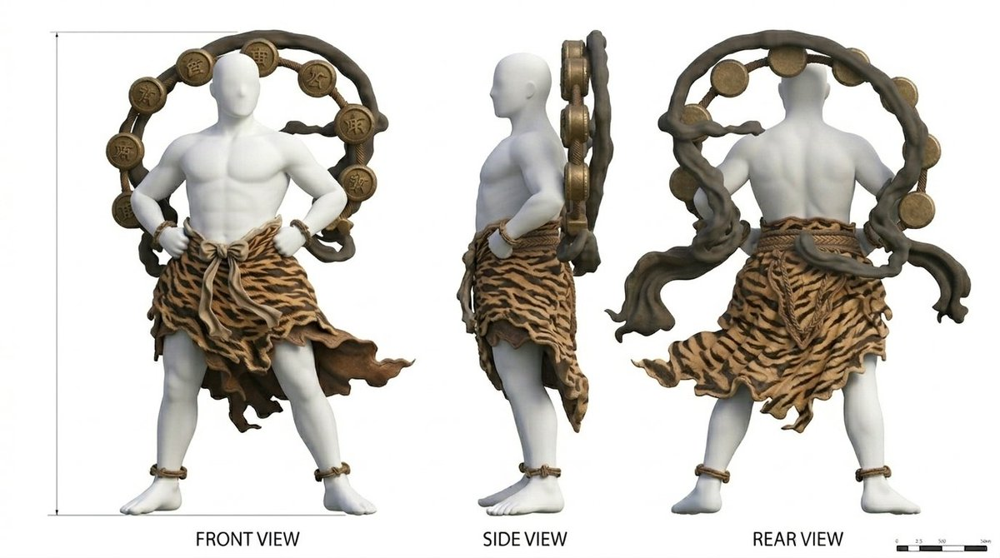</a></td>
<td align="center"><a href="https://evolink.ai/gpt-image-2-prompts?utm_source=github&utm_medium=picture&utm_campaign=gptimage2-x-seedance2">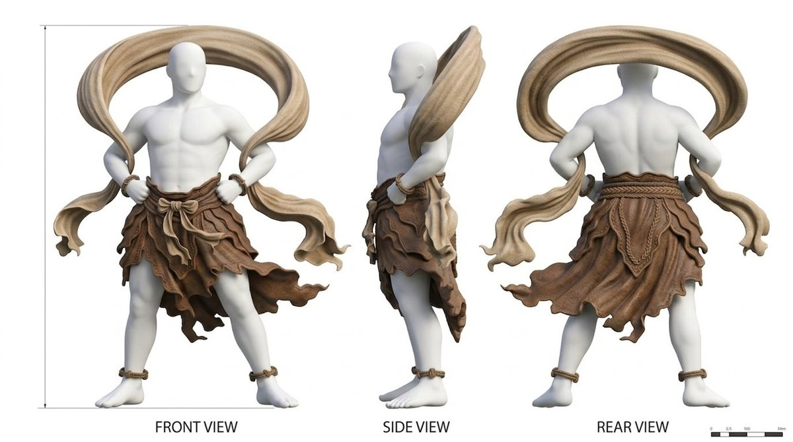</a></td>
<td align="center"><a href="https://evolink.ai/gpt-image-2-prompts?utm_source=github&utm_medium=picture&utm_campaign=gptimage2-x-seedance2">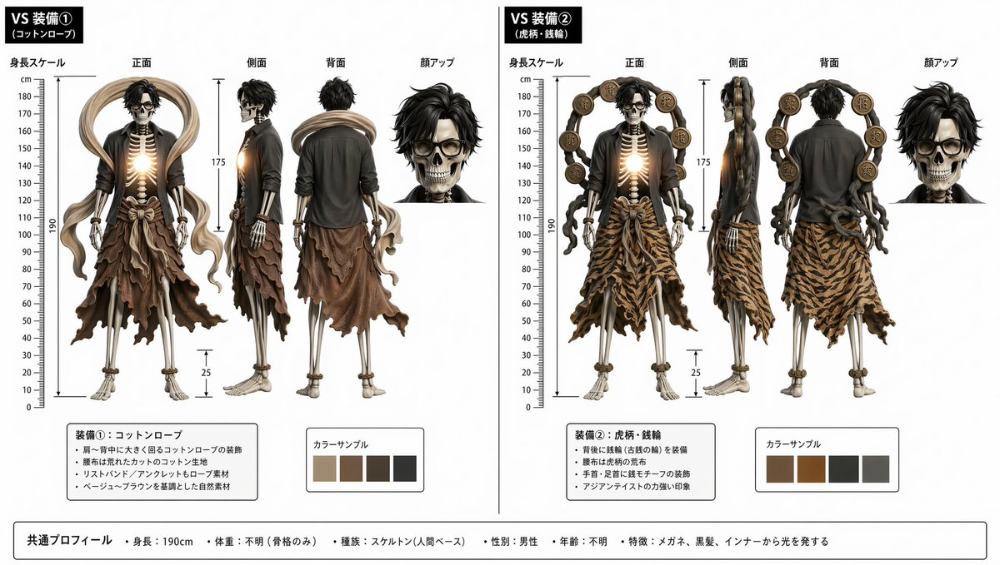</a></td>
</tr></table>

<table><tr>
<td align="center"><a href="https://evolink.ai/gpt-image-2-prompts?utm_source=github&utm_medium=picture&utm_campaign=gptimage2-x-seedance2">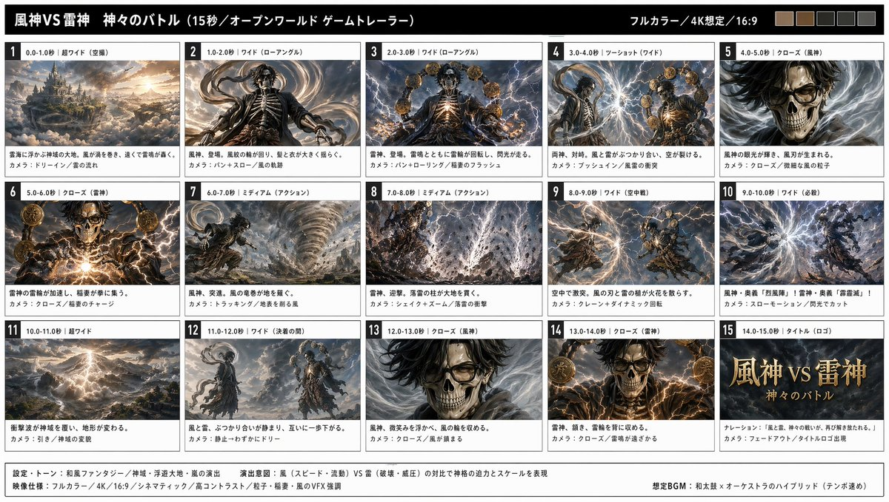</a></td>
<td align="center"><video src="https://github.com/user-attachments/assets/92a0aa56-441f-40db-b9c9-13410254cb3f" width="400" controls></video></td>
</tr></table>

**Steps:**

1. Generate a character three-view sheet (front / side / back) with GPT Image 2
2. Generate equipment sheets separately if needed, then combine into a fully-equipped three-view sheet
3. Use the three-view sheet as reference to generate storyboard frames
4. Import storyboard frames into Seedance 2.0 and animate

**GPT Image 2 Prompt:**

```
Create a character three-view sheet (front, side, back views) for the following character:
[character name], [hair color], [eye color], [outfit description], [body type].
Style: Japanese anime illustration, clean linework, flat color, white background.
All three views must maintain consistent proportions and design details.
```

**Seedance 2.0 Prompt — Idle motion:**

```
Japanese full-color anime style, character in natural idle breathing animation, subtle hair movement, 24fps, seamless loop.
```

**Seedance 2.0 Prompt — Battle motion:**

```
Japanese full-color anime style, high-speed cuts, high frame count, 24fps, dark fantasy anime OP style. Protagonist faces a giant creature — a sequence of high-impact combat scenes.
```

<!-- Case 4: Anime OP Style Video (by @Toshi_nyaruo_AI) -->
### Case 4: [Anime OP Style Video](https://x.com/Toshi_nyaruo_AI/status/2047216971184546231) (by [@Toshi_nyaruo_AI](https://x.com/Toshi_nyaruo_AI))

Use GPT Image 2 to build a scene setting image, then let Seedance 2.0 animate freely. Comparing constrained (storyboard-guided) and free-form (prompt-only) outputs helps decide the right approach per shot.

<table><tr>
<td align="center"><a href="https://evolink.ai/gpt-image-2-prompts?utm_source=github&utm_medium=picture&utm_campaign=gptimage2-x-seedance2">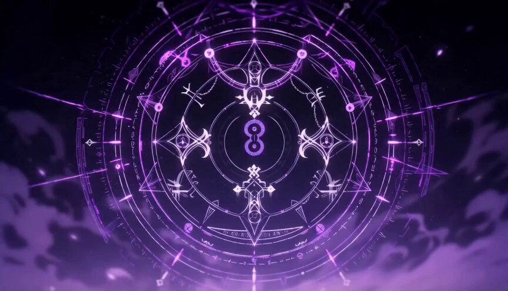</a></td>
<td align="center"><video src="https://github.com/user-attachments/assets/f08a2fee-89a7-4c7c-a58a-f1306f87419a" width="280" controls></video></td>
<td align="center"><video src="https://github.com/user-attachments/assets/09d81a41-b5c5-47f3-8c67-442b7a93b019" width="280" controls></video></td>
</tr></table>

**Steps:**

1. Generate a detailed scene setting image with GPT Image 2
2. Import into Seedance 2.0 with a minimal motion prompt
3. Optionally compare: one version with tight storyboard control, one with Seedance animating freely

**GPT Image 2 Prompt:**

```
Create a scene setting illustration for a dark fantasy anime:
Location: [describe location], Time: [day/night], Atmosphere: [mood].
Style: Japanese anime production art, high detail, cinematic composition.
Character: [character name and appearance]. Fix this visual design across all panels.
```

**Seedance 2.0 Prompt:**

```
Japanese full-color anime, fast cuts, high frame count, 24fps. Dark fantasy anime OP style. Epic battle between protagonist and massive supernatural creatures. High-impact sequence of scenes. Only [character name] appears.
```

> [!NOTE]
> When Seedance animates freely (without a storyboard reference), results can be more dynamic but less consistent with your source image. Use storyboard control for key character shots and free animation for action sequences.

## 📱 App & Product Demo

<!-- Case 5: App MVP Demo Video (by @Shin_Engineer) -->
### Case 5: [App MVP Demo Video](https://x.com/Shin_Engineer/status/2047182050323812381) (by [@Shin_Engineer](https://x.com/Shin_Engineer))

Use GPT Image 2 to generate finished-looking UI screenshots of an app that doesn't exist yet, then animate them with Seedance 2.0 into a product demo. Post to TikTok or social media to test market interest before building.

| Output |
| :----: |
| <a href="https://evolink.ai/gpt-image-2-prompts?utm_source=github&utm_medium=picture&utm_campaign=gptimage2-x-seedance2">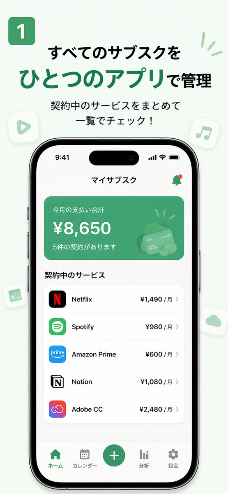</a> |

<table><tr>
<td align="center"><a href="https://evolink.ai/gpt-image-2-prompts?utm_source=github&utm_medium=picture&utm_campaign=gptimage2-x-seedance2">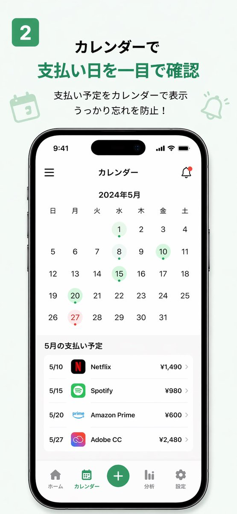</a></td>
<td align="center"><a href="https://evolink.ai/gpt-image-2-prompts?utm_source=github&utm_medium=picture&utm_campaign=gptimage2-x-seedance2">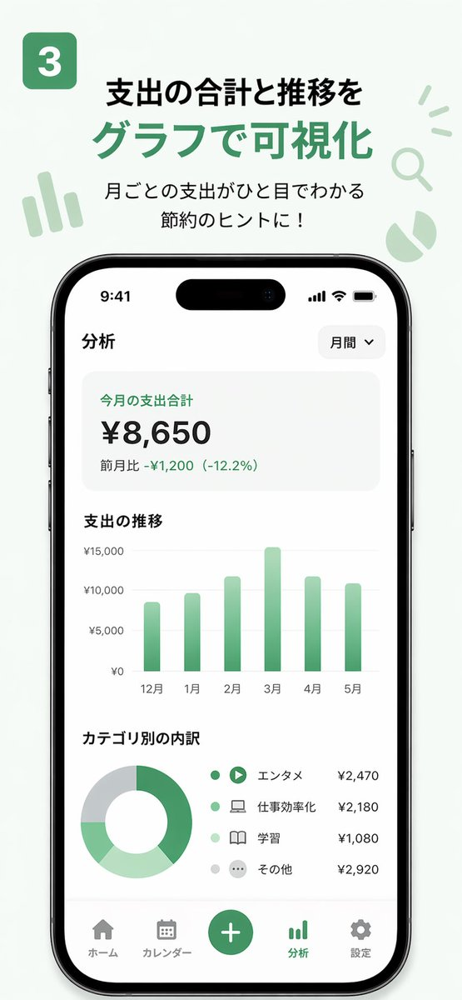</a></td>
<td align="center"><a href="https://evolink.ai/gpt-image-2-prompts?utm_source=github&utm_medium=picture&utm_campaign=gptimage2-x-seedance2">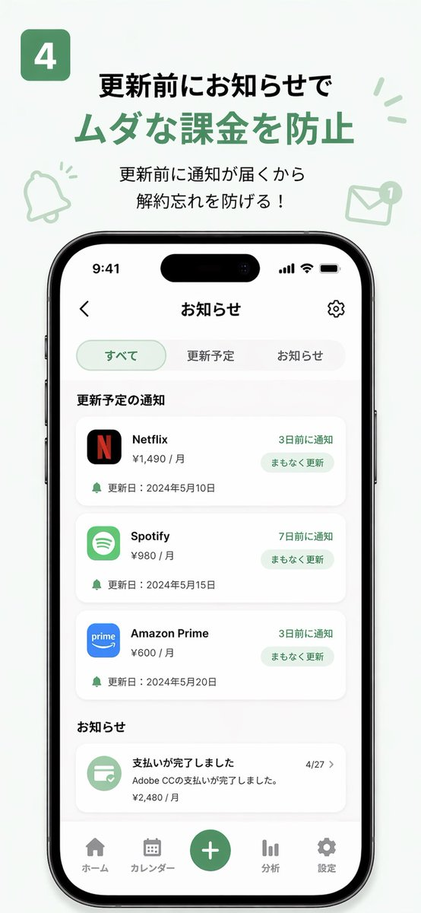</a></td>
</tr></table>

**Steps:**

1. Describe your app concept and design language to GPT Image 2
2. Generate 3–5 key UI screenshots (home, feature, profile pages)
3. Sort screenshots in user-flow order and import into Seedance 2.0
4. Export the demo video and post it to test market reaction

**GPT Image 2 Prompt:**

```
Design [N] UI screenshots for a "[app concept]" app:
1. [Page 1 name and description]
2. [Page 2 name and description]
3. [Page 3 name and description]
Style: [iOS/Android] native design language, [primary color] accent, [light/dark] mode.
Output as realistic app screenshots, not wireframes or mockups.
```

**Seedance 2.0 Prompt:**

```
Smooth app UI transition animation, screen tap interaction, natural interface motion, clean and modern feel, 3 seconds.
```

> [!NOTE]
> **Replace the placeholders in brackets before use.** In your video caption, do not label it as AI-generated — post it as a product demo and observe real audience feedback in the comments.

<!-- Case 6: 15-Second Commercial (by @ai_mitosan) -->
### Case 6: [15-Second Commercial](https://x.com/ai_mitosan/status/2047146600422846762) (by [@ai_mitosan](https://x.com/ai_mitosan))

Two-step workflow: GPT Image 2 generates the hero image and matching storyboard, then Seedance 2.0 animates each clip. Assemble with captions and music for a complete 15-second spot.

<table><tr>
<td align="center"><a href="https://evolink.ai/gpt-image-2-prompts?utm_source=github&utm_medium=picture&utm_campaign=gptimage2-x-seedance2">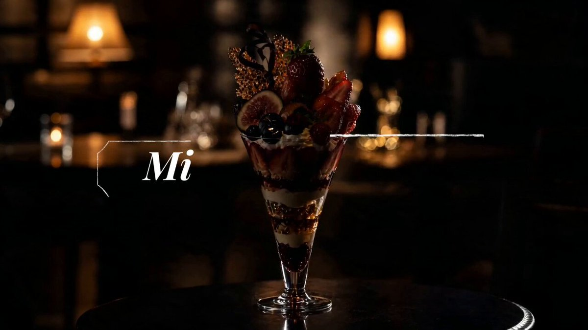</a></td>
<td align="center"><video src="https://github.com/user-attachments/assets/09ae3c57-b8fb-4323-ba76-7777541fe4a3" width="400" controls></video></td>
</tr></table>

**Steps:**

1. Generate the hero visual (product / character / scene) with GPT Image 2
2. Generate a 4–5 panel storyboard based on the hero visual
3. Animate each panel in Seedance 2.0, targeting 3–4 seconds per clip
4. Assemble clips, add captions and music

**Storyboard count guide:**

| Video length | Panels | Duration per clip |
| :---: | :---: | :---: |
| 15 seconds | 4–5 | 3–4 seconds |
| 30 seconds | 8–10 | 3 seconds |
| 60 seconds | 15–18 | 3–4 seconds |

**GPT Image 2 Prompt:**

```
Create a 5-panel storyboard for a 15-second commercial for [product/brand]:
Panel 1: [opening shot]
Panel 2: [product feature]
Panel 3: [emotional moment]
Panel 4: [call to action]
Panel 5: [closing brand shot]
Style: [brand aesthetic], 16:9 widescreen, cinematic.
```

**Seedance 2.0 Prompt:**

```
Cinematic commercial quality, [brand tone: premium / energetic / warm], [product name] centered in frame, slow camera push-in, [lighting direction] lighting highlights the product, clean background, no people, 3 seconds.
```

## 🎵 Creative Combinations

<!-- Case 7: Music Video with Suno (by @fukaborichannel) -->
### Case 7: [Music Video with Suno](https://x.com/fukaborichannel/status/2047206670020055317) (by [@fukaborichannel](https://x.com/fukaborichannel))

Three-tool combination: GPT Image 2 for visuals, Seedance 2.0 for motion, Suno for music. Produce music first to lock the tempo and structure, then design storyboards that align to the beat.

<table><tr>
<td align="center"><a href="https://evolink.ai/gpt-image-2-prompts?utm_source=github&utm_medium=picture&utm_campaign=gptimage2-x-seedance2"></a></td>
<td align="center"><a href="https://evolink.ai/gpt-image-2-prompts?utm_source=github&utm_medium=picture&utm_campaign=gptimage2-x-seedance2"></a></td>
<td align="center"><video src="https://github.com/user-attachments/assets/fd4be5c7-cd02-4a77-ae07-6b80efeff201" width="280" controls></video></td>
</tr></table>

**Steps:**

1. Generate the target-style music in Suno — confirm song structure (intro / verse / chorus)
2. Design storyboard panels per song section in GPT Image 2
3. Animate each panel in Seedance 2.0 — match clip duration to the beat
4. Sync clips to the music track in your editing software

**GPT Image 2 Prompt:**

```
Create a [N]-panel storyboard for a music video in [style] style:
Intro: [visual concept]
Verse: [visual concept]
Chorus: [visual concept]
Style: [art style], [color palette], [mood].
```

**Seedance 2.0 Prompt — City Pop style:**

```
Japanese city pop anime style, soft summer afternoon light, character walking lightly, Tokyo street background, blue sky, film grain texture, 24fps.
```

> [!NOTE]
> Produce music first. Knowing the tempo and length before designing the storyboard lets you precisely match panel timing to beat cuts.

<!-- Case 8: Cyberpunk Style Short Film (by @ponyodong) -->
### Case 8: [Cyberpunk Style Short Film](https://x.com/ponyodong/status/2047210987263230133) (by [@ponyodong](https://x.com/ponyodong))

Use GPT Image 2 to establish a consistent visual style (cyberpunk, neon, lanterns, feminine aesthetic), then animate each image with Seedance 2.0 to produce a short stylized film that lands between wallpaper, poster, and story opening.

<table><tr>
<td align="center"><a href="https://evolink.ai/gpt-image-2-prompts?utm_source=github&utm_medium=picture&utm_campaign=gptimage2-x-seedance2">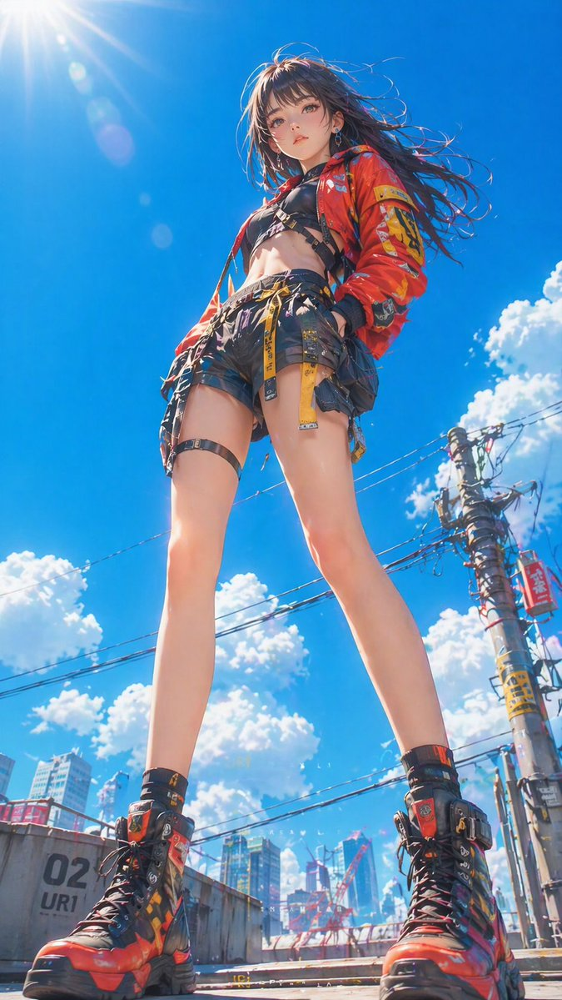</a></td>
<td align="center"><a href="https://evolink.ai/gpt-image-2-prompts?utm_source=github&utm_medium=picture&utm_campaign=gptimage2-x-seedance2">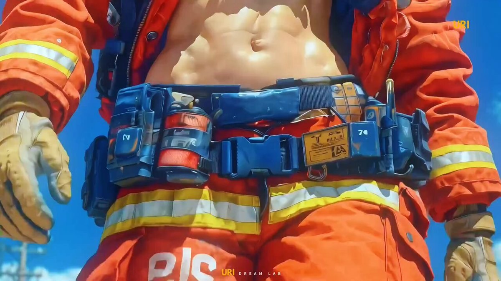</a></td>
<td align="center"><video src="https://github.com/user-attachments/assets/db6ebb63-90dc-47c5-96c5-ab2fa53ed56d" width="280" controls></video></td>
</tr></table>

**Steps:**

1. Define the visual style system in GPT Image 2 — fix colors, lighting, and character look
2. Generate 4–6 images that each carry the same mood
3. Animate each image in Seedance 2.0 with slow, atmospheric motion prompts
4. Sequence the clips to build a short visual narrative

**GPT Image 2 Prompt:**

```
Generate a [style] illustration:
Visual elements: [neon lights / lanterns / rain / specific props].
Character: [appearance description]. Keep this character design fixed across all images.
Color palette: [dominant colors].
Mood: [atmospheric, cinematic, etc.].
```

**Seedance 2.0 Prompt:**

```
Slow atmospheric camera drift, neon reflections on wet pavement, soft particle effects, cinematic color grade, 24fps, 4 seconds.
```

<!-- Case 9: Game & Interactive Content (by @AbleGPT) -->
### Case 9: [Game & Interactive Content](https://x.com/AbleGPT/status/2047149644778746020) (by [@AbleGPT](https://x.com/AbleGPT))

Use GPT Image 2 to generate game-style UI images (with HUD elements, skill bars, choice overlays), then animate them in Seedance 2.0 to simulate interactive game sequences. Game and illustration styles face fewer content restrictions in Seedance than realistic human footage.

<table><tr>
<td align="center"><a href="https://evolink.ai/gpt-image-2-prompts?utm_source=github&utm_medium=picture&utm_campaign=gptimage2-x-seedance2">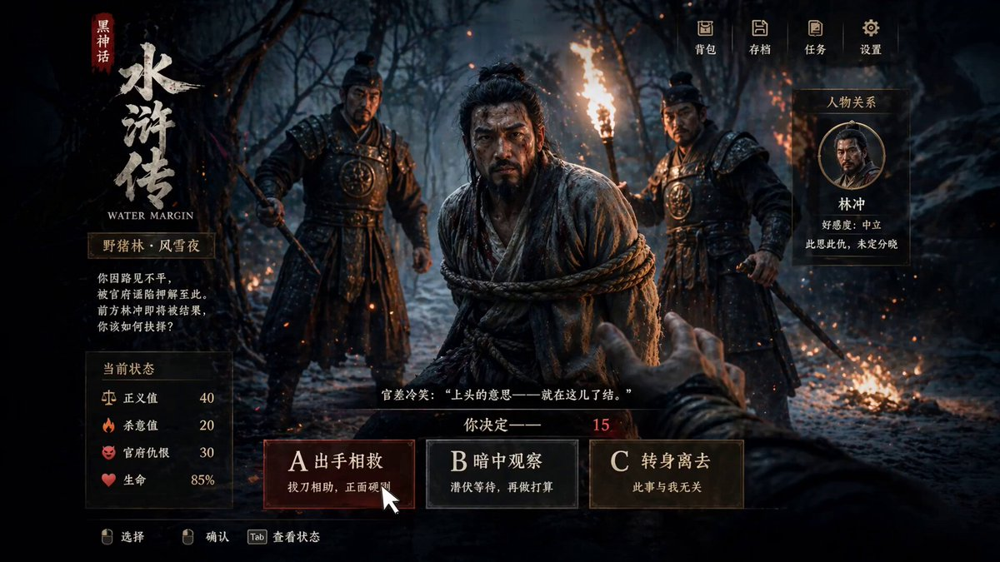</a></td>
<td align="center"><video src="https://github.com/user-attachments/assets/961c4bc4-c83c-49d3-bc14-7b128e80bc17" width="400" controls></video></td>
</tr></table>

**Steps:**

1. Generate ARPG or game-UI-style images with GPT Image 2, including HUD elements
2. Import into Seedance 2.0 and describe the interaction or combat sequence
3. Add post-production effects (particles, glow) for polish

**GPT Image 2 Prompt:**

```
Generate a game UI screenshot in [Black Myth / ARPG / JRPG] style:
Theme: [Chinese mythology / fantasy / sci-fi].
UI elements: health bar, skill icons, choice panel with options A/B/C.
Art style: [realistic / painterly / anime], high detail rendering.
```

**Seedance 2.0 Prompt:**

```
Click option A, normal UI transition animation, then a reasonable combat sequence begins.
[Style: Black Myth style, Chinese mythological martial arts, realistic rendering, dynamic camera work.]
```

**Variant — ARPG Game Simulation (by [@0xbisc](https://x.com/0xbisc/status/2047315350862352715)):**

One Piece, Stranger Things, any IP — generate a game screenshot of a world that doesn't exist, then expand it into live gameplay with Seedance 2.0. 934 likes / 125K views.

<table><tr>
<td align="center"><video src="https://raw.githubusercontent.com/EvoLinkAI/GPT-Image-2-Seedance2-Workflow/main/images/game_case9/output_onepiece.mp4" width="400" controls></video></td>
</tr></table>

**GPT Image 2 Prompt:**

```
Generate an ARPG dialogue game screenshot inspired by [film/series name]
```

**Seedance 2.0:** Use Image-to-Video mode. No prompt needed — Seedance reads the HUD layout and extends it into a gameplay sequence automatically.

> [!NOTE]
> Seedance 2.0 has restrictions on realistic human content. Game, anime, and illustration styles bypass most of these limitations and offer more creative range.
>
> **ARPG tip (via [@peter6759](https://x.com/peter6759/status/2047130834180903166)):** For interactive movie-game style, combine both steps in one pass — GPT Image 2 prompt: `Interactive movie game, Black Myth style, Water Margin` → Seedance 2.0 prompt: `Click option A, normal UI shift, then reasonable combat happens`. The dual-language approach (Chinese prompt for GPT Image 2, English for Seedance) often improves cultural fidelity.
>
> **Community showcase:** [@markgadala](https://x.com/markgadala/status/2047825115631518115) used this workflow to generate a full trailer for a game that doesn't exist. [@0xInk_](https://x.com/0xInk_/status/2047648944004755679) used it for high-detail UI animations (972 likes / 75K views).

<!-- Case 10: Multi-Frame Reference Storyboard (by @heygentlewhale + @ai_gezgini) -->
### Case 10: [Multi-Frame Reference → Fast-Cut Video](https://x.com/heygentlewhale/status/2047969137969004946) (by [@heygentlewhale](https://x.com/heygentlewhale))

Feed Seedance 2.0 a storyboard image with multiple reference frames and instruct it to follow the sequence order. The model reads frame positions as scene cues and outputs a coherent fast-cut edit — without manual clip assembly.

<table><tr>
<td align="center"><video src="https://raw.githubusercontent.com/EvoLinkAI/GPT-Image-2-Seedance2-Workflow/main/images/storyboard_case10/output.mp4" width="400" controls></video></td>
<td align="center"><video src="https://raw.githubusercontent.com/EvoLinkAI/GPT-Image-2-Seedance2-Workflow/main/images/storyboard_case10/storyboard_ref.mp4" width="400" controls></video></td>
</tr></table>

**Steps:**

1. Generate a multi-panel storyboard image in GPT Image 2 (12 frames, 3×4 or 4×3 grid)
2. Upload the storyboard as the reference image in Seedance 2.0
3. Write a sequencing prompt that names the frame count and edit style

**GPT Image 2 Prompt:**

```
Create a 12-panel storyboard grid for a [N]-second [genre] film:
- 4 columns × 3 rows, left-to-right, top-to-bottom reading order
- Each panel: [shot type] + [action description]
- Location: [setting], Time: [day/night], Mood: [atmosphere]
- Consistent character design and scene across all panels
- No text labels, no panel borders
Output as a single image.
```

**Seedance 2.0 Prompt:**

```
Follow the storyboard sequence of the 12 reference frames in image1, edited as a fast-cut memory montage.
[Describe visual style — example below:]
A nostalgic romance film set in 1990s Singapore, shot on 35mm film in Kodak Portra 800 style.
Soft grain, dreamy blur, warm highlights, and slight color shifts create a vintage cinematic atmosphere.
```

**Universal sequencing prompt (via [@ai_gezgini](https://x.com/ai_gezgini/status/2047349122315805016)):**

```
Use this storyboard to generate a video, follow the scene order, keep transitions smooth,
and preserve cinematic lighting and pacing.
[Add any extra visual details you want.]
```

> [!NOTE]
> This prompt works across genres — swap the style description for sci-fi, horror, documentary, or any other look. The key phrase is `follow the storyboard sequence of the [N] reference frames` — it tells Seedance to treat frame positions as a timeline rather than a single composition.

<!-- Case 11: Japanese MV Full Toolchain (by @Tz_2022) -->
### Case 11: [Japanese MV — Full AI Toolchain](https://x.com/Tz_2022/status/2047684399404056609) (by [@Tz_2022](https://x.com/Tz_2022))

Four-tool pipeline producing a complete Japanese-style music video: GPT Image 2 for visuals → Seedance 2.0 for motion → Suno 5.5 for music → CapCut for final edit. 742 likes / 107K views.

<table><tr>
<td align="center"><video src="https://raw.githubusercontent.com/EvoLinkAI/GPT-Image-2-Seedance2-Workflow/main/images/creative_case11/output.mp4" width="400" controls></video></td>
</tr></table>

**Steps:**

1. Generate the music in Suno 5.5 first — lock song length, tempo, and mood
2. Design storyboard panels in GPT Image 2 timed to the song sections
3. Animate each panel in Seedance 2.0, matching clip duration to beat
4. Import video clips and the Suno track into CapCut — sync and export

**GPT Image 2 Prompt:**

```
Create a [N]-panel storyboard for a Japanese-style music video:
Intro: [visual concept]
Verse: [visual concept]
Chorus: [visual concept]
Style: [anime illustration / painterly / film still], [color palette], [mood].
Character: [name and appearance]. Keep this character design fixed across all panels.
```

**Seedance 2.0 Prompt:**

```
Japanese anime style, [season] atmosphere, [lighting description], soft film grain, 24fps.
[Character name] [action description], [background description].
```

> [!NOTE]
> Produce music first — knowing the beat structure before designing storyboards lets you precisely match panel timing to song cuts. This extends Case 7 (City Pop MV) by adding Suno into the loop and treating the whole pipeline as a synchronized production rather than post-assembly.

<!-- Case 12: Claude Code + Character Sheet → Animation (by @old_pgmrs_will) -->
### Case 12: [Claude Code × Character Sheet → Animation](https://x.com/old_pgmrs_will/status/2045091769180914019) (by [@old_pgmrs_will](https://x.com/old_pgmrs_will))

Use Claude Code to write the world-building and character lore, then pass structured descriptions to GPT Image 2 to generate the character key visual, then animate with Seedance 2.0. Developer-friendly workflow for original IP creation. 191 likes / 7K views.

<table><tr>
<td align="center"><a href="https://evolink.ai/seedance2?utm_source=github&utm_medium=picture&utm_campaign=gptimage2-x-seedance2"></a></td>
</tr></table>

**Steps:**

1. Use Claude Code to draft world-building notes and a structured character spec (name, appearance, personality, setting)
2. Feed the character spec directly into GPT Image 2 to generate a key visual or character sheet
3. Use the key visual as the reference image in Seedance 2.0 and animate

**Claude Code → GPT Image 2 handoff prompt:**

```
Based on the following character spec, generate a key visual for [character name]:
[Paste Claude Code output here — name, appearance, outfit, world setting, mood]
Style: [anime / cinematic illustration / game art], [color palette].
Fix this character design — it will be used as a reference across all subsequent images.
```

**Seedance 2.0 Prompt:**

```
Japanese full-color anime style, character in natural idle breathing animation,
subtle hair and clothing movement, 24fps, seamless loop.
[Or: high-speed cuts, 24fps, dark fantasy anime OP style — protagonist in opening sequence.]
```

> [!NOTE]
> Claude Code outputs structured text — character specs, scene descriptions, dialogue outlines — which GPT Image 2 handles well as detailed prompts. This pipeline is particularly effective for original story IP: build the lore in code, visualize it in GPT Image 2, animate it in Seedance.

## 💡 Tips & Techniques

### Consistency Guide

Maintaining visual consistency between GPT Image 2 outputs and through Seedance 2.0 animation is the most common challenge. These approaches address each layer.

**Product image consistency**

The root cause of product distortion in Seedance is that its motion interpolation rewrites fine details — logos, textures, and surface patterns get modified.

Solutions:
- Add `keep the product appearance completely unchanged, camera movement only, no rotation` to your Seedance prompt
- Choose camera motion (push-in, pull-out) rather than subject motion — keep the product still and move the camera
- Keep clip duration under 3 seconds — shorter clips accumulate less distortion

**Character consistency**

- Generate a three-view character sheet first and use it as the visual anchor for all subsequent storyboard frames
- Include a brief character description (hair color, outfit, build) in every storyboard panel prompt
- Avoid switching character perspectives within a single clip

**Scene consistency**

When generating multiple storyboard panels in GPT Image 2, fix the scene parameters at the top of your prompt:

```
Scene setting: [location], [time of day], [lighting direction], [fixed background elements].
Maintain this scene setting unchanged across all panels.
```

---

### Prompt Templates

**GPT Image 2 → Storyboard template**

```
Create a [N]-panel storyboard for [subject]:
- Style: [realistic / anime / illustration / cinematic]
- Aspect ratio: 16:9 widescreen
- Each panel: include shot type (wide / medium / close-up) + action description
- Character: [fixed appearance description]
- Scene tone: [color palette / lighting / mood]
Output as a single image with [N] panels separated by thin lines.
```

**GPT Image 2 → 3×3 grid template**

```
Output a single 3×3 grid storyboard image showing the following continuous action:
[describe the action sequence]
Requirements:
- 9 panels arranged left-to-right, top-to-bottom showing continuous motion
- Character position and scale consistent across all panels
- Background consistent throughout
- No text, labels, or content outside the panel borders
```

**Seedance 2.0 → Anime style template**

```
Japanese full-color animation, high-speed editing, high frame count, 24fps.
[Scene description]. [Character description]. [Action description].
Strong camera work, high visual impact.
```

**Seedance 2.0 → Commercial style template**

```
Cinematic commercial quality, [brand tone: premium / energetic / warm],
[product] centered in frame, slow camera push-in,
[lighting direction] highlights the product, clean background, no people.
Duration: 3 seconds.
```

**Prompt length — shorter often wins**

Community experiment via [@Iancu_ai](https://x.com/Iancu_ai/status/2047882924679168083): a 1500-word cinema-grade Seedance prompt lost to a single sentence. Same character, same 15 seconds. The short prompt won. Seedance rewards directional clarity over exhaustive description — write the motion intent, not every detail of the scene.

---

### Troubleshooting

**Seedance content moderation block**

Cause: the image contains content flagged as sensitive (realistic violence, human faces in certain poses).
Fix: switch to anime or illustration style, or remove human figure descriptions from your prompt.

**Output motion is chaotic**

Cause: the storyboard image is too complex — Seedance cannot determine the primary motion direction.
Fix: simplify the storyboard panel to one main subject and one clear action. Reduce background elements.

**Product image distorts**

See the Consistency Guide → Product image consistency section above.

**Platform input format requirements**

| Platform | Recommended input size | Supported formats | Max file size |
| :---: | :---: | :---: | :---: |
| Hailuo | 1280×720 or 720×1280 | JPG / PNG | 10 MB |
| Higgsfield | 1920×1080 | PNG | 20 MB |
| HitPaw | Any ratio | JPG / PNG / WEBP | 15 MB |

## 🚀 Try It on Evolink

Evolink lets you run both GPT Image 2 and Seedance 2.0 in one place — no switching platforms, no re-uploading files.

**Why Evolink**

- Single API key for GPT Image 2 and Seedance 2.0
- Direct image-to-video transfer in the same interface — generate an image and click "Send to Video" without downloading
- Batch processing — queue multiple storyboard panels for sequential video generation

**How to use**

```
Step 1: Open Evolink → select GPT Image 2 → generate your storyboard image
Step 2: Click "Generate Video" → Seedance 2.0 receives the image automatically
Step 3: Add your Seedance prompt → generate
```

<a href='https://evolink.ai/signup?utm_source=github&utm_medium=readme&utm_campaign=gptimage2-x-seedance2'></a>


## 🙏 Acknowledge

This repository was inspired by outstanding open workflow collections and community-shared experiments.

Thanks to the creators and contributors who shared their work publicly and made these case studies possible.

- [@szounft](https://x.com/szounft)
- [@Toshi_nyaruo_AI](https://x.com/Toshi_nyaruo_AI)
- [@ponyodong](https://x.com/ponyodong)
- [@servasyy_ai](https://x.com/servasyy_ai)
- [@YaReYaRu30Life](https://x.com/YaReYaRu30Life)
- [@fukaborichannel](https://x.com/fukaborichannel)
- [@Shin_Engineer](https://x.com/Shin_Engineer)
- [@ai_mitosan](https://x.com/ai_mitosan)
- [@kiyoshi_shin](https://x.com/kiyoshi_shin)
- [@AbleGPT](https://x.com/AbleGPT)
- [@patata1216](https://x.com/patata1216)
- [@peter6759](https://x.com/peter6759)
- [@hibi_ai__](https://x.com/hibi_ai__)
- [@heygentlewhale](https://x.com/heygentlewhale)
- [@ai_gezgini](https://x.com/ai_gezgini)
- [@Tz_2022](https://x.com/Tz_2022)
- [@old_pgmrs_will](https://x.com/old_pgmrs_will)
- [@0xbisc](https://x.com/0xbisc)
- [@Iancu_ai](https://x.com/Iancu_ai)
- [@Jake_Joseph](https://x.com/Jake_Joseph)
- [@venturetwins](https://x.com/venturetwins)
- [@0xInk_](https://x.com/0xInk_)
- [@markgadala](https://x.com/markgadala)
- [@Ankit_patel211](https://x.com/Ankit_patel211)

*We cannot guarantee that every case is attributed to the original creator. If anything needs to be corrected, please contact us and we will update it.*

If you have more interesting workflow cases to share, feel free to reach out and help us expand the Evolink workflow library.

[](https://www.star-history.com/#EvolinkAI/gptimage2-x-seedance2&Date)
