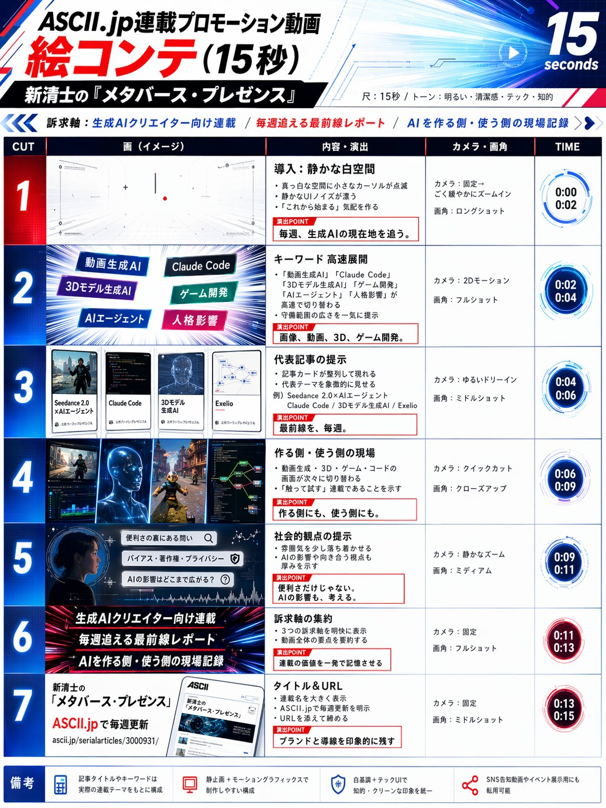
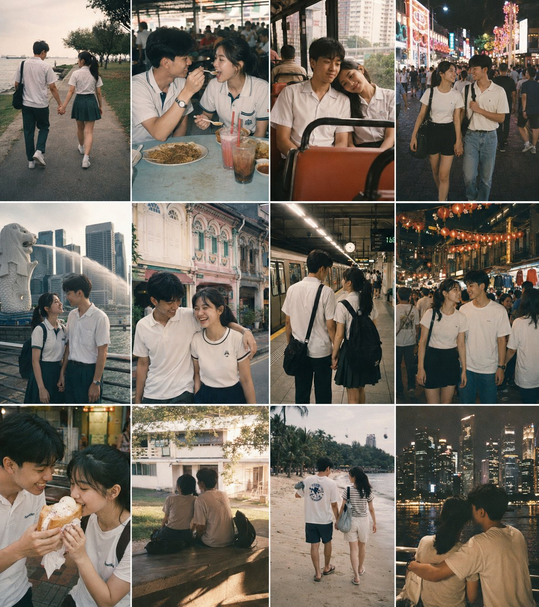
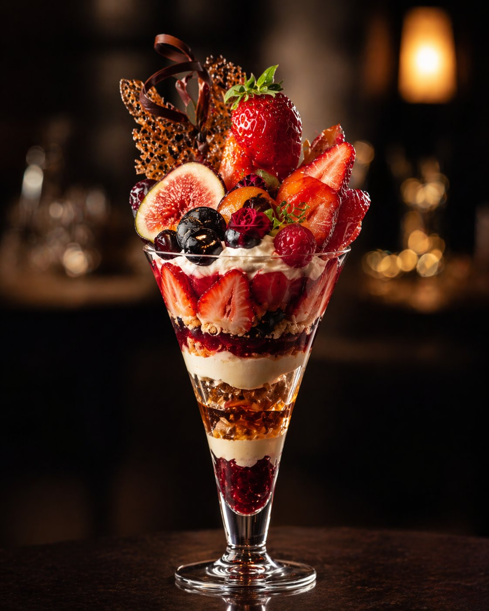
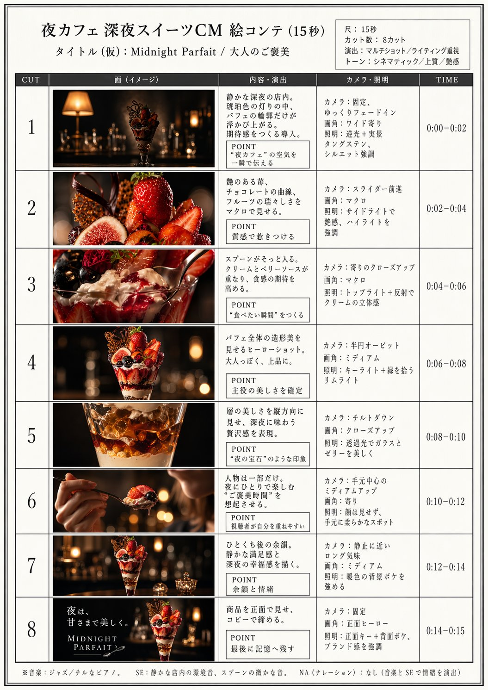

<div align="center">

<a href="https://evolink.ai/gpt-image-2-prompts?utm_source=github&utm_medium=banner&utm_campaign=gptimage2-x-seedance2"></a>

[](LICENSE)
[](https://github.com/EvoLinkAI/awesome-seedance-2.0-prompts)
[](https://github.com/EvoLinkAI/Seedance-2.0-Gateway-Service)
[](https://github.com/EvoLinkAI/awesome-seedance-2-guide)
[](https://github.com/EvoLinkAI/awesome-gpt-image-2-prompts)


[](README.md)
[](README_es.md)
[](README_pt.md)
[](README_ja.md)
[](README_ko.md)
[](README_de.md)
[](README_fr.md)
[](README_tr.md)
[](README_zh-TW.md)
[](README_zh-CN.md)
[](README_ru.md)

</div>


## 🎬 Einführung

Willkommen im Workflow-Repository für GPT Image 2 × Seedance 2.0! 🤗

**Wir sammeln bewährte Workflows, Prompt-Vorlagen und echte Creator-Beispiele, um GPT Image 2 und Seedance 2.0 für hochwertige KI-Videos zu kombinieren.**

GPT Image 2 übernimmt das "Was soll gezeichnet werden?" und die visuelle Konsistenz. Seedance 2.0 übernimmt das "Wie soll es sich bewegen?" und animiert diese Bilder zu Video. Zusammen bilden sie eine der leistungsfähigsten KI-Video-Pipelines, die aktuell verfügbar sind.

Die meisten Fälle in diesem Repository stammen aus kuratierten Beiträgen von X/Twitter-Creatorn, Community-Experimenten und echten Produktions-Workflows.

Teste es: [GPT Image 2 + Seedance 2.0](https://evolink.ai?utm_source=github&utm_medium=readme&utm_campaign=gptimage2-x-seedance2)

Wenn dir das nützlich ist, gib dem Repository gern einen Star. ⭐


## 📰 Neuigkeiten

- **1. Mai 2026:** Fall 13–27 hinzugefügt (Tanzsequenz-Grid, Comic-Seite-Animation, Luxus-Werbespot, Filmisches Food-Video, Spiel-Interface-Pipeline, Single-Agent-Workflow, Storyboard-First-Kostenkontrolle, Claude-Shotlist-MV, Casting-Grid, 3D-Sculpt-Pipeline, IP-Cyberpunk-Remake, GTA-City-Konzept, K-Pop-Choreografie, Produkt-Video-Ad, Charakter-Intro-Animation)
- **25. April 2026:** Fall 10–12 hinzugefügt (Multi-Frame-Storyboard, japanische MV-Toolchain, Claude Code × Charakterbogen), Fall 9 um ARPG-Simulationsvarianten erweitert, Community-Showcase zur Galerie hinzugefügt
- **23. April 2026:** Repository mit 9 kuratierten Workflow-Fällen gestartet

## 📑 Menü

- [🎬 Einführung](#-einführung)
- [📰 Neuigkeiten](#-neuigkeiten)
- [📑 Menü](#-menü)
- [🎥 Storyboard-Techniken](#-storyboard-techniken)
  - [Fall 1: Standard-Storyboard → Video (von @kiyoshi_shin)](#fall-1-standard-storyboard--video-von-kiyoshi_shin)
  - [Fall 2: 3×3-Grid-Storyboard-Methode (von @servasyy_ai)](#fall-2-33-grid-storyboard-methode-von-servasyy_ai)
  - [Fall 10: Multi-Frame-Referenz → Fast-Cut-Video (von @heygentlewhale)](#fall-10-multi-frame-referenz--fast-cut-video-von-heygentlewhale)
  - [Fall 19: Storyboard-First-Kostenkontrolle (von @0xbisc)](#fall-19-storyboard-first-kostenkontrolle-von-0xbisc)
- [📱 Werbung & Produkt](#-werbung--produkt)
  - [Fall 5: App-MVP-Demovideo (von @Shin_Engineer)](#fall-5-app-mvp-demovideo-von-shin_engineer)
  - [Fall 6: 15-Sekunden-Werbespot (von @ai_mitosan)](#fall-6-15-sekunden-werbespot-von-ai_mitosan)
  - [Fall 15: Luxus-Werbespot — Vom Storyboard zum Film (von @insmind_com)](#fall-15-luxus-werbespot--vom-storyboard-zum-film-von-insmind_com)
  - [Fall 16: Filmisches Food-Video (von @kingofdairyque)](#fall-16-filmisches-food-video-von-kingofdairyque)
  - [Fall 26: Produktbild → Kurzvideo-Werbung (von @insmind_com)](#fall-26-produktbild--kurzvideo-werbung-von-insmind_com)
- [🎨 Animation & Charakter](#-animation--charakter)
  - [Fall 3: Charakterbogen → Animation (von @YaReYaRu30Life)](#fall-3-charakterbogen--animation-von-yareyaru30life)
  - [Fall 4: Video im Anime-OP-Stil (von @Toshi_nyaruo_AI)](#fall-4-video-im-anime-op-stil-von-toshi_nyaruo_ai)
  - [Fall 12: Claude Code × Charakterbogen → Animation (von @old_pgmrs_will)](#fall-12-claude-code--charakterbogen--animation-von-old_pgmrs_will)
  - [Fall 13: Tanzsequenz-Grid → Tanzvideo (von @Ciri_ai)](#fall-13-tanzsequenz-grid--tanzvideo-von-ciri_ai)
  - [Fall 14: Comic-Seite → Animiertes Video (von @nimentrix)](#fall-14-comic-seite--animiertes-video-von-nimentrix)
  - [Fall 25: K-Pop-Choreografie — Detaillierte Kontrolle (von @Kashberg_0)](#fall-25-k-pop-choreografie--detaillierte-kontrolle-von-kashberg_0)
  - [Fall 27: Charakter-Intro-Animation (von @0xbisc)](#fall-27-charakter-intro-animation-von-0xbisc)
- [🎵 Musikvideo & Kurzfilm](#-musikvideo--kurzfilm)
  - [Fall 7: Musikvideo mit Suno (von @fukaborichannel)](#fall-7-musikvideo-mit-suno-von-fukaborichannel)
  - [Fall 8: Cyberpunk-Kurzfilm (von @ponyodong)](#fall-8-cyberpunk-kurzfilm-von-ponyodong)
  - [Fall 11: Japanisches MV — Vollständige KI-Toolchain (von @Tz_2022)](#fall-11-japanisches-mv--vollständige-ki-toolchain-von-tz_2022)
  - [Fall 20: Claude-Shotlist → Musikvideo (von @CoffeeVectors)](#fall-20-claude-shotlist--musikvideo-von-coffeevectors)
- [🎮 Spielkonzept](#-spielkonzept)
  - [Fall 9: Spiele & interaktive Inhalte (von @op7418)](#fall-9-spiele--interaktive-inhalte-von-op7418)
  - [Fall 17: Spiel-Interface-Animation — Vollständige Pipeline (von @0xInk_)](#fall-17-spiel-interface-animation--vollständige-pipeline-von-0xink_)
  - [Fall 24: GTA-Style-City-Game-Konzept (von @markgadala)](#fall-24-gta-style-city-game-konzept-von-markgadala)
- [🛠 Produktionswerkzeuge](#-produktionswerkzeuge)
  - [Fall 18: Single-Agent-Automatisierter Workflow (von @venturetwins)](#fall-18-single-agent-automatisierter-workflow-von-venturetwins)
  - [Fall 21: Casting-Grid — Schauspieler-Audition (von @8fstudioz)](#fall-21-casting-grid--schauspieler-audition-von-8fstudioz)
  - [Fall 22: 3D-Sculpt → KI-Rendering → Animation (von @_DAntunes_)](#fall-22-3d-sculpt--ki-rendering--animation-von-_dantunes_)
- [💡 Tipps & Techniken](#-tipps--techniken)
  - [Leitfaden für Konsistenz](#leitfaden-für-konsistenz)
  - [Prompt-Vorlagen](#prompt-vorlagen)
  - [Fehlerbehebung](#fehlerbehebung)
- [🚀 Auf Evolink ausprobieren](#-auf-evolink-ausprobieren)
- [🙏 Danksagung](#-danksagung)


## 🎥 Storyboard-Techniken

<!-- Case 1: Standard Storyboard → Video (by @kiyoshi_shin) -->
### Fall 1: [Standard-Storyboard → Video](https://x.com/kiyoshi_shin/status/2047133524403400847) (von [@kiyoshi_shin](https://x.com/kiyoshi_shin))

Der häufigste Workflow. Nutze GPT Image 2, um ein Storyboard-Panel zu erzeugen, und animiere es anschließend mit Seedance 2.0. Besonders geeignet für Promo-Videos, kurze Dramen und Anime-Openings.

<table><tr>
<td align="center"><a href="https://evolink.ai/gpt-image-2-prompts?utm_source=github&utm_medium=picture&utm_campaign=gptimage2-x-seedance2"></a></td>
<td align="center"><video src="https://github.com/user-attachments/assets/ac25fc3d-b6cb-4149-a8ba-e7e10c5b1faa" width="280" controls></video></td>
</tr></table>

**Schritte:**

1. Beschreibe deine Szene für GPT Image 2 und erstelle ein Storyboard-Bild
2. Importiere das Storyboard in Seedance 2.0 im Modus Image-to-Video
3. Exportiere jeden Clip und setze sie in deiner Schnittsoftware zusammen

**GPT Image 2 Prompt:**

```
Create a 6-panel storyboard for a 15-second brand promotional video. Label each panel with a shot description.
Style: cinematic, cool color tone, widescreen 16:9.
Content: the journey of a product from factory to the customer's hands.
```

**Seedance 2.0 Prompt:**

```
Cinematic brand advertisement, slow camera push-in, product centered in frame, warm side lighting, soft background blur, no people, 3 seconds.
```

> [!NOTE]
> Gib Storyboard-Bilder im Format 16:9 aus, damit Seedance sie nicht automatisch zuschneidet. Stelle die Bildrate auf 24 fps ein, um dem Filmstandard zu entsprechen. Halte jedes Storyboard-Panel einfach — je einfacher der Inhalt, desto präziser die Bewegungsausgabe.


<!-- Case 2: 3×3 Grid Storyboard Method (by @servasyy_ai) -->
### Fall 2: [3×3-Grid-Storyboard-Methode](https://x.com/servasyy_ai/status/2047198012750143999) (von [@servasyy_ai](https://x.com/servasyy_ai))

Eine wichtige Technik aus der Community: Wenn alle Storyboard-Panels vor dem Import in Seedance in einem einzigen 3×3-Grid-Bild zusammengeführt werden, sinkt die Fehlerrate deutlich im Vergleich zum Einzelimport der Frames.

<table><tr>
<td align="center"><a href="https://evolink.ai/gpt-image-2-prompts?utm_source=github&utm_medium=picture&utm_campaign=gptimage2-x-seedance2"></a></td>
<td align="center"><video src="https://github.com/user-attachments/assets/00f32388-a17b-4b9c-8da3-1956436ce91b" width="400" controls></video></td>
</tr></table>


**Schritte:**

1️⃣ Gib den gewünschten Inhalt ein + den ✅ Prompt "Create a storyboard in a 3×3 grid format"
2️⃣ Erstelle mit ChatGPT einen Prompt aus dem Bild von Schritt 1
3️⃣ Referenziere das Bild aus Schritt 1 in Seedance
4️⃣ Gib den in Schritt 2 erstellten Prompt ein.

**GPT Image 2 Prompt:**

```
[describe your scene] and Create a storyboard in a 3×3 grid format
```

**Seedance 2.0 Prompt:**
turn this image into video
```
[Describe the motion and style. Example: Japanese full-color animation, fast cuts, high frame count, 24fps, dark fantasy anime OP style, intense battle scenes.]
```

> [!NOTE]
> **Ersetze den Inhalt in den eckigen Klammern vor der Nutzung.** Diese Methode funktioniert, weil Seedance die Bewegungsabsicht aus einem einzelnen Bild analysiert. Ein Grid gibt eine Richtungsreferenz vor und erzeugt kohärentere Bewegung als getrennte Bilder.


<!-- Case 10: Multi-Frame Reference Storyboard (by @heygentlewhale + @ai_gezgini) -->
### Fall 10: [Multi-Frame-Referenz → Fast-Cut-Video](https://x.com/heygentlewhale/status/2047969137969004946) (von [@heygentlewhale](https://x.com/heygentlewhale))

Übergib Seedance 2.0 ein Storyboard-Bild mit mehreren Referenz-Frames und weise es an, der Sequenzreihenfolge zu folgen. Das Modell liest die Frame-Positionen als Szenenhinweise und liefert einen kohärenten Fast-Cut-Edit — ohne manuelles Clip-Zusammensetzen.

<table><tr>
<td align="center"><a href="https://evolink.ai/gpt-image-2-prompts?utm_source=github&utm_medium=picture&utm_campaign=gptimage2-x-seedance2"></a></td>
<td align="center"><video src="https://github.com/user-attachments/assets/4d7af334-4e49-4de4-899e-803f72116c21" width="280" controls></video></td>
<td align="center"><video src="https://github.com/user-attachments/assets/5def7e00-6fc6-4a4e-8075-5f37cb24b84c" width="280" controls></video></td>
</tr></table>

**Schritte:**

1. Erzeuge in GPT Image 2 ein Multi-Panel-Storyboard-Bild (12 Frames, 3×4- oder 4×3-Grid)
2. Lade das Storyboard als Referenzbild in Seedance 2.0 hoch
3. Schreibe einen Sequenzierungs-Prompt, der die Frameanzahl und den Schnittstil benennt

**GPT Image 2 Prompt:**

```
Create a 12-panel storyboard grid for a [N]-second [genre] film:
- 4 columns × 3 rows, left-to-right, top-to-bottom reading order
- Each panel: [shot type] + [action description]
- Location: [setting], Time: [day/night], Mood: [atmosphere]
- Consistent character design and scene across all panels
- No text labels, no panel borders
Output as a single image.
```

**Seedance 2.0 Prompt:**

```
Follow the storyboard sequence of the 12 reference frames in image1, edited as a fast-cut memory montage.
[Describe visual style — example below:]
A nostalgic romance film set in 1990s Singapore, shot on 35mm film in Kodak Portra 800 style.
Soft grain, dreamy blur, warm highlights, and slight color shifts create a vintage cinematic atmosphere.
```

**Universeller Sequenzierungs-Prompt (via [@ai_gezgini](https://x.com/ai_gezgini/status/2047349122315805016)):**

```
Use this storyboard to generate a video, follow the scene order, keep transitions smooth,
and preserve cinematic lighting and pacing.
[Add any extra visual details you want.]
```

> [!NOTE]
> Dieser Prompt funktioniert genreübergreifend — tausche die Stilbeschreibung gegen Sci-Fi, Horror, Dokumentarfilm oder jedes andere Format aus. Die Schlüsselphrase lautet `follow the storyboard sequence of the [N] reference frames` — sie weist Seedance an, die Frame-Positionen als Zeitachse statt als einzelne Komposition zu behandeln.


<!-- Case 19: Storyboard-First Cost Control (by @0xbisc) -->
### Fall 19: [Storyboard-First-Kostenkontrolle](https://x.com/0xbisc/status/2049100073481716076) (von [@0xbisc](https://x.com/0xbisc))

Ein produktionsorientierter Ansatz: Iteriere zuerst am Storyboard in GPT Image 2 (günstig), und erzeuge das Video erst, wenn die Komposition feststeht (teuer). Das spart erheblich Credits, da Video-Iterationen 10–50× mehr verbrauchen als Bild-Iterationen. 298 Likes / 13K Aufrufe / 291 Lesezeichen.

<table><tr>
<td align="center"><a href="https://evolink.ai/gpt-image-2-prompts?utm_source=github&utm_medium=picture&utm_campaign=gptimage2-x-seedance2"></a></td>
<td align="center"><video src="https://github.com/user-attachments/assets/09e04d80-c0d1-4a8c-9b74-2efe474acfcd" width="400" controls></video></td>
</tr></table>

**Schritte:**

1. Erzeuge mit GPT Image 2 ein 8-Panel-Storyboard-Grid
2. Prüfe jedes Panel — regeneriere oder bearbeite einzelne Panels, bis du zufrieden bist
3. Importiere erst in Seedance 2.0, wenn das gesamte Storyboard feststeht
4. Erzeuge das Video in einem Durchgang aus dem finalisierten Storyboard

**GPT Image 2 Prompt:**

```
Create a single cinematic storyboard image containing 8 panels, arranged in a 4-column horizontal grid layout across the canvas.
Panels are evenly distributed in 4 columns, forming a balanced multi-row composition.
Use generous white space between panels and around the entire layout, creating a calm, refined editorial presentation.
Minimalist editorial design, white background, precise alignment, consistent spacing, strong grid system.
Subtle divider lines, ultra-thin, low-contrast, neutral tone, strictly aligned to the grid.
Each panel is presented as a clean modular card with a clear hierarchy: image frame on top, minimal text block below.
Refined modern sans-serif typography, light to regular weight, tight typographic control, consistent scale rhythm.
Visual consistency across all panels: a white flying dragon and a short blond-haired young male wearing a loose flowing white robe riding on its back. A glowing spherical object remains consistent in appearance.
Style: live-action cinematic realism, human actor proportions, natural skin detail, physically accurate lighting, real-world materials, high-end film still quality, ultra high resolution, sharp focus.
Cinematic sequence:
Scene 01
Shot type
Wide shot, low-angle tracking
Narrative
Dragon skims rapidly above ground toward vast geometric ruins, rider standing steadily, bright daylight
Scene 02
Shot type
Wide shot, side view
Narrative
Dragon enters ruin airspace, stone structures begin sinking and shifting, geometry reconfigures
Scene 03
Shot type
Medium shot, tracking
Narrative
Dragon navigates through moving structures forming a spatial maze, rider leans forward, focused
Scene 04
Shot type
Push-in shot, centered composition
Narrative
Massive floating ring appears at center, glowing sphere suspended inside, focal point established
Scene 05
Shot type
Wide-angle, low-angle tracking, high speed
Narrative
Dragon dives through narrow moving gaps, massive structures pass extremely close, intense speed and compression
Scene 06
Shot type
Close-up, centered composition
Narrative
Rider reaches forward to grasp glowing sphere, golden light illuminating face and arm
Scene 07
Shot type
Wide shot, upward motion
Narrative
Dragon ascends sharply as ruins collapse below, structures sinking and closing, dust fills air
Scene 08
Shot type
Wide shot, high-angle view
Narrative
Dragon exits above collapsed ruins, open sky, clear silhouette of rider and dragon, resolution moment
```

**Seedance 2.0 Prompt:**

```
Generate video based strictly on storyboard @ image1. Follow the storyboard exactly as shown, matching each panel's composition, framing, and action. Keep perfect visual continuity with no errors or inconsistencies.
```

> [!NOTE]
> **Warum Storyboard-First bei den Kosten gewinnt:** Video-Iterationen verbrauchen Credits schnell. Mit einem Storyboard kannst du Einstellung für Einstellung anpassen und Probleme frühzeitig erkennen. Der Video-Schritt wird zu einem einzigen finalen Render statt zu einer teuren Trial-and-Error-Schleife. Community-Feedback bestätigt, dass dies der budgeteffizienteste Workflow für längere Sequenzen ist.


## 📱 Werbung & Produkt

<!-- Case 5: App MVP Demo Video (by @Shin_Engineer) -->
### Fall 5: [App-MVP-Demovideo](https://x.com/Shin_Engineer/status/2047182050323812381) (von [@Shin_Engineer](https://x.com/Shin_Engineer))

Nutze GPT Image 2, um fertig wirkende UI-Screenshots einer App zu erzeugen, die noch gar nicht existiert, und animiere sie dann mit Seedance 2.0 zu einer Produktdemo. Poste das Ergebnis auf TikTok oder Social Media, um Marktinteresse zu testen, bevor du die App wirklich baust.

| Output |
| :----: |
| <a href="https://evolink.ai/gpt-image-2-prompts?utm_source=github&utm_medium=picture&utm_campaign=gptimage2-x-seedance2"></a> |

<table><tr>
<td align="center"><a href="https://evolink.ai/gpt-image-2-prompts?utm_source=github&utm_medium=picture&utm_campaign=gptimage2-x-seedance2"></a></td>
<td align="center"><a href="https://evolink.ai/gpt-image-2-prompts?utm_source=github&utm_medium=picture&utm_campaign=gptimage2-x-seedance2"></a></td>
<td align="center"><a href="https://evolink.ai/gpt-image-2-prompts?utm_source=github&utm_medium=picture&utm_campaign=gptimage2-x-seedance2"></a></td>
</tr></table>

**Schritte:**

1. Beschreibe dein App-Konzept und die Designsprache für GPT Image 2
2. Erzeuge 3–5 zentrale UI-Screenshots (Startseite, Feature-Seite, Profilseite)
3. Ordne die Screenshots nach Nutzerfluss und importiere sie in Seedance 2.0
4. Exportiere das Demo-Video und veröffentliche es, um Marktreaktionen zu testen

**GPT Image 2 Prompt:**

```
Design [N] UI screenshots for a "[app concept]" app:
1. [Page 1 name and description]
2. [Page 2 name and description]
3. [Page 3 name and description]
Style: [iOS/Android] native design language, [primary color] accent, [light/dark] mode.
Output as realistic app screenshots, not wireframes or mockups.
```

**Seedance 2.0 Prompt:**

```
Smooth app UI transition animation, screen tap interaction, natural interface motion, clean and modern feel, 3 seconds.
```

> [!NOTE]
> **Ersetze die Platzhalter in eckigen Klammern vor der Nutzung.** Kennzeichne das Video in deiner Caption nicht als KI-generiert — poste es als Produktdemo und beobachte das echte Feedback im Kommentarbereich.


<!-- Case 6: 15-Second Commercial (by @ai_mitosan) -->
### Fall 6: [15-Sekunden-Werbespot](https://x.com/ai_mitosan/status/2047146600422846762) (von [@ai_mitosan](https://x.com/ai_mitosan))

Zweistufiger Workflow: GPT Image 2 erzeugt das Hero-Bild und das passende Storyboard, dann animiert Seedance 2.0 jeden Clip. Zusammensetzen mit Untertiteln und Musik ergibt einen kompletten 15-Sekunden-Spot.

<table><tr>
<td align="center"><a href="https://evolink.ai/gpt-image-2-prompts?utm_source=github&utm_medium=picture&utm_campaign=gptimage2-x-seedance2"></a></td>
<td align="center"><a href="https://evolink.ai/gpt-image-2-prompts?utm_source=github&utm_medium=picture&utm_campaign=gptimage2-x-seedance2"></a></td>
<td align="center"><video src="https://github.com/user-attachments/assets/09ae3c57-b8fb-4323-ba76-7777541fe4a3" width="280" controls></video></td>
</tr></table>

**Schritte:**

1. Erzeuge das Hauptbild + Storyboard mit Image 2  
2. Gib das in Seedance 2.0 ein, um es in ein Video umzuwandeln  

**Leitfaden zur Storyboard-Anzahl:**

| Videolänge | Panels | Dauer pro Clip |
| :---: | :---: | :---: |
| 15 Sekunden | 4–5 | 3–4 Sekunden |
| 30 Sekunden | 8–10 | 3 Sekunden |
| 60 Sekunden | 15–18 | 3–4 Sekunden |

**GPT Image 2 Prompt:**

```
夜カフェ　深夜スイーツをテーマにした15秒CMを作るので、絵コンテを作って。 
プロの映像クリエイターによる15秒、８カット、マルチショット、ライティング重視。
```

**Seedance 2.0 Prompt:**

```
15秒、８カット、マルチショット、ライティング重視
```


<!-- Case 15: Luxury Commercial — Storyboard to Film (by @insmind_com) -->
### Fall 15: [Luxus-Werbespot — Vom Storyboard zum Film](https://x.com/insmind_com/status/2049481439285223785) (von [@insmind_com](https://x.com/insmind_com))

Erzeuge mit GPT Image 2 ein 3×4-Storyboard-Grid (12 Frames) für eine Luxus-Parfüm-Werbung und animiere es dann mit Seedance 2.0 zu einem filmischen Markenfilm. Der strukturierte Ablauf — Intro → Ritual → Transformation → Auflösung → Markenabschluss — erzeugt einen vollständigen Erzählbogen in einer Generation. 371 Likes / 84K Aufrufe / 255 Lesezeichen.

<table><tr>
<td align="center"><a href="https://evolink.ai/gpt-image-2-prompts?utm_source=github&utm_medium=picture&utm_campaign=gptimage2-x-seedance2"></a></td>
<td align="center"><video src="https://github.com/user-attachments/assets/281fef1e-f42d-442c-b06e-44d7cff221ec" width="400" controls></video></td>
</tr></table>

**Schritte:**

1. Erzeuge mit GPT Image 2 ein 12-Frame-Storyboard-Grid (3×4) mit Editorial-Layout und Luxusmarken-Ästhetik
2. Importiere das Storyboard-Grid als einzelnes Referenzbild in Seedance 2.0
3. Weise Seedance an, die Sequenz als filmischen Luxus-Werbespot zu animieren
4. Füge Musik und finales Color Grading in deiner Schnittsoftware hinzu

**GPT Image 2 Prompt:**

```
Create a high-end 9:16 luxury fragrance pitch deck storyboard in 3x4 grid (12 frames), editorial layout, Aesop/Byredo style, beige + lavender palette. Structured flow: intro → ritual → transformation → resolution → brand closure. Each frame split: top cinematic image (no text) + bottom storyboard notes. Luxury minimal European aesthetic, calm femininity, slow living mood. Candle is the emotional center throughout
```

**Seedance 2.0 Prompt:**

```
Animate the provided 3x4 storyboard into a smooth cinematic video. Preserve exact shot order and continuity. Use slow push-in, gentle pan, subtle orbit, and rack focus. Lighting transitions from soft morning glow to warm golden ambient light. Fragrance brand editorial aesthetic, minimal luxury, soft film grain. No new shots, no reordering, candle remains emotional focus in all scenes
```

> [!NOTE]
> Das Editorial-Pitch-Deck-Layout (mit visuellen Regieanweisungen in jedem Frame) gibt Seedance stärkere narrative Hinweise als ein einfaches Grid. Dieser Workflow lässt sich auf jede Luxusprodukt-Kategorie skalieren — Hautpflege, Uhren, Mode — indem man die Farbpalette und Produktreferenzen austauscht.


<!-- Case 16: Cinematic Food Video (by @kingofdairyque) -->
### Fall 16: [Filmisches Food-Video](https://x.com/kingofdairyque/status/2049812014596599834) (von [@kingofdairyque](https://x.com/kingofdairyque))

Nutze GPT Image 2 + Seedance 2.0, um ultra-realistische Food-Zubereitungsvideos mit zeitgestempelten Einstellungsbeschreibungen zu erstellen. Jedes Zeitstempel-Segment (0–2s, 2–4s usw.) definiert einen bestimmten Kamerawinkel und eine Aktion, was Seedance präzise Kontrolle über die 15-Sekunden-Sequenz gibt. 55 Likes / 1K Aufrufe.

<table><tr>
<td align="center"><a href="https://evolink.ai/gpt-image-2-prompts?utm_source=github&utm_medium=picture&utm_campaign=gptimage2-x-seedance2"></a></td>
<td align="center"><video src="https://github.com/user-attachments/assets/30a20e57-8384-4117-adf7-4f92faebeb33" width="400" controls></video></td>
</tr></table>

**Schritte:**

1. Schreibe eine detaillierte zeitgestempelte Einstellungsliste, die jedes 2-Sekunden-Segment beschreibt
2. Erzeuge mit GPT Image 2 das Storyboard-Bild basierend auf der Einstellungsliste
3. Gib das Bild + den vollständigen zeitgestempelten Prompt in Seedance 2.0 ein
4. Das Modell folgt der Zeitstempel-Struktur und erzeugt eine kohärente Kochsequenz

**Seedance 2.0 Prompt:**

```
Ultra-realistic cinematic 15-second vertical video (9:16), 4K, dark rustic wooden table,
soft dramatic lighting, shallow depth of field, natural textures, no text, no subtitles, no music.
[0-2s] Top-down shot: hands gently touch a bowl of [ingredient]. Subtle ambient movement.
[2-4s] Side close shot: [preparation action] in slow motion, catching warm light.
[4-6s] Macro shot: hands [action]. Texture detail visible.
[6-8s] 45-degree angle: [ingredient] pours into [vessel]. Natural bounce and movement.
[8-10s] Top angled close-up: hands carefully [assembly action]. Precise controlled motion.
[10-12s] Side shot: oven door opens. Warm golden light spills out with gentle steam.
[12-14s] Close-up: [finishing touch]. Surface becomes glossy, light reflecting softly.
[14-15s] Final frontal shot: finished [dish] on rustic table. Hands enter frame softly.
```

> [!NOTE]
> Die Zeitstempel-Prompt-Technik gibt Seedance eine präzise Einstellung-für-Einstellung-Zeitachse. Das funktioniert für jedes Produkt- oder Prozessvideo — Unboxing, Handwerk, Cocktail-Zubereitung. Halte jedes Segment bei 2 Sekunden und beschreibe sowohl den Kamerawinkel als auch die Aktion für beste Ergebnisse.


<!-- Case 26: Product Image → Short Video Ad (by @insmind_com) -->
### Fall 26: [Produktbild → Kurzvideo-Werbung](https://x.com/insmind_com/status/2049843814337306974) (von [@insmind_com](https://x.com/insmind_com))

Verwandle statische Produktbilder in aufmerksamkeitsstarke Social-Media-Videos. Lade deine vorhandenen Produktfotos als Referenzen in GPT Image 2 hoch, erzeuge eine Szenenkomposition und animiere sie dann mit Seedance 2.0. Konzipiert für E-Commerce und Social-Media-Marketing — erstelle TikTok/Reels-taugliche Inhalte aus Produktfotos, die du bereits hast.

<table><tr>
<td align="center"><a href="https://evolink.ai/gpt-image-2-prompts?utm_source=github&utm_medium=picture&utm_campaign=gptimage2-x-seedance2"></a></td>
<td align="center"><video src="https://github.com/user-attachments/assets/880c0019-e45a-4eb9-be6f-638ff71a0e0f" width="400" controls></video></td>
</tr></table>

**Schritte:**

1. Produktbilder eingeben.
2. Die Kernszene erzeugen.
3. Bewegung und Struktur definieren.
4. Stil und Einschränkungen festlegen.

> [!NOTE]
> Dies unterscheidet sich von Fall 15 (Luxus-Werbespot) dadurch, dass es von vorhandenen Produktfotos ausgeht, anstatt alles von Grund auf zu generieren. Am besten geeignet für E-Commerce-Verkäufer, die bereits Produktbilder haben und diese schnell in Video-Werbung umwandeln möchten.


## 🎨 Animation & Charakter

<!-- Case 3: Character Sheet → Animation (by @YaReYaRu30Life) -->
### Fall 3: [Charakterbogen → Animation](https://x.com/YaReYaRu30Life/status/2047203375314571501) (von [@YaReYaRu30Life](https://x.com/YaReYaRu30Life))

Erzeuge mit GPT Image 2 einen Charakter-Dreiseitenansichtsbogen (vorne, Seite, hinten) und nutze ihn als Anker für die Animation in Seedance 2.0. Ideal für Anime-Charaktere, Spielcharaktere und Figuren-Enthüllungen.

<table><tr>
<td align="center"><a href="https://evolink.ai/gpt-image-2-prompts?utm_source=github&utm_medium=picture&utm_campaign=gptimage2-x-seedance2"></a></td>
<td align="center"><a href="https://evolink.ai/gpt-image-2-prompts?utm_source=github&utm_medium=picture&utm_campaign=gptimage2-x-seedance2"></a></td>
<td align="center"><a href="https://evolink.ai/gpt-image-2-prompts?utm_source=github&utm_medium=picture&utm_campaign=gptimage2-x-seedance2"></a></td>
</tr></table>

<table><tr>
<td align="center"><a href="https://evolink.ai/gpt-image-2-prompts?utm_source=github&utm_medium=picture&utm_campaign=gptimage2-x-seedance2"></a></td>
<td align="center"><video src="https://github.com/user-attachments/assets/92a0aa56-441f-40db-b9c9-13410254cb3f" width="400" controls></video></td>
</tr></table>

**Schritte:**

1. Dreiseitenansicht (Charakter) + zwei Ausrüstungs-Dreiseitenansichten. Darauf basierend Dreiseitenansichten mit jeweils angelegter Ausrüstung in einem Bild vorbereiten. Aus Gründen der Bildanzahl wird der Charakter-Anhang weggelassen
2. Erstelle ein Storyboard basierend auf dieser Dreiseitenansicht  
3. Wandle das Storyboard mit Seedance 2.0 in ein Video um

**GPT Image 2 Prompt:**

```
Create a storyboard based on this three-view drawing  
```

**Seedance 2.0 Prompt:**

```
Turn the storyboard into video using Seedance2.0
```


<!-- Case 4: Anime OP Style Video (by @Toshi_nyaruo_AI) -->
### Fall 4: [Video im Anime-OP-Stil](https://x.com/Toshi_nyaruo_AI/status/2047216971184546231) (von [@Toshi_nyaruo_AI](https://x.com/Toshi_nyaruo_AI))

Nutze GPT Image 2, um ein Szeneneinstellungsbild zu erstellen, und lass Seedance 2.0 dann frei animieren. Der Vergleich zwischen eingeschränkter (storyboard-geführter) und freier (nur prompt-basierter) Ausgabe hilft bei der Entscheidung über den richtigen Ansatz pro Einstellung.

<table><tr>
<td align="center"><a href="https://evolink.ai/gpt-image-2-prompts?utm_source=github&utm_medium=picture&utm_campaign=gptimage2-x-seedance2"></a></td>
<td align="center"><video src="https://github.com/user-attachments/assets/f08a2fee-89a7-4c7c-a58a-f1306f87419a" width="280" controls></video></td>
<td align="center"><video src="https://github.com/user-attachments/assets/09d81a41-b5c5-47f3-8c67-442b7a93b019" width="280" controls></video></td>
</tr></table>

**Schritte:**

1. Grok erfindet Liedtexte für ein fiktives Anime-Opening
2. GPT Image 2 verwandelt die Liedtexte in ein Storyboard
3. Seedance 2 generiert daraus Videos

**GPT Image 2 Prompt:**

```
turn the lyrics into a storyboard
```

**Seedance 2.0 Prompt:**

```
Japanese full-color anime, fast cuts, high frame count, 24fps. Dark fantasy anime OP style. Epic battle between protagonist and massive supernatural creatures. High-impact sequence of scenes. Only [character name] appears.
```

> [!NOTE]
> Wenn Seedance frei animiert (ohne Storyboard-Referenz), können die Ergebnisse dynamischer, aber weniger konsistent mit deinem Quellbild sein. Nutze Storyboard-Kontrolle für wichtige Charakter-Einstellungen und freie Animation für Actionsequenzen.


<!-- Case 12: Claude Code + Character Sheet → Animation (by @old_pgmrs_will) -->
### Fall 12: [Claude Code × Charakterbogen → Animation](https://x.com/old_pgmrs_will/status/2045091769180914019) (von [@old_pgmrs_will](https://x.com/old_pgmrs_will))

Nutze Claude Code, um Worldbuilding und Charakter-Lore zu schreiben, übergib dann strukturierte Beschreibungen an GPT Image 2, um das Charakter-Key-Visual zu erzeugen, und animiere es anschließend mit Seedance 2.0. Entwicklerfreundlicher Workflow für die Erstellung eigener IPs. 191 Likes / 7K Aufrufe.

<table><tr>
<td align="center"><a href="https://evolink.ai/seedance2?utm_source=github&utm_medium=picture&utm_campaign=gptimage2-x-seedance2"></a></td>
</tr></table>

**Schritte:**

1. Nutze Claude Code, um Worldbuilding-Notizen und eine strukturierte Charakter-Spezifikation zu entwerfen (Name, Aussehen, Persönlichkeit, Setting)
2. Gib die Charakter-Spezifikation direkt in GPT Image 2 ein, um ein Key Visual oder einen Charakterbogen zu erzeugen
3. Nutze das Key Visual als Referenzbild in Seedance 2.0 und animiere es

> [!NOTE]
> Claude Code gibt strukturierten Text aus — Charakter-Spezifikationen, Szenenbeschreibungen, Dialog-Outlines — die GPT Image 2 gut als detaillierte Prompts verarbeiten kann. Diese Pipeline ist besonders effektiv für eigene Story-IPs: Baue die Lore im Code, visualisiere sie in GPT Image 2, animiere sie in Seedance.


<!-- Case 13: Dance Sequence Grid → Dance Video (by @Ciri_ai) -->
### Fall 13: [Tanzsequenz-Grid → Tanzvideo](https://x.com/Ciri_ai/status/2049034340160704643) (von [@Ciri_ai](https://x.com/Ciri_ai))

Erzeuge mit GPT Image 2 ein 4×4-Grid mit Tanzposen und gib es Seedance 2.0 als Bewegungsreferenz. Das Modell liest das Grid als Choreografie-Sequenz und gibt ein durchgehendes Tanzvideo aus. Fortgeschrittene Variante: Lade mehrere Charakter-Referenzen hoch für beat-synchrone Outfit-Wechsel. 161 Likes / 9K Aufrufe.

<table><tr>
<td align="center"><a href="https://evolink.ai/gpt-image-2-prompts?utm_source=github&utm_medium=picture&utm_campaign=gptimage2-x-seedance2"></a></td>
<td align="center"><video src="https://github.com/user-attachments/assets/39376245-e7c7-4812-b770-9e81acf4eca2" width="400" controls></video></td>
</tr></table>

**Schritte:**

1. Erzeuge mit GPT Image 2 ein 4×4-Grid-Bild, das einen Charakter in aufeinanderfolgenden Tanzposen zeigt
2. Lade das Grid als Referenzbild in Seedance 2.0 hoch
3. Weise Seedance an, der Tanzsequenz aus dem Referenzbild zu folgen
4. (Fortgeschritten) Lade den Charakter in Outfit A, den Charakter in Outfit B und das Tanz-Grid als drei Referenzen hoch für Outfit-Wechsel mitten im Tanz

**GPT Image 2 Prompt:**

```
Transform the input image into a stylized K-pop dance tutorial poster with a fashion-forward streetwear aesthetic, keeping the exact 4x4 grid layout (16 panels) and choreography structure.
Core Composition
Maintain a 16-panel grid (4 columns × 4 rows) with clean spacing

Each panel shows the same female dancer performing sequential choreography

Preserve panel numbering (1–16) in bold, modern UI-style labels

Keep step titles and instructional captions, but redesign typography to feel like K-pop album graphics / dance practice overlays

Subject Styling (K-pop Idol Inspired)

Young female dancer with soft glam K-pop makeup (dewy skin, subtle shimmer, defined eyes)

Hair: long, sleek, slightly dynamic (motion-friendly, flowing during moves)

Expression: confident, charismatic stage presence

Outfit (streetwear-inspired):

Cropped hoodie or oversized zip-up jacket

Cargo pants or parachute pants with straps

Chunky sneakers or platform boots

Optional accessories: chain necklace, ear cuffs, fingerless gloves

Visual Style

Switch from plain grayscale → high-contrast + soft neon accents

Base palette: black, white, gray

Accent colors: neon pink, electric blue, or violet glow (subtle, not overpowering)

Lighting:

Studio lighting with a soft glow + rim light effect

Slight stage-light vibe, like a K-pop dance practice video

Graphics & Effects

Add dynamic motion trails and glow accents on arms, legs, and hair movement

Replace basic arrows with stylized motion graphics (neon strokes, swooshes)

Subtle light streaks or particle effects for energy

Optional faint floor reflection or glossy surface

Typography

Titles: bold, modern, slightly condensed sans-serif (K-pop album style)

Add subtle glow or gradient to titles

Instruction text: clean, minimal, slightly futuristic UI style

Panel numbers: inside rounded squares or pill shapes with neon outline

Camera & Framing

Full-body framing in each panel (consistent scale)

Straight-on angle, but with slight dynamic tilt or perspective energy

Maintain clarity of movement for instructional purpose

Mood & Energy

Feels like a K-pop dance practice meets fashion editorial

Clean but energetic

Stylish, rhythmic, performance-driven

Important Constraints

Keep choreography readable and sequential

Do NOT merge panels or change layout

Maintain consistency of dancer identity across all panels
```

**Seedance 2.0 Prompt:**

```
Character from Image 1 performs the dance based on the breakdown in Image 3. Midway through the performance, they switch outfits on beat into the character from Image 2. Then, the character from Image 2 continues and completes the remaining dance steps from Image 3. Emphasize precise beat synchronization with the music
```

> [!NOTE]
> Diese Technik funktioniert für jede Bewegungssequenz — Tanz, Kampfkunst, Sport. Das 4×4-Grid gibt Seedance 16 Referenz-Frames zur Interpolation, was flüssigere Bewegung erzeugt als weniger Panels.
>
> **Community-Varianten:** [@airina_xyz](https://x.com/airina_xyz/status/2049830199236190326) demonstrierte den grundlegenden Workflow mit einem Urban-Street-Tänzer. [@Kashberg_0](https://x.com/Kashberg_0/status/2049697925262102689) nutzte Charakter-Boards + Bewegungsreferenz-Frames für K-Pop-Choreografie (52 Likes / 2K Aufrufe).


<!-- Case 14: Comic Page → Animated Video (by @nimentrix) -->
### Fall 14: [Comic-Seite → Animiertes Video](https://x.com/nimentrix/status/2049560412979708334) (von [@nimentrix](https://x.com/nimentrix))

Erstelle mit GPT Image 2 eine mehrteilige Comic-Seite — diagonales Layout, Sprechblasen, filmisches Storytelling — und animiere dann die gesamte Seite mit Seedance 2.0 zu einem Video. Das Modell liest die Comic-Panels als narrative Sequenz und erzeugt einen durchgehenden animierten Kurzfilm. 330 Likes / 21K Aufrufe / 360 Lesezeichen.

<table><tr>
<td align="center"><strong>GPT Image 2 Inputs</strong><br><a href="https://evolink.ai/gpt-image-2-prompts?utm_source=github&utm_medium=picture&utm_campaign=gptimage2-x-seedance2"></a></td>
<td align="center"><br><a href="https://evolink.ai/gpt-image-2-prompts?utm_source=github&utm_medium=picture&utm_campaign=gptimage2-x-seedance2"></a></td>
<td align="center"><strong>Seedance 2.0 Input</strong><br><a href="https://evolink.ai/gpt-image-2-prompts?utm_source=github&utm_medium=picture&utm_campaign=gptimage2-x-seedance2"></a></td>
</tr></table>

<table><tr>
<td align="center"><video src="https://github.com/user-attachments/assets/0b5038e2-dfca-4c65-b5d7-a719a74408b0" width="400" controls></video></td>
</tr></table>

**Schritte:**

1. Erstelle mit GPT Image 2 einen Charakter-Designbogen (Vorder-, Seiten-, Rückansicht), um den Charakter-Look festzulegen
2. Erzeuge eine mehrteilige Comic-Seite mit dem Charakter als Referenz
3. Importiere die Comic-Seite in Seedance 2.0 und animiere sie

**GPT Image 2 Prompt — Charakterbogen:**

```
Create a character design style sheet for [describe your character]:
front view, side view, back view on white background.
Make the aspect ratio 4:3.
```

**GPT Image 2 Prompt — Comic-Seite:**

```
[Character description] and [companion], american comic multi-panel illustration,
diagonal layout, six panels, cinematic storytelling, clear reading flow, with speech bubbles.
[Describe the story sequence across panels.]
```

**Seedance 2.0 Prompt:**

```
Animate this comic page as a cinematic sequence. Follow the panel order from top-left to bottom-right.
Smooth transitions between panels, maintain character consistency, cinematic camera movement.
```

> [!NOTE]
> Das diagonale Layout und die Sprechblasen geben Seedance klare visuelle Hinweise für Panel-Grenzen und Lesereihenfolge. Für beste Ergebnisse halte die Aktion in jedem Panel einfach und deutlich. Dieser Workflow lässt sich auch gut mit Suno kombinieren, um dem fertigen Video einen Soundtrack hinzuzufügen.


<!-- Case 25: K-Pop Choreography with Detailed Control (by @Kashberg_0) -->
### Fall 25: [K-Pop-Choreografie — Detaillierte Kontrolle](https://x.com/Kashberg_0/status/2049839091899088948) (von [@Kashberg_0](https://x.com/Kashberg_0))

Maximale Kontrolle über Tanzanimation: Schreibe eine 16-Schritte-Choreografie-Aufschlüsselung mit präzisen Bewegungsbeschreibungen, erzeuge das Referenz-Grid mit GPT Image 2 und animiere dann mit Seedance 2.0. Jeder Schritt bekommt 2–3 Sekunden, was ein 35–50 Sekunden langes durchgehendes Tanzvideo mit authentischer K-Pop-Bewegungsqualität ergibt.

<table><tr>

<td align="center"><video src="https://github.com/user-attachments/assets/1c088b5e-6305-4bf6-9377-97784d5f8fac" width="400" controls></video></td>
</tr></table>

**Schritte:**

1. Schreibe eine detaillierte Choreografie-Sequenz (16 Schritte mit spezifischen Tanzbewegungen)
2. Erzeuge mit GPT Image 2 ein Referenz-Grid, das jeden Schritt zeigt
3. Gib das Grid + die vollständige Choreografie-Beschreibung in Seedance 2.0 ein
4. Das Modell folgt der Schrittsequenz mit fließenden Übergängen


**Seedance 2.0 Prompt:**

```
K-Pop Dance Sequence (16 Steps, Korean Street)
[PROJECT TYPE]
Cinematic K-pop dance video (instruction-to-performance translation)
[CORE REQUIREMENT — STRICT]
The video must faithfully follow the exact 16-step choreography shown in the reference sheet, in the same order, with accurate poses and transitions.
No steps added, removed, or rearranged.
🧍‍♀️ [CHARACTER]
Korean female dancer (K-pop idol aesthetic)
Slim, athletic build
Same consistent face and proportions throughout
Expressive, confident stage presence
Natural, fluid but sharp K-pop movement quality
👕 [WARDROBE — K-POP STYLE]
Fitted crop top
Loose high-waisted jeans
Sneakers
Modern idol styling (clean, trendy)
Fabric reacts naturally to movement (denim weight, subtle folds)
📍 [LOCATION / ENVIRONMENT]
Empty aesthetic Korean street (Seoul-inspired)
Clean urban design: narrow street, minimal signage, soft architecture
No people, no vehicles
Slight cinematic depth (buildings, street lights, textures)
Lighting:
Soft daylight or golden hour (ideal for K-pop vibe)
Balanced highlights + gentle shadows
🔢 [16-STEP CHOREOGRAPHY — LOCKED SEQUENCE]
Starting Pose
Step Touch Right
Step Touch Left
Hip Sway Combo
Body Roll Down
Back Step Sweep
Quarter Turn Pivot
Hair Flip & Pose
Side Step Drag
Cross Behind Unwind
Body Wave Up
Hip Circle
Step Lock Step
Arm Sweep Pose
Chest Pop & Hit
Final Pose (hold 2–3 sec)
🎥 [CAMERA DIRECTION]
Full-body framing at all times
Start: centered wide shot
Smooth tracking + subtle dolly movement
Slight angle variation (front → 3/4 → side for spins)
No fast cuts — continuous flow
Camera movement complements choreography, not distracts
💃 [MOVEMENT STYLE — IMPORTANT]
Authentic K-pop choreography feel
Mix of:
Sharp hits (chest pop, accents)
Smooth transitions (body waves, turns)
Clean isolations (hips, chest, arms)
Controlled spins, balanced footwork
No jitter, no unnatural speed
⏱️ [TIMING]
Each step: ~2–3 seconds
Total duration: ~35–50 seconds
Seamless transitions between steps
🎵 [MUSIC DIRECTION — VERY IMPORTANT]
Genre: K-pop / K-pop instrumental / dance-pop
Tempo: 100–115 BPM
Style:
Clean beat drops
Punchy percussion
Light synth melodies
Modern idol choreography vibe
Sync Notes:
Step transitions hit beats
Step 8 (Hair Flip) hits a musical accent
Step 15 (Chest Pop) synced with a strong beat hit
Final pose lands on a clean musical ending
🎨 [VISUAL STYLE]
Photorealistic
Slightly stylized K-pop MV tone
Soft cinematic grading
Clean, polished, high-end look
⚙️ [OUTPUT SETTINGS]
4K resolution
24–30 FPS
High motion clarity
No distortion, no artifacts
🚫 [RESTRICTIONS]
No extra dancers
No background crowd
No outfit changes
No deviation from choreography
No camera cuts that break continuity
```

> [!NOTE]
> Je spezifischer deine Schrittbeschreibungen, desto besser folgt Seedance der Choreografie. Benenne konkrete Tanzbewegungen (Body Roll, Hair Flip, Chest Pop) statt vager Beschreibungen. Diese Technik funktioniert auch für Kampfkunst-Kata, Yoga-Flows oder jede sequenzielle Bewegung.


<!-- Case 27: Character Intro Animation (by @0xbisc) -->
### Fall 27: [Charakter-Intro-Animation](https://x.com/0xbisc/status/2049496584283656690) (von [@0xbisc](https://x.com/0xbisc))

Erstelle eine Charakter-Vorstellungsanimation im Cyberpunk-AAA-Spielstil. Nimm ein beliebiges Charakterbild, gestalte es mit GPT Image 2 als Spielcharakter um, erzeuge einen filmischen Intro-Screen und animiere die Enthüllung mit Seedance 2.0. Tausche jeden beliebigen Charakter ein — der Workflow ist charakterunabhängig. 55 Likes / 3K Aufrufe.

<table><tr>
<td align="center"><a href="https://evolink.ai/gpt-image-2-prompts?utm_source=github&utm_medium=picture&utm_campaign=gptimage2-x-seedance2"></a></td>
<td align="center"><video src="https://github.com/user-attachments/assets/e52eaa0b-b2fa-4c35-b790-a92af05d0c82" width="400" controls></video></td>
</tr></table>

**Schritte:**

1. Beginne mit einem Charakterbild (eigene Kunst, Foto oder KI-generiert)
2. Nutze GPT Image 2, um es als Cyberpunk-AAA-Spielcharakter umzugestalten — behalte die Gesichtsidentität bei, upgrade den Stil
3. Erzeuge einen filmischen Intro-Screen mit dem Charakter (dunkler Hintergrund, dramatische Beleuchtung, Titelkarten-Layout)
4. Animiere die Intro-Enthüllung in Seedance 2.0

**GPT Image 2 Prompt — Charakter-Redesign:**

```
based on the provided image, redesign as a cyberpunk AAA game character, keep face identity, keep original outfit, hyper-realistic game character, near-photoreal but still game-rendered, cinematic realism, in-game cutscene quality, cinematic lighting, strong contrast, realistic materials, depth of field, subject in sharp focus, background slightly blurred, strong foreground-background separation, Night City inspired environment, dense futuristic megacity, neon signage, wet streets, reflections, industrial details, fully human appearance, clean natural skin, no mechanical lines, no implants, no cyber patterns, character holding a highly designed futuristic weapon, dynamic action-ready pose, confident and intense expression, 16:9 AAA key visual, strong composition, character dominant, no logo, generate a unique character name fitting the character personality, character name in graffiti-style typography, medium-to-small size, integrated into layout, not dominant, refined character info module, editorial layout style, minimal, no background panel, only 1–2 short traits, extremely concise labels, grid-aligned typography-driven layout, Cyberpunk style UI, neon yellow text only, flat geometric layout, strict alignment, only one info module, no additional graphics, clean image, no heavy grain, no film grain, smooth surfaces, high polish, no anime, illustration, raw photography, metallic UI, gold color, cluttered layout, dense UI, boxes, background panels, color blocks, arrows, mechanical skin lines, cyber patterns

```

**Seedance 2.0 Prompt:**

```
industrial cyberpunk city at night, wet reflective ground, neon lights, distant explosions, floating sparks, cinematic atmosphere
camera always follows the character closely, no cuts, smooth tracking
motion continuity, no pose popping, no animation snapping, physically coherent transitions
0–2s:
character transitions into a low sliding movement
one hand brushing the ground for balance
sparks and debris react dynamically
weapon rotates forward in a smooth, deliberate motion
brief partial slow motion to emphasize control and flow
2–5s:
character raises weapon and fires while still moving forward
stylized compressed slow motion:
muzzle flash expands in layered light
face and muscles illuminated
subtle controlled recoil
shell casings eject in short slow-motion beats
particles and light distort around the shot
eyes focused strictly on target direction
final precise shot lands near the end of this phase
strong forward impact implied (sparks / explosion burst)
5–7s:
character motion fully stops, body settles naturally into final stance
character remains still, only subtle breathing motion
character lifts head and turns toward camera for the first time, then holds eye contact steadily
camera performs a subtle push-in
UI takes full visual focus:
UI builds progressively over the entire duration:
light glitch and scan effects
elements align into a clean layout
character name appears in graffiti handwritten animation, stroke-by-stroke reveal
secondary UI fades and slides in smoothly
```

> [!NOTE]
> Dieser Workflow ist charakterunabhängig — tausche jeden beliebigen Charakter ein (Anime, realistisch, stilisiert) und die Pipeline passt sich an. Der Schlüssel ist der zweistufige GPT Image 2 Prozess: Zuerst den Charakter für den Zielstil umgestalten, dann den Intro-Screen komponieren.


## 🎵 Musikvideo & Kurzfilm


<!-- Case 7: Music Video with Suno (by @fukaborichannel) -->
### Fall 7: [Musikvideo mit Suno](https://x.com/fukaborichannel/status/2047206670020055317) (von [@fukaborichannel](https://x.com/fukaborichannel))

Drei-Tool-Kombination: GPT Image 2 für Visuals, Seedance 2.0 für Bewegung, Suno für Musik. Produziere zuerst die Musik, um Tempo und Struktur festzulegen, dann entwirf Storyboards, die zum Beat passen.

<table><tr>
<td align="center"><a href="https://evolink.ai/gpt-image-2-prompts?utm_source=github&utm_medium=picture&utm_campaign=gptimage2-x-seedance2"></a></td>
<td align="center"><a href="https://evolink.ai/gpt-image-2-prompts?utm_source=github&utm_medium=picture&utm_campaign=gptimage2-x-seedance2"></a></td>
<td align="center"><video src="https://github.com/user-attachments/assets/fd4be5c7-cd02-4a77-ae07-6b80efeff201" width="280" controls></video></td>
</tr></table>

**Schritte:**

1. Erzeuge die Zielstil-Musik in Suno — bestätige die Songstruktur (Intro / Strophe / Refrain)
2. Entwirf Storyboard-Panels pro Song-Abschnitt in GPT Image 2
3. Animiere jedes Panel in Seedance 2.0 — passe die Clip-Dauer an den Beat an
4. Synchronisiere die Clips mit dem Musiktrack in deiner Schnittsoftware


> [!NOTE]
> Produziere zuerst die Musik. Wenn du Tempo und Länge kennst, bevor du das Storyboard entwirfst, kannst du das Panel-Timing präzise auf die Beat-Schnitte abstimmen.


<!-- Case 8: Cyberpunk Style Short Film (by @ponyodong) -->
### Fall 8: [Cyberpunk-Kurzfilm](https://x.com/ponyodong/status/2047210987263230133) (von [@ponyodong](https://x.com/ponyodong))

Nutze GPT Image 2, um einen konsistenten visuellen Stil zu etablieren (Cyberpunk, Neon, Laternen, feminine Ästhetik), und animiere dann jedes Bild mit Seedance 2.0, um einen kurzen stilisierten Film zu produzieren, der zwischen Wallpaper, Poster und Story-Opening liegt.

<table><tr>
<td align="center"><a href="https://evolink.ai/gpt-image-2-prompts?utm_source=github&utm_medium=picture&utm_campaign=gptimage2-x-seedance2"></a></td>
<td align="center"><video src="https://github.com/user-attachments/assets/db6ebb63-90dc-47c5-96c5-ab2fa53ed56d" width="280" controls></video></td>
</tr></table>

**Schritte:**

1. Definiere das visuelle Stilsystem in GPT Image 2 — lege Farben, Beleuchtung und Charakter-Look fest
2. Erzeuge 4–6 Bilder, die alle die gleiche Stimmung tragen
3. Animiere jedes Bild in Seedance 2.0 mit langsamen, atmosphärischen Bewegungs-Prompts
4. Reihe die Clips aneinander, um eine kurze visuelle Erzählung aufzubauen


<!-- Case 11: Japanese MV Full Toolchain (by @Tz_2022) -->
### Fall 11: [Japanisches MV — Vollständige KI-Toolchain](https://x.com/Tz_2022/status/2047684399404056609) (von [@Tz_2022](https://x.com/Tz_2022))

Vier-Tool-Pipeline für ein komplettes japanisches Musikvideo: GPT Image 2 für Visuals → Seedance 2.0 für Bewegung → Suno 5.5 für Musik → CapCut für den finalen Schnitt. 742 Likes / 107K Aufrufe.

<table><tr>
<td align="center"><video src="https://github.com/user-attachments/assets/e5ce621c-7fa3-47b5-99a7-00df7741a651" width="400" controls></video></td>
</tr></table>

**Schritte:**

1. Erzeuge zuerst die Musik in Suno 5.5 — lege Songlänge, Tempo und Stimmung fest
2. Entwirf Storyboard-Panels in GPT Image 2, abgestimmt auf die Song-Abschnitte
3. Animiere jedes Panel in Seedance 2.0, passe die Clip-Dauer an den Beat an
4. Importiere Videoclips und den Suno-Track in CapCut — synchronisiere und exportiere


> [!NOTE]
> Produziere zuerst die Musik — wenn du die Beat-Struktur kennst, bevor du Storyboards entwirfst, kannst du das Panel-Timing präzise auf die Song-Schnitte abstimmen. Dies erweitert Fall 7 (City Pop MV), indem Suno in den Kreislauf eingebunden wird und die gesamte Pipeline als synchronisierte Produktion statt als nachträgliche Zusammenstellung behandelt wird.


<!-- Case 20: Claude Shotlist → MV (by @CoffeeVectors) -->
### Fall 20: [Claude-Shotlist → Musikvideo](https://x.com/CoffeeVectors/status/2049592150581485757) (von [@CoffeeVectors](https://x.com/CoffeeVectors))

Nutze Claude, um eine detaillierte Einstellungsliste zu generieren (15 Ein-Sekunden-Clips mit verschiedenen Kamerawinkeln und Aktionen), erzeuge ein einzelnes Porträt mit GPT Image 2 und produziere dann jede Einstellung mit Seedance 2.0. Schneide die Clips zusammen mit deiner eigenen Suno-Musik für ein komplettes MV. Die KI schreibt die kreative Regie — du führst nur aus.

<table><tr>
<td align="center"><a href="https://evolink.ai/gpt-image-2-prompts?utm_source=github&utm_medium=picture&utm_campaign=gptimage2-x-seedance2"></a></td>
<td align="center"><video src="https://github.com/user-attachments/assets/d6ba86c4-65c3-4b1d-aa3c-846667f53b5e" width="400" controls></video></td>
</tr></table>

**Schritte:**

1. Erzeuge mit GPT Image 2 ein einzelnes Charakter-Porträt als visuellen Anker
2. Bitte Claude, eine 15-Einstellungen-Shotlist zu schreiben (eine Einstellung pro Sekunde) mit verschiedenen Winkeln und Aktionen
3. Gib das Porträt + jede Einstellungsbeschreibung einzeln in Seedance 2.0 ein
4. Schneide alle Clips zusammen und synchronisiere sie mit deinem Musiktrack


**Seedance 2.0 Prompt (pro Einstellung):**

```
A 15-second prestige-TV sequence, one shot per second, scored to an apocalyptic sacred crescendo — low organ and dissonant brass through roaring choir, hammered bells, and earth-shaking timpani to a final shattering harmonic strike. Throughout: a pale young queen with white hair, a tall ornate gold filigree crown, a translucent gauze veil, and a heavily jeweled pale gown — channeler of divine fire from above. Shot entirely handheld — visible micro-shake, breath-rhythm sway, reactive whip-corrections to action, documentary-tense framing.
1 (0–1s) Sky Opens. Handheld wide low-angle, camera tilted up. Black clouds spiral and split in a tear of white-gold light. She stands small below. Organ slams.
2 (1–2s) Eyes To Heaven. Handheld tight close-up, slight float. Her eyes lifted, gold light on her face, a tear of fire tracking down her cheek. Choir enters.
3 (2–3s) Hand Raised. Handheld medium, slight push-in. She raises one palm to the sky. Clouds above twist toward her gesture. Strings climb.
4 (3–4s) First Bolt. Handheld wide. A colossal pillar of holy fire descends and splits a distant black tower. Camera jolts on impact. Hammer beat.
5 (4–5s) The Pointing. Handheld tight medium. She extends one ringed finger slowly toward the horizon. Camera barely breathing. Bells ring.
6 (5–6s) Bolts Rain. Handheld wide, panning to track strikes. Dozens of pillars of holy fire descend across a battlefield. Camera whips reactively to each impact. Drums hammer.
7 (6–7s) Cloaked In Light. Handheld low-angle medium. A shaft of holy fire engulfs her without burning. Camera trembles in the pressure wave. Choir doubles.
8 (7–8s) The Wicked Burn. Handheld tight medium. A robed figure raises a blade — consumed in white-gold fire from above, ash silhouette collapsing. Camera flinches with the strike. Bass hit.
9 (8–9s) Walking Forward. Handheld tracking wide, operator moving with her. She advances across cracked scorched earth, pillars of fire descending in her wake. Strings shriek.
10 (9–10s) Crown Of Lightning. Handheld tight on the crown, slight float. White-gold lightning arcs continuously between the spires. Hair lifts in charged air. Bells climb.
11 (10–11s) Closed Fist. Handheld tight close-up. Her hand closes slowly into a fist. Vast clap of thunder. Camera shakes hard. Sustained held chord.
12 (11–12s) The Cleansing. Handheld wide, operator on a high vantage with visible sway. A fortified city struck by a grid of descending holy fire pillars. She stands small below, untouched. Choir at full roar.
13 (12–13s) The Quiet After. Handheld medium, breathing slowly. She lowers her hand. The storm stills. Ash falls like snow around her. Music drops to near-silence.
14 (13–14s) Eyes Return. Handheld extreme close-up, slight float. Eyes still warm gold blink once slowly. Faintest exhale. Single sustained tone.
15 (14–15s) The Smiting. Handheld frontal wide at dusk, settling into stillness on the final hold. She stands at the center of a vast scorched circle, horizon reduced to smoking ruin. Torn sky still glowing above her. Final shattering harmonic strike sustains.

Style: Photorealistic dark holy fantasy, prestige-TV aesthetic. Anamorphic 35mm, shallow DoF, heavy volumetric atmosphere — smoke, ash, ember haze, heat distortion, charged air shimmer. Palette of scorched bone-white, ivory, ash-gray, storm-slate, and incandescent white-gold. Painterly compositions, fine detail against destruction, organic film grain, heavy highlight bloom on the divine fire. Handheld throughout — visible micro-shake, reactive whip-corrections, breath-rhythm sway, camera flinching with every impact. No tripod stillness until the final hold. Operatic, terrifying, sovereign. The sky itself as her instrument.
```

> [!NOTE]
> Dieser Workflow trennt kreative Regie (Claude) von visueller Umsetzung (GPT Image 2 + Seedance). Er ist besonders effektiv für Musikvideos, bei denen du viele verschiedene Einstellungen desselben Charakters brauchst. Das einzelne Porträt als Anker erhält die Konsistenz über alle 15 Clips.


## 🎮 Spielkonzept


<!-- Case 9: Game & Interactive Content (by @AbleGPT) -->
### Fall 9: [Spiele & interaktive Inhalte](https://x.com/op7418/status/2046854932620525750) (von [@op7418](https://x.com/op7418))

Nutze GPT Image 2, um Bilder im Spielstil mit UI-Elementen zu erzeugen (HUD-Elemente, Skill-Leisten, Auswahl-Overlays), und animiere sie dann in Seedance 2.0, um interaktive Spielsequenzen zu simulieren. Spiel- und Illustrationsstile unterliegen in Seedance weniger Inhaltsbeschränkungen als realistisches menschliches Filmmaterial.

<table><tr>
<td align="center"><a href="https://evolink.ai/gpt-image-2-prompts?utm_source=github&utm_medium=picture&utm_campaign=gptimage2-x-seedance2"></a></td>
<td align="center"><video src="https://github.com/user-attachments/assets/3d5d7525-b469-4c3b-aab9-68dc47630fdd" width="400" controls></video></td>
</tr></table>

**Schritte:**

1. Erzeuge mit GPT Image 2 Bilder im ARPG- oder Spiel-UI-Stil, einschließlich HUD-Elementen
2. Importiere sie in Seedance 2.0 und beschreibe die Interaktion oder Kampfsequenz
3. Füge Nachbearbeitungseffekte (Partikel, Leuchten) für den Feinschliff hinzu

**GPT Image 2 Prompt-2:**

```
帮我生成一个以《金瓶梅》为主题的古代 ARPG MMO 开放世界游戏的截图
```
**GPT Image 2 Prompt-2:**
```
出现 UI 选择 UI 之后变成第二张图的场景图
```

**Seedance 2.0 Prompt:**

```
选择 UI 之后变成第二张图右边的场景
```

**Variante — ARPG-Spielsimulation (von [@0xbisc](https://x.com/0xbisc/status/2047315350862352715)):**

One Piece, Stranger Things, jede IP — erzeuge einen Spiel-Screenshot einer Welt, die nicht existiert, und erweitere ihn dann mit Seedance 2.0 zu Live-Gameplay. 934 Likes / 125K Aufrufe.

<table><tr>
<td align="center"><video src="https://github.com/user-attachments/assets/983b433a-88ea-4843-9047-fc01396752fe" width="400" controls></video></td>
</tr></table>

**GPT Image 2 Prompt:**

```
Generate an ARPG dialogue game screenshot inspired by [film/series name]
```

**Seedance 2.0:** Nutze den Image-to-Video-Modus. Kein Prompt nötig — Seedance liest das HUD-Layout und erweitert es automatisch zu einer Gameplay-Sequenz.

> [!NOTE]
> Seedance 2.0 hat Einschränkungen bei realistischen menschlichen Inhalten. Spiel-, Anime- und Illustrationsstile umgehen die meisten dieser Beschränkungen und bieten mehr kreativen Spielraum.


<!-- Case 17: Game Interface Animation Full Pipeline (by @0xInk_) -->
### Fall 17: [Spiel-Interface-Animation — Vollständige Pipeline](https://x.com/0xInk_/status/2048809000121360649) (von [@0xInk_](https://x.com/0xInk_))

Der viralste Workflow in dieser Sammlung: Erstelle eine komplette Videospiel-Interface-Animation von Grund auf. Beginne mit einem 2D-Charakter in Midjourney, konvertiere ihn mit GPT Image 2 in einen 3D-spielfertigen Look, entwirf das vollständige Spiel-UI (HUD, Ladebildschirme, Menüs) und animiere dann alles mit Seedance 2.0. GPT Image 2 glänzt hier, weil es UI-Details verarbeitet und iteratives Überarbeiten ohne Qualitätsverlust ermöglicht. 2280 Likes / 208K Aufrufe / 2793 Lesezeichen.

<table><tr>
<td align="center"><a href="https://evolink.ai/gpt-image-2-prompts?utm_source=github&utm_medium=picture&utm_campaign=gptimage2-x-seedance2"></a></td>
<td align="center"><video src="https://github.com/user-attachments/assets/b83da8f3-3dd6-44a3-bb27-b0d59cab381a" width="400" controls></video></td>
</tr></table>


> [!NOTE]
> Die zentrale Erkenntnis: GPT Image 2 ermöglicht es, ein Bild mehrfach zu überarbeiten, ohne Qualitätsverlust — perfekt für das Iterieren an UI-Layouts. Baue das gesamte Spiel-Interface als Serie statischer Screens auf und lass Seedance sie dann zu einer nahtlosen Animation verbinden.


<!-- Case 24: GTA-Style City Game Concept (by @markgadala) -->
### Fall 24: [GTA-Style-City-Game-Konzept](https://x.com/markgadala/status/2048560337960489385) (von [@markgadala](https://x.com/markgadala))

Erstelle jede beliebige GTA-Version in 5 Minuten. Erzeuge mit GPT Image 2 Spiel-UI-Screenshots in jeder Stadt (Tokio, Lagos, Mumbai) und animiere sie dann mit Seedance 2.0 zu Gameplay-Material. Das Ergebnis sieht aus wie ein echter Spieltrailer für ein Spiel, das nicht existiert. 99 Likes / 8,7K Aufrufe.

<table><tr>
<td align="center"><video src="https://github.com/user-attachments/assets/d3b0a7b9-827a-47f6-b24e-eabfacf3e892" width="400" controls></video></td>
</tr></table>

**Schritte:**

1. Definiere deine GTA-Variante — Stadt, Epoche, visueller Stil
2. Erzeuge mit GPT Image 2 Spiel-Screenshots: Third-Person-Ansicht, HUD-Overlay, Stadtumgebung
3. Importiere sie in Seedance 2.0 und animiere als Gameplay-Material
4. Setze die Clips zu einem Trailer zusammen


> [!NOTE]
> Dies erweitert den Spielkonzept-Ansatz von Fall 9 speziell auf Open-World-Stadtspiele. Die HUD-Elemente (Minimap, Lebensleiste, Fahndungssterne) sind es, die die "echtes Spiel"-Illusion verkaufen. Funktioniert für jede Stadt — je spezifischer deine Straßendetails, desto überzeugender das Ergebnis.


## 🛠 Produktionswerkzeuge


<!-- Case 18: Single Agent Automated Workflow (by @venturetwins) -->
### Fall 18: [Single-Agent-Automatisierter Workflow](https://x.com/venturetwins/status/2048526911056613586) (von [@venturetwins](https://x.com/venturetwins))

Der Null-Aufwand-Ansatz: Sage einem einzelnen KI-Agenten (wie Glif), was du willst, und er übernimmt die gesamte Pipeline — Storyboard-Generierung mit GPT Image 2 und Animation mit Seedance 2.0 — in einer einzigen Konversation. Kein manueller Dateitransfer, kein Prompt-Engineering pro Schritt. 934 Likes / 70K Aufrufe.

<table><tr>
<td align="center"><a href="https://evolink.ai/gpt-image-2-prompts?utm_source=github&utm_medium=picture&utm_campaign=gptimage2-x-seedance2"></a></td>
<td align="center"><video src="https://github.com/user-attachments/assets/cc01849d-ee9b-47af-a7b0-d13250a001e0" width="400" controls></video></td>
</tr></table>


<!-- Case 21: Casting Grid Actor Audition (by @8fstudioz) -->
### Fall 21: [Casting-Grid — Schauspieler-Audition](https://x.com/8fstudioz/status/2049547426198151627) (von [@8fstudioz](https://x.com/8fstudioz))

Spare Credits, indem du 4 Schauspieler aus einer Generation testest. Erzeuge mit GPT Image 2 ein 4-Panel-Casting-Grid, das verschiedene Schauspieler für dieselbe Rolle zeigt, und teste dann jeden in Seedance 2.0 mit derselben Dialogzeile. Finde heraus, welcher Schauspieler es wert ist, mehr Credits zu investieren, bevor du dich auf ein vollständiges Video festlegst.

<table><tr>
<td align="center"><a href="https://evolink.ai/gpt-image-2-prompts?utm_source=github&utm_medium=picture&utm_campaign=gptimage2-x-seedance2"></a></td>
<td align="center"><video src="https://github.com/user-attachments/assets/dcdd958f-70cd-43f6-b191-4e0715fe2472" width="400" controls></video></td>
</tr></table>

**Schritte:**

1. Erzeuge mit GPT Image 2 ein 4-Panel-Casting-Grid — dieselbe Rolle, 4 verschiedene Schauspieler
2. Teste jeden Schauspieler einzeln in Seedance 2.0 mit demselben Dialog und derselben Aktion
3. Vergleiche die Performance-Qualität (Blickkontakt, Ausdruck, Bewegung)
4. Investiere die verbleibenden Credits nur in den Gewinner

**GPT Image 2 Prompt:**

```
Create a 16:9 horizontal cinematic casting board showing 4 different actor candidates for the same role.

Style:
[INSERT VISUAL STYLE]
Examples: CGI AAA video game cinematic, photorealistic, anime, stylized 3D

Role brief:
[INSERT ROLE DESCRIPTION]
Describe the type of lead or character the user is casting for.

World / genre:
[INSERT WORLD OR GENRE]
Examples: spy-action thriller, fantasy RPG, sci-fi adventure, crime drama

Wardrobe:
[INSERT WARDROBE DESCRIPTION]
Describe the clothing or outfit direction all 4 actors should share.

Tone:
[INSERT TONE]
Examples: sleek, dangerous, adventurous, grounded, moody, confident

Visual direction:
[INSERT VISUAL RENDERING NOTES]
Describe the rendering quality, material detail, realism level, facial detail, costume detail, and overall look.

Cinematic look:
[INSERT CINEMATIC STYLE]
Examples: blockbuster trailer aesthetic, prestige drama look, AAA game cinematic look

Camera framing:
[INSERT FRAMING]
Examples: 3/4 body, full body, waist-up

Camera angle:
[INSERT CAMERA ANGLE]
Examples: eye-level, slight low angle, slight 3/4 angle

Lens:
[INSERT LENS]
Examples: 50mm cinematic lens, 85mm portrait lens

Depth of field:
[INSERT DEPTH OF FIELD]
Examples: shallow, shallow but controlled

Lighting:
[INSERT LIGHTING SETUP]
Describe the lighting style.

Background:
[INSERT BACKGROUND DESCRIPTION]
Describe the background environment or backdrop.

Colour treatment:
[INSERT COLOUR TREATMENT]
Describe the grading or colour tone.

Layout:
Arrange the 4 actor candidates in a 16:9 horizontal composition with 4 evenly spaced vertical panels across the frame, one actor per panel from left to right.

Character variation:
Each candidate should feel like a different casting choice for the same role. Vary facial structure, age feel, hairstyle, expression, posture, and energy, but keep them grounded in the same world, wardrobe logic, and tonal universe.

Important:
- Same role
- Same world
- Same wardrobe logic
- Same visual style
- Different actor interpretations
- No duplicated faces
- No text
- No labels
- No watermark

The final image should feel like a premium cinematic casting board for [INSERT PROJECT TYPE].
Examples: a film, a game, an animated short, a cinematic trailer
```


**Seedance 2.0 Prompt (pro Schauspieler):**

```
Use the uploaded 16:9 four-panel casting board as the source image.

Create a controlled 15-second cinematic casting audition reel for [INSERT ROLE OR PROJECT TYPE].

Animate the actors one by one in this exact order from left to right:

0.0–3.5 seconds: ONLY the far-left actor performs.
3.5–7.0 seconds: ONLY the second actor from the left performs.
7.0–10.5 seconds: ONLY the third actor from the left performs.
10.5–14.0 seconds: ONLY the far-right actor performs.
14.0–15.0 seconds: hold on the full four-panel board with all actors still.

Each actor delivers the same audition line:
"[INSERT DIALOGUE LINE]"

Performance direction:
Each actor should look directly into the camera while delivering the line, as if performing a screen test audition. Their eye line should stay locked to camera.

Each actor should deliver the line with:
[INSERT PERFORMANCE TRAITS]
Examples: calm control, quiet menace, emotional vulnerability, confidence, charm, intensity, humor

The performance should feel:
[INSERT PERFORMANCE TONE]
Examples: sleek, cinematic, believable, grounded, dramatic, stylized

Each actor should bring a slightly different interpretation of the same role.

Control rules:
ONLY the active actor moves during their assigned time window.
ONLY the active actor speaks during their assigned time window.
ONLY animate the active actor's mouth, eyes, facial expression, head, and subtle upper-body movement.
The active actor must look directly at the camera while speaking.
All other actors remain completely still like frozen reference images.
Do not animate multiple actors at the same time.
Do not change the panel layout.
Do not change actor positions.
Do not cut to a new scene.
Do not reframe into a different composition.
Do not change wardrobe.
Do not change background.
Do not change lighting.
Do not add new characters.
Do not add extra dialogue.
Do not add captions, subtitles, labels, or text.

Camera direction:
Keep the four-panel 16:9 casting board as the main composition. Use only [INSERT CAMERA MOVEMENT STYLE] toward the active actor during their performance window.
Examples: a subtle cinematic push-in, gentle focus emphasis, minimal controlled emphasis

Keep the movement [INSERT CAMERA BEHAVIOUR].
Examples: minimal, smooth, controlled

Keep the actor presented toward camera so the audition feels direct and comparable.

Audio / timing:
Each actor should speak the dialogue clearly within about 3.5 seconds.
The same line is repeated four times, once per actor.
No overlapping voices.
No background conversation.
No unnecessary sound effects.

Final result:
A clean casting audition reel where four actor candidates perform the same line one by one from left to right, each looking directly into the camera, making it easy to compare screen presence, facial acting, eye contact, posture, and dialogue delivery.
```

> [!NOTE]
> Ein Charakter kann auf einem Standbild großartig aussehen, aber die Rolle komplett verlieren, sobald du Dialog, Blickkontakt und Performance testest. Dieser Workflow verlagert die Casting-Entscheidung vor den Zeitpunkt, an dem du Credits für vollständige Szenen ausgibst.


<!-- Case 22: 3D Sculpt → AI Render → Animation (by @_DAntunes_) -->
### Fall 22: [3D-Sculpt → KI-Rendering → Animation](https://x.com/_DAntunes_/status/2049142166232904078) (von [@_DAntunes_](https://x.com/_DAntunes_))

Verbinde traditionelle 3D-Modellierung mit KI-Video: Erstelle ein grobes 3D-Tonmodell in Nomad Sculpt (oder einer anderen Sculpting-App), nutze GPT Image 2, um es in eine polierte Illustration zu rendern, und animiere es dann mit Seedance 2.0 über ComfyUI. Das gibt dir präzise Kontrolle über Pose und Komposition, die reine Text-Prompts nicht erreichen können.

<table><tr>
<td align="center"><video src="https://github.com/user-attachments/assets/f5ecdb0c-d1ca-4291-91bc-eb88de91cd82" width="400" controls></video></td>
</tr></table>

**Schritte:**

1. Modelliere ein grobes 3D-Modell in Nomad Sculpt (oder Blender, ZBrush usw.)
2. Exportiere einen Screenshot des Modells aus deinem gewünschten Kamerawinkel
3. Nutze GPT Image 2, um das 3D-Modell in eine polierte Illustration oder ein realistisches Bild zu rendern
4. Importiere das gerenderte Bild in Seedance 2.0 (über ComfyUI oder direkt) und animiere es

> [!NOTE]
> Das 3D-Modell gibt dir etwas, das kein Text-Prompt kann: exakte Kontrolle über Körperpose, Handposition und Kamerawinkel. Selbst ein grobes Tonmodell reicht aus — GPT Image 2 übernimmt das gesamte Rendering und die Detailarbeit. Diese Pipeline ist ideal für Creator, die bereits 3D-Tools nutzen und KI-Animation in ihren Workflow integrieren möchten.


## 💡 Tipps & Techniken

### Leitfaden für Konsistenz

Die Aufrechterhaltung visueller Konsistenz zwischen GPT Image 2 Ausgaben und durch die Seedance 2.0 Animation ist die häufigste Herausforderung. Diese Ansätze adressieren jede Ebene.

**Produktbild-Konsistenz**

Die Hauptursache für Produktverzerrungen in Seedance ist, dass die Bewegungsinterpolation feine Details umschreibt — Logos, Texturen und Oberflächenmuster werden verändert.

Lösungen:
- Füge `keep the product appearance completely unchanged, camera movement only, no rotation` zu deinem Seedance-Prompt hinzu
- Wähle Kamerabewegung (Push-in, Pull-out) statt Objektbewegung — halte das Produkt still und bewege die Kamera
- Halte die Clip-Dauer unter 3 Sekunden — kürzere Clips akkumulieren weniger Verzerrung

**Charakter-Konsistenz**

- Erzeuge zuerst einen Dreiseitenansichts-Charakterbogen und nutze ihn als visuellen Anker für alle nachfolgenden Storyboard-Frames
- Füge eine kurze Charakterbeschreibung (Haarfarbe, Outfit, Statur) in jeden Storyboard-Panel-Prompt ein
- Vermeide Perspektivwechsel des Charakters innerhalb eines einzelnen Clips

**Szenen-Konsistenz**

Wenn du mehrere Storyboard-Panels in GPT Image 2 erzeugst, fixiere die Szenenparameter am Anfang deines Prompts:

```
Scene setting: [location], [time of day], [lighting direction], [fixed background elements].
Maintain this scene setting unchanged across all panels.
```

---

### Prompt-Vorlagen

**GPT Image 2 → Storyboard-Vorlage**

```
Create a [N]-panel storyboard for [subject]:
- Style: [realistic / anime / illustration / cinematic]
- Aspect ratio: 16:9 widescreen
- Each panel: include shot type (wide / medium / close-up) + action description
- Character: [fixed appearance description]
- Scene tone: [color palette / lighting / mood]
Output as a single image with [N] panels separated by thin lines.
```

**GPT Image 2 → 3×3-Grid-Vorlage**

```
Output a single 3×3 grid storyboard image showing the following continuous action:
[describe the action sequence]
Requirements:
- 9 panels arranged left-to-right, top-to-bottom showing continuous motion
- Character position and scale consistent across all panels
- Background consistent throughout
- No text, labels, or content outside the panel borders
```

**Seedance 2.0 → Anime-Stil-Vorlage**

```
Japanese full-color animation, high-speed editing, high frame count, 24fps.
[Scene description]. [Character description]. [Action description].
Strong camera work, high visual impact.
```

**Seedance 2.0 → Werbespot-Stil-Vorlage**

```
Cinematic commercial quality, [brand tone: premium / energetic / warm],
[product] centered in frame, slow camera push-in,
[lighting direction] highlights the product, clean background, no people.
Duration: 3 seconds.
```

**Prompt-Länge — kürzer gewinnt oft**

Community-Experiment via [@Iancu_ai](https://x.com/Iancu_ai/status/2047882924679168083): Ein 1500-Wörter-Kino-Prompt für Seedance verlor gegen einen einzigen Satz. Gleicher Charakter, gleiche 15 Sekunden. Der kurze Prompt gewann. Seedance belohnt Richtungsklarheit statt erschöpfender Beschreibung — schreibe die Bewegungsabsicht, nicht jedes Detail der Szene.

---

### Fehlerbehebung

**Seedance-Inhaltsmoderation blockiert**

Ursache: Das Bild enthält Inhalte, die als sensibel eingestuft werden (realistische Gewalt, menschliche Gesichter in bestimmten Posen).
Lösung: Wechsle zu Anime- oder Illustrationsstil, oder entferne Beschreibungen menschlicher Figuren aus deinem Prompt.

**Ausgabebewegung ist chaotisch**

Ursache: Das Storyboard-Bild ist zu komplex — Seedance kann die primäre Bewegungsrichtung nicht bestimmen.
Lösung: Vereinfache das Storyboard-Panel auf ein Hauptmotiv und eine klare Aktion. Reduziere Hintergrundelemente.

**Produktbild verzerrt sich**

Siehe den Leitfaden für Konsistenz → Abschnitt Produktbild-Konsistenz oben.

**Plattform-Eingabeformat-Anforderungen**

| Plattform | Empfohlene Eingabegröße | Unterstützte Formate | Max. Dateigröße |
| :---: | :---: | :---: | :---: |
| Hailuo | 1280×720 oder 720×1280 | JPG / PNG | 10 MB |
| Higgsfield | 1920×1080 | PNG | 20 MB |
| HitPaw | Beliebiges Verhältnis | JPG / PNG / WEBP | 15 MB |

## 🚀 Auf Evolink ausprobieren

Evolink ermöglicht es dir, sowohl GPT Image 2 als auch Seedance 2.0 an einem Ort zu nutzen — kein Plattformwechsel, kein erneutes Hochladen von Dateien.

**Warum Evolink**

- Ein einziger API-Schlüssel für GPT Image 2 und Seedance 2.0
- Direkter Bild-zu-Video-Transfer in derselben Oberfläche — erzeuge ein Bild und klicke auf "An Video senden", ohne herunterzuladen
- Stapelverarbeitung — reihe mehrere Storyboard-Panels für sequenzielle Videogenerierung ein

**So nutzt du es**

```
Step 1: Open Evolink → select GPT Image 2 → generate your storyboard image
Step 2: Click "Generate Video" → Seedance 2.0 receives the image automatically
Step 3: Add your Seedance prompt → generate
```

<a href='https://evolink.ai/signup?utm_source=github&utm_medium=readme&utm_campaign=gptimage2-x-seedance2'></a>


## 🙏 Danksagung

Dieses Repository wurde von herausragenden offenen Workflow-Sammlungen und von der Community geteilten Experimenten inspiriert.

Vielen Dank an die Creator und Mitwirkenden, die ihre Arbeit öffentlich geteilt und diese Fallstudien ermöglicht haben:
[@szounft](https://x.com/szounft) · [@Toshi_nyaruo_AI](https://x.com/Toshi_nyaruo_AI) · [@ponyodong](https://x.com/ponyodong) · [@servasyy_ai](https://x.com/servasyy_ai) · [@YaReYaRu30Life](https://x.com/YaReYaRu30Life) · [@fukaborichannel](https://x.com/fukaborichannel) · [@Shin_Engineer](https://x.com/Shin_Engineer) · [@ai_mitosan](https://x.com/ai_mitosan) · [@kiyoshi_shin](https://x.com/kiyoshi_shin) · [@AbleGPT](https://x.com/AbleGPT) · [@patata1216](https://x.com/patata1216) · [@peter6759](https://x.com/peter6759) · [@hibi_ai__](https://x.com/hibi_ai__) · [@heygentlewhale](https://x.com/heygentlewhale) · [@ai_gezgini](https://x.com/ai_gezgini) · [@Tz_2022](https://x.com/Tz_2022) · [@old_pgmrs_will](https://x.com/old_pgmrs_will) · [@0xbisc](https://x.com/0xbisc) · [@Iancu_ai](https://x.com/Iancu_ai) · [@Jake_Joseph](https://x.com/Jake_Joseph) · [@venturetwins](https://x.com/venturetwins) · [@0xInk_](https://x.com/0xInk_) · [@markgadala](https://x.com/markgadala) · [@Ankit_patel211](https://x.com/Ankit_patel211) · [@Ciri_ai](https://x.com/Ciri_ai) · [@nimentrix](https://x.com/nimentrix) · [@insmind_com](https://x.com/insmind_com) · [@kingofdairyque](https://x.com/kingofdairyque) · [@Kashberg_0](https://x.com/Kashberg_0) · [@airina_xyz](https://x.com/airina_xyz) · [@CoffeeVectors](https://x.com/CoffeeVectors) · [@mdmadeit](https://x.com/mdmadeit) · [@Morph_VGart](https://x.com/Morph_VGart) · [@MEnesKirca](https://x.com/MEnesKirca) · [@MrLarus](https://x.com/MrLarus) · [@AYi_AInotes](https://x.com/AYi_AInotes) · [@8fstudioz](https://x.com/8fstudioz) · [@_DAntunes_](https://x.com/_DAntunes_)

*Wir können nicht garantieren, dass jeder Fall dem ursprünglichen Creator zugeordnet ist. Falls etwas korrigiert werden muss, kontaktiere uns bitte und wir werden es aktualisieren.*

Wenn du weitere interessante Workflow-Fälle teilen möchtest, melde dich gerne und hilf uns, die Evolink-Workflow-Bibliothek zu erweitern.

[](https://www.star-history.com/#EvoLinkAI/GPT-Image-2-Seedance2-Workflow&Date)
