<div align="center">

<a href="https://evolink.ai/gpt-image-2-prompts?utm_source=github&utm_medium=banner&utm_campaign=gptimage2-x-seedance2"></a>

[](LICENSE)
[](https://github.com/EvoLinkAI/awesome-seedance-2.0-prompts)
[](https://github.com/EvoLinkAI/Seedance-2.0-Gateway-Service)
[](https://github.com/EvoLinkAI/awesome-seedance-2-guide)
[](https://github.com/EvoLinkAI/awesome-gpt-image-2-prompts)


[](README.md)
[](README_es.md)
[](README_pt.md)
[](README_ja.md)
[](README_ko.md)
[](README_de.md)
[](README_fr.md)
[](README_tr.md)
[](README_zh-TW.md)
[](README_zh-CN.md)
[](README_ru.md)

</div>


## 🎬 Giris

GPT Image 2 × Seedance 2.0 is akisi deposuna hos geldiniz! 🤗

**Bu depoda GPT Image 2 ile Seedance 2.0'i birlestirerek yuksek kaliteli yapay zeka videolari uretmek icin kanitlanmis is akislari, prompt sablonlari ve gercek uretici ornekleri topluyoruz.**

GPT Image 2 "ne cizilecegini" ve gorsel tutarliligi yonetir. Seedance 2.0 ise "nasil hareket edecegini" yonetir ve bu goruntuleri videoya donusturur. Birlikte, bugun mevcut en guclu yapay zeka video hatlarindan birini olustururlar.

Bu depodaki vakalarin cogu X/Twitter ureticilerinden, topluluk deneylerinden ve gercek uretim is akislarindan derlenmistir.

Evolink uzerinde deneyin: [GPT Image 2 + Seedance 2.0](https://evolink.ai?utm_source=github&utm_medium=readme&utm_campaign=gptimage2-x-seedance2)

Faydali bulursaniz yildiz vermeyi dusunebilirsiniz. ⭐


## 📰 Haberler

- **1 Mayis 2026:** Vaka 13–27 eklendi (dans dizisi izgarasi, cizgi roman sayfasi animasyonu, luks reklam, sinematik yemek videosu, oyun arayuzu pipeline'i, tek agent is akisi, storyboard oncelikli maliyet kontrolu, Claude cekim listesi MV, oyuncu secimi izgarasi, 3D heykel pipeline'i, IP siberpunk yeniden yapim, GTA sehir konsepti, K-Pop koreografi, urun video reklami, karakter tanitim animasyonu)
- **25 Nisan 2026:** Vaka 10–12 eklendi (cok kareli storyboard, Japon MV toolchain, Claude Code × karakter sheet'i), Vaka 9 ARPG simulasyon varyantiyla genisletildi, galeriye topluluk showcase'i eklendi
- **23 Nisan 2026:** Depo 9 secilmis is akisi vakasiyla yayina alindi

## 📑 Menu

- [🎬 Giris](#-giris)
- [📰 Haberler](#-haberler)
- [📑 Menu](#-menu)
- [🎥 Storyboard Is Akislari](#-storyboard-is-akislari)
  - [Vaka 1: Standart Storyboard → Video (by @kiyoshi_shin)](#vaka-1-standart-storyboard--video-by-kiyoshi_shin)
  - [Vaka 2: 3×3 Izgara Storyboard Yontemi (by @servasyy_ai)](#vaka-2-33-izgara-storyboard-yontemi-by-servasyy_ai)
  - [Vaka 10: Cok Kareli Referans → Hizli Kesim Video (by @heygentlewhale)](#vaka-10-cok-kareli-referans--hizli-kesim-video-by-heygentlewhale)
  - [Vaka 14: Cizgi Roman Sayfasi → Animasyonlu Video (by @nimentrix)](#vaka-14-cizgi-roman-sayfasi--animasyonlu-video-by-nimentrix)
  - [Vaka 19: Storyboard Oncelikli Maliyet Kontrolu (by @0xbisc)](#vaka-19-storyboard-oncelikli-maliyet-kontrolu-by-0xbisc)
- [🎨 Karakter & Animasyon](#-karakter--animasyon)
  - [Vaka 3: Karakter Sheet'i → Animasyon (by @YaReYaRu30Life)](#vaka-3-karakter-sheeti--animasyon-by-yareyaru30life)
  - [Vaka 4: Anime OP Tarzi Video (by @Toshi_nyaruo_AI)](#vaka-4-anime-op-tarzi-video-by-toshi_nyaruo_ai)
  - [Vaka 12: Claude Code × Karakter Sheet'i → Animasyon (by @old_pgmrs_will)](#vaka-12-claude-code--karakter-sheeti--animasyon-by-old_pgmrs_will)
  - [Vaka 13: Dans Dizisi Izgarasi → Dans Videosu (by @Ciri_ai)](#vaka-13-dans-dizisi-izgarasi--dans-videosu-by-ciri_ai)
  - [Vaka 25: K-Pop Koreografi — Detayli Kontrol (by @Kashberg_0)](#vaka-25-k-pop-koreografi--detayli-kontrol-by-kashberg_0)
  - [Vaka 27: Karakter Tanitim Animasyonu (by @0xbisc)](#vaka-27-karakter-tanitim-animasyonu-by-0xbisc)
- [📱 Uygulama & Urun Demosu](#-uygulama--urun-demosu)
  - [Vaka 5: Uygulama MVP Demo Videosu (by @Shin_Engineer)](#vaka-5-uygulama-mvp-demo-videosu-by-shin_engineer)
  - [Vaka 6: 15 Saniyelik Reklam (by @ai_mitosan)](#vaka-6-15-saniyelik-reklam-by-ai_mitosan)
  - [Vaka 15: Luks Reklam — Storyboard'dan Filme (by @insmind_com)](#vaka-15-luks-reklam--storyboarddan-filme-by-insmind_com)
  - [Vaka 26: Urun Gorseli → Kisa Video Reklam (by @insmind_com)](#vaka-26-urun-gorseli--kisa-video-reklam-by-insmind_com)
- [🎵 Yaratici Kombinasyonlar](#-yaratici-kombinasyonlar)
  - [Vaka 7: Suno ile Muzik Videosu (by @fukaborichannel)](#vaka-7-suno-ile-muzik-videosu-by-fukaborichannel)
  - [Vaka 8: Siberpunk Tarzinda Kisa Film (by @ponyodong)](#vaka-8-siberpunk-tarzinda-kisa-film-by-ponyodong)
  - [Vaka 9: Oyun ve Etkilesimli Icerik (by @AbleGPT)](#vaka-9-oyun-ve-etkilesimli-icerik-by-ablegpt)
  - [Vaka 11: Japon MV — Tam AI Toolchain (by @Tz_2022)](#vaka-11-japon-mv--tam-ai-toolchain-by-tz_2022)
  - [Vaka 16: Sinematik Yemek Videosu (by @kingofdairyque)](#vaka-16-sinematik-yemek-videosu-by-kingofdairyque)
  - [Vaka 17: Oyun Arayuzu Animasyonu — Tam Pipeline (by @0xInk_)](#vaka-17-oyun-arayuzu-animasyonu--tam-pipeline-by-0xink_)
  - [Vaka 18: Tek Agent Otomatik Is Akisi (by @venturetwins)](#vaka-18-tek-agent-otomatik-is-akisi-by-venturetwins)
  - [Vaka 20: Claude Cekim Listesi → Muzik Videosu (by @CoffeeVectors)](#vaka-20-claude-cekim-listesi--muzik-videosu-by-coffeevectors)
  - [Vaka 21: Oyuncu Secimi Izgarasi — Oyuncu Audition (by @8fstudioz)](#vaka-21-oyuncu-secimi-izgarasi--oyuncu-audition-by-8fstudioz)
  - [Vaka 22: 3D Heykel → AI Render → Animasyon (by @_DAntunes_)](#vaka-22-3d-heykel--ai-render--animasyon-by-_dantunes_)
  - [Vaka 23: IP Siberpunk Yeniden Yapim — Konsept Film (by @AYi_AInotes)](#vaka-23-ip-siberpunk-yeniden-yapim--konsept-film-by-ayi_ainotes)
  - [Vaka 24: GTA Tarzi Sehir Oyun Konsepti (by @markgadala)](#vaka-24-gta-tarzi-sehir-oyun-konsepti-by-markgadala)
- [💡 Ipuclari & Teknikler](#-ipuclari--teknikler)
  - [Tutarlilik Rehberi](#tutarlilik-rehberi)
  - [Prompt Sablonlari](#prompt-sablonlari)
  - [Sorun Giderme](#sorun-giderme)
- [🚀 Evolink Uzerinde Deneyin](#-evolink-uzerinde-deneyin)
- [🙏 Tesekkur](#-tesekkur)

## 🎥 Storyboard Is Akislari

<!-- Case 1: Standard Storyboard → Video (by @kiyoshi_shin) -->
### Vaka 1: [Standart Storyboard → Video](https://x.com/kiyoshi_shin/status/2047133524403400847) (by [@kiyoshi_shin](https://x.com/kiyoshi_shin))

En yaygin is akisi. GPT Image 2 ile bir storyboard paneli uretin, ardindan bunu Seedance 2.0 ile canlandirin. Tanitim videolari, kisa dramalar ve anime acilis videolari icin uygundur.

<table><tr>
<td align="center"><a href="https://evolink.ai/gpt-image-2-prompts?utm_source=github&utm_medium=picture&utm_campaign=gptimage2-x-seedance2"></a></td>
<td align="center"><video src="https://github.com/user-attachments/assets/ac25fc3d-b6cb-4149-a8ba-e7e10c5b1faa" width="400" controls></video></td>
</tr></table>

**Adimlar:**

1. GPT Image 2'ye sahneyi tarif edin ve bir storyboard goruntusu olusturun
2. Storyboard'u Seedance 2.0'a Image-to-Video modunda aktarin
3. Her klibi disa aktarip kurgu yaziliminizda birlestirin

**GPT Image 2 Prompt'u:**

```
Create a 6-panel storyboard for a 15-second brand promotional video. Label each panel with a shot description.
Style: cinematic, cool color tone, widescreen 16:9.
Content: the journey of a product from factory to the customer's hands.
```

**Seedance 2.0 Prompt'u:**

```
Cinematic brand advertisement, slow camera push-in, product centered in frame, warm side lighting, soft background blur, no people, 3 seconds.
```

> [!NOTE]
> Seedance'in otomatik kirpmasini onlemek icin storyboard goruntulerini 16:9 olarak cikti alin. Sinema standardi icin kare hizini 24fps yapin. Her storyboard panelini basit tutun; icerik ne kadar basitse hareket ciktisi o kadar dogru olur.

<!-- Case 2: 3×3 Grid Storyboard Method (by @servasyy_ai) -->
### Vaka 2: [3×3 Izgara Storyboard Yontemi](https://x.com/servasyy_ai/status/2047198012750143999) (by [@servasyy_ai](https://x.com/servasyy_ai))

Toplulugun kesfettigi onemli bir teknik: Tum storyboard panellerini Seedance'e tek tek aktarmak yerine once tek bir 3×3 izgara goruntusunde birlestirmek, hata oranini belirgin bicimde dusurur.

<table><tr>
<td align="center"><a href="https://evolink.ai/gpt-image-2-prompts?utm_source=github&utm_medium=picture&utm_campaign=gptimage2-x-seedance2"></a></td>
<td align="center"><video src="https://github.com/user-attachments/assets/00f32388-a17b-4b9c-8da3-1956436ce91b" width="400" controls></video></td>
</tr></table>


**Adimlar:**

1. GPT Image 2'den tum panelleri tek bir 3×3 izgara goruntusu olarak cikarmasini isteyin
2. Tum izgarayi tek goruntu olarak Seedance 2.0'a aktarin
3. Seedance izgarayi bir hareket dizisi gibi okur ve surekli bir video uretir

**GPT Image 2 Prompt'u:**

```
Generate a single 3×3 storyboard grid image (9 panels total) showing the following continuous action:
[describe your scene here]
Requirements: each panel is clean and self-contained, character positions are consistent across panels, background is consistent, no text labels or annotations.
Output as a single image with all 9 panels arranged in a grid.
```

**Seedance 2.0 Prompt'u:**

```
[Describe the motion and style. Example: Japanese full-color animation, fast cuts, high frame count, 24fps, dark fantasy anime OP style, intense battle scenes.]
```

> [!NOTE]
> **Kullanmadan once koseli parantez icindeki icerigi degistirin.** Bu yontem ise yarar cunku Seedance hareket niyetini tek bir goruntuden analiz eder. Izgara yon referansi saglar ve ayri goruntulere gore daha tutarli hareket uretir.

<!-- Case 10: Multi-Frame Reference Storyboard (by @heygentlewhale + @ai_gezgini) -->
### Vaka 10: [Cok Kareli Referans → Hizli Kesim Video](https://x.com/heygentlewhale/status/2047969137969004946) (by [@heygentlewhale](https://x.com/heygentlewhale))

Seedance 2.0'a birden fazla referans karesi iceren bir storyboard goruntusu verin ve sirayi takip etmesini soyleyin. Model, kare konumlarini sahne sinyalleri olarak okur ve klipleri manuel olarak birlestirmeye gerek kalmadan tutarli bir hizli kesim duzenlemesi uretir.

<table><tr>
<td align="center"><video src="https://github.com/user-attachments/assets/4d7af334-4e49-4de4-899e-803f72116c21" width="400" controls></video></td>
<td align="center"><video src="https://github.com/user-attachments/assets/5def7e00-6fc6-4a4e-8075-5f37cb24b84c" width="400" controls></video></td>
</tr></table>

**Adimlar:**

1. GPT Image 2'de cok panelli bir storyboard goruntusu uretin (12 kare, 3×4 veya 4×3 izgara)
2. Storyboard'u Seedance 2.0'a referans goruntu olarak yukleyin
3. Kare sayisini ve duzenleme stilini belirten bir siralama prompt'u yazin

**GPT Image 2 Prompt'u:**

```
Create a 12-panel storyboard grid for a [N]-second [genre] film:
- 4 columns × 3 rows, left-to-right, top-to-bottom reading order
- Each panel: [shot type] + [action description]
- Location: [setting], Time: [day/night], Mood: [atmosphere]
- Consistent character design and scene across all panels
- No text labels, no panel borders
Output as a single image.
```

**Seedance 2.0 Prompt'u:**

```
Follow the storyboard sequence of the 12 reference frames in image1, edited as a fast-cut memory montage.
[Describe visual style — example below:]
A nostalgic romance film set in 1990s Singapore, shot on 35mm film in Kodak Portra 800 style.
Soft grain, dreamy blur, warm highlights, and slight color shifts create a vintage cinematic atmosphere.
```

**Evrensel siralama prompt'u (via [@ai_gezgini](https://x.com/ai_gezgini/status/2047349122315805016)):**

```
Use this storyboard to generate a video, follow the scene order, keep transitions smooth,
and preserve cinematic lighting and pacing.
[Add any extra visual details you want.]
```

> [!NOTE]
> Bu prompt her turde isler: stil aciklamasini bilim kurgu, korku, belgesel veya baska bir turle degistirin. Anahtar ifade `follow the storyboard sequence of the [N] reference frames`'dir; bu ifade Seedance'e kare konumlarini tek bir kompozisyon yerine bir zaman cizelgesi olarak ele almasi gerektigini soyler.

<!-- Case 14: Comic Page → Animated Video (by @nimentrix) -->
### Vaka 14: [Cizgi Roman Sayfasi → Animasyonlu Video](https://x.com/nimentrix/status/2049560412979708334) (by [@nimentrix](https://x.com/nimentrix))

GPT Image 2 ile cok panelli bir cizgi roman sayfasi olusturun — capraz duzen, konusma balonlari, sinematik hikaye anlatimi — sonra tum sayfayi Seedance 2.0 ile videoya donusturun. Model, cizgi roman panellerini bir anlati dizisi olarak okur ve surekli bir animasyonlu kisa film uretir. 330 begeni / 21B gorunum / 360 yer imi.

<table><tr>
<td align="center"><a href="https://evolink.ai/gpt-image-2-prompts?utm_source=github&utm_medium=picture&utm_campaign=gptimage2-x-seedance2">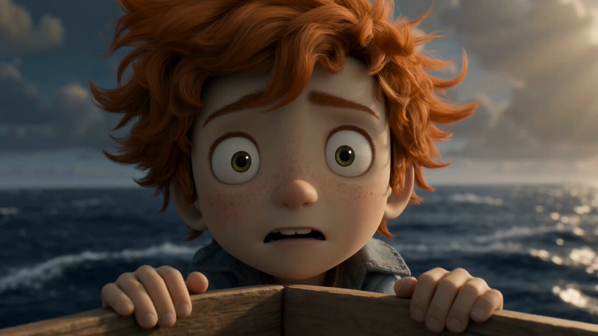</a></td>
<td align="center"><video src="https://github.com/user-attachments/assets/0b5038e2-dfca-4c65-b5d7-a719a74408b0" width="400" controls></video></td>
</tr></table>

**Adimlar:**

1. Karakter gorunumunu sabitlemek icin GPT Image 2 ile bir karakter tasarim sayfasi (on, yan, arka gorunum) olusturun
2. Karakteri referans alarak cok panelli bir cizgi roman sayfasi uretin
3. Cizgi roman sayfasini Seedance 2.0'a aktarip canlandirin

**GPT Image 2 Prompt'u — Karakter sayfasi:**

```
Create a character design style sheet for [describe your character]:
front view, side view, back view on white background.
Make the aspect ratio 4:3.
```

**GPT Image 2 Prompt'u — Cizgi roman sayfasi:**

```
[Character description] and [companion], american comic multi-panel illustration,
diagonal layout, six panels, cinematic storytelling, clear reading flow, with speech bubbles.
[Describe the story sequence across panels.]
```

**Seedance 2.0 Prompt'u:**

```
Animate this comic page as a cinematic sequence. Follow the panel order from top-left to bottom-right.
Smooth transitions between panels, maintain character consistency, cinematic camera movement.
```

> [!NOTE]
> Capraz duzen ve konusma balonlari, Seedance'e panel sinirlari ve okuma sirasi icin net gorsel ipuclari verir. En iyi sonuc icin her panelin eylemini basit ve belirgin tutun. Bu is akisi, son videoya muzik eklemek icin Suno ile de iyi eslenir.

<!-- Case 19: Storyboard-First Cost Control (by @0xbisc) -->
### Vaka 19: [Storyboard Oncelikli Maliyet Kontrolu](https://x.com/0xbisc/status/2049100073481716076) (by [@0xbisc](https://x.com/0xbisc))

Uretim odakli bir yaklasim: once storyboard'u GPT Image 2'de iterasyon yapin (ucuz), sonra kompozisyon kesinlestiginde video uretin (pahali). Bu, onemli miktarda kredi tasarrufu saglar cunku video iterasyonlari goruntu iterasyonlarindan 10-50 kat daha fazla harcar. 298 begeni / 13B gorunum / 291 yer imi.

<table><tr>
<td align="center"><a href="https://evolink.ai/gpt-image-2-prompts?utm_source=github&utm_medium=picture&utm_campaign=gptimage2-x-seedance2">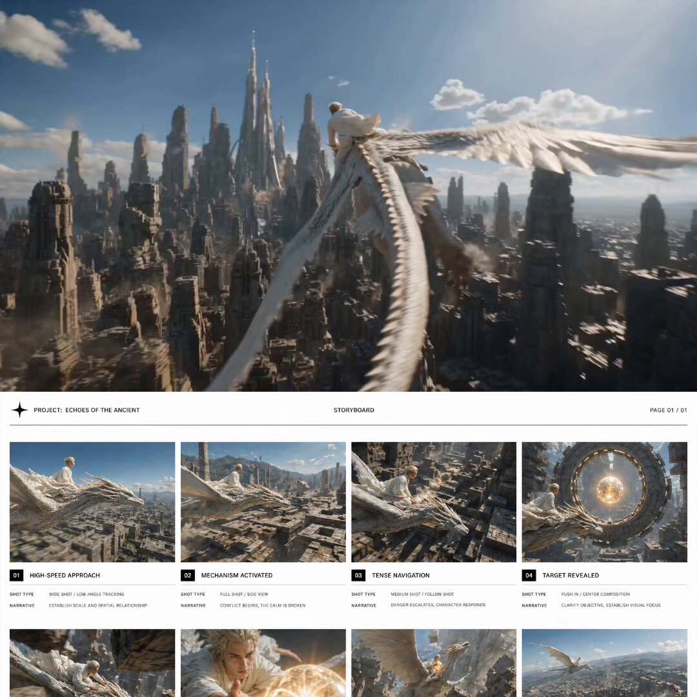</a></td>
<td align="center"><video src="https://github.com/user-attachments/assets/09e04d80-c0d1-4a8c-9b74-2efe474acfcd" width="400" controls></video></td>
</tr></table>

**Adimlar:**

1. GPT Image 2 ile 8 panellik bir storyboard izgarasi uretin
2. Her paneli inceleyin — memnun olana kadar tek tek panelleri yeniden uretin veya duzenleyin
3. Ancak tum storyboard kesinlestiginde Seedance 2.0'a aktarin
4. Kesinlesmis storyboard'dan tek seferde video uretin

**GPT Image 2 Prompt'u:**

```
Create a single cinematic storyboard image containing 8 panels,
arranged in a 4-column horizontal grid layout across the canvas.
Panels are evenly distributed in 4 columns, forming a balanced multi-row composition.
Use generous spacing between panels for visual clarity.
[Describe each panel's content, camera angle, and action.]
Character: [fixed appearance description across all panels].
Style: [art style], cinematic lighting, high detail.
```

**Seedance 2.0 Prompt'u:**

```
Follow the storyboard sequence. Cinematic [genre] style,
smooth transitions between shots, maintain character consistency,
[describe pacing and mood]. 24fps.
```

> [!NOTE]
> **Storyboard onceligi neden maliyet acisindan kazandirir:** Video iterasyonlari kredileri hizla tuketir. Storyboard ile her cekimi tek tek ayarlayabilir ve sorunlari erkenden yakalayabilirsiniz. Video adimi, pahali bir deneme-yanilma dongusu yerine tek bir son render haline gelir. Topluluk geri bildirimleri bunun uzun sekanslar icin en butce dostu is akisi oldugunu dogruluyor.

## 🎨 Karakter & Animasyon

<!-- Case 3: Character Sheet → Animation (by @YaReYaRu30Life) -->
### Vaka 3: [Karakter Sheet'i → Animasyon](https://x.com/YaReYaRu30Life/status/2047203375314571501) (by [@YaReYaRu30Life](https://x.com/YaReYaRu30Life))

GPT Image 2 ile bir karakterin uc gorunumlu sayfasini (on, yan, arka) uretin, sonra bunu Seedance 2.0 icindeki animasyon icin referans capasi olarak kullanin. Anime karakterleri, oyun karakterleri ve figurin tanitimlari icin idealdir.

<table><tr>
<td align="center"><a href="https://evolink.ai/gpt-image-2-prompts?utm_source=github&utm_medium=picture&utm_campaign=gptimage2-x-seedance2"></a></td>
<td align="center"><a href="https://evolink.ai/gpt-image-2-prompts?utm_source=github&utm_medium=picture&utm_campaign=gptimage2-x-seedance2"></a></td>
<td align="center"><a href="https://evolink.ai/gpt-image-2-prompts?utm_source=github&utm_medium=picture&utm_campaign=gptimage2-x-seedance2"></a></td>
</tr></table>

<table><tr>
<td align="center"><a href="https://evolink.ai/gpt-image-2-prompts?utm_source=github&utm_medium=picture&utm_campaign=gptimage2-x-seedance2"></a></td>
<td align="center"><video src="https://github.com/user-attachments/assets/92a0aa56-441f-40db-b9c9-13410254cb3f" width="400" controls></video></td>
</tr></table>

**Adimlar:**

1. GPT Image 2 ile karakterin uc gorunumlu sayfasini (on / yan / arka) uretin
2. Gerekirse ekipman sayfalarini ayri uretin, sonra tam donanimli uc gorunumlu sayfada birlestirin
3. Storyboard karelerini uretmek icin bu uc gorunumlu sayfayi referans olarak kullanin
4. Storyboard karelerini Seedance 2.0'a aktarip canlandirin

**GPT Image 2 Prompt'u:**

```
Create a character three-view sheet (front, side, back views) for the following character:
[character name], [hair color], [eye color], [outfit description], [body type].
Style: Japanese anime illustration, clean linework, flat color, white background.
All three views must maintain consistent proportions and design details.
```

**Seedance 2.0 Prompt'u — Bos durus hareketi:**

```
Japanese full-color anime style, character in natural idle breathing animation, subtle hair movement, 24fps, seamless loop.
```

**Seedance 2.0 Prompt'u — Savas hareketi:**

```
Japanese full-color anime style, high-speed cuts, high frame count, 24fps, dark fantasy anime OP style. Protagonist faces a giant creature — a sequence of high-impact combat scenes.
```

<!-- Case 4: Anime OP Style Video (by @Toshi_nyaruo_AI) -->
### Vaka 4: [Anime OP Tarzi Video](https://x.com/Toshi_nyaruo_AI/status/2047216971184546231) (by [@Toshi_nyaruo_AI](https://x.com/Toshi_nyaruo_AI))

GPT Image 2 ile sahne kurulum goruntusu olusturun, sonra Seedance 2.0'a daha serbest canlandirma yaptirin. Kisitli (storyboard kontrollu) ve serbest (yalnizca prompt ile) ciktinin karsilastirilmasi, her cekim icin dogru yaklasimi secmeye yardim eder.

<table><tr>
<td align="center"><a href="https://evolink.ai/gpt-image-2-prompts?utm_source=github&utm_medium=picture&utm_campaign=gptimage2-x-seedance2"></a></td>
<td align="center"><video src="https://github.com/user-attachments/assets/f08a2fee-89a7-4c7c-a58a-f1306f87419a" width="280" controls></video></td>
<td align="center"><video src="https://github.com/user-attachments/assets/09d81a41-b5c5-47f3-8c67-442b7a93b019" width="280" controls></video></td>
</tr></table>

**Adimlar:**

1. GPT Image 2 ile ayrintili bir sahne kurulum goruntusu uretin
2. Bunu Seedance 2.0'a minimum hareket prompt'uyla aktarin
3. Istege bagli olarak karsilastirin: biri siki storyboard kontroluyle, digeri Seedance'in serbest animasyonuyla

**GPT Image 2 Prompt'u:**

```
Create a scene setting illustration for a dark fantasy anime:
Location: [describe location], Time: [day/night], Atmosphere: [mood].
Style: Japanese anime production art, high detail, cinematic composition.
Character: [character name and appearance]. Fix this visual design across all panels.
```

**Seedance 2.0 Prompt'u:**

```
Japanese full-color anime, fast cuts, high frame count, 24fps. Dark fantasy anime OP style. Epic battle between protagonist and massive supernatural creatures. High-impact sequence of scenes. Only [character name] appears.
```

> [!NOTE]
> Seedance serbest canlandirma yaptiginda (storyboard referansi olmadan), sonuc daha dinamik olabilir ama kaynak goruntuyle daha az tutarli olur. Kritik karakter cekimleri icin storyboard kontrolu, aksiyon sekanslari icin ise serbest animasyon kullanin.

<!-- Case 12: Claude Code + Character Sheet → Animation (by @old_pgmrs_will) -->
### Vaka 12: [Claude Code × Karakter Sheet'i → Animasyon](https://x.com/old_pgmrs_will/status/2045091769180914019) (by [@old_pgmrs_will](https://x.com/old_pgmrs_will))

Lore ve dunya insasi icin Claude Code kullanin, ardindan yapilandirilmis aciklamalari GPT Image 2'ye aktararak karakterin key visual'ini olusturun ve Seedance 2.0 ile canlandirin. Orijinal IP olusturma icin gelistiricilere yonelik is akisi. 191 begeni / 7B gorunum.

<table><tr>
<td align="center"><a href="https://evolink.ai/seedance2?utm_source=github&utm_medium=picture&utm_campaign=gptimage2-x-seedance2"></a></td>
</tr></table>

**Adimlar:**

1. Lore notlari ve yapilandirilmis karakter spesifikasyonu (isim, gorunum, kisilik, ortam) olusturmak icin Claude Code kullanin
2. Karakter spesifikasyonunu dogrudan GPT Image 2'ye girerek key visual veya karakter sheet'i uretin
3. Key visual'i Seedance 2.0'da referans goruntu olarak kullanin ve canlandirin

**Claude Code → GPT Image 2 aktarim prompt'u:**

```
Based on the following character spec, generate a key visual for [character name]:
[Paste Claude Code output here — name, appearance, outfit, world setting, mood]
Style: [anime / cinematic illustration / game art], [color palette].
Fix this character design — it will be used as a reference across all subsequent images.
```

**Seedance 2.0 Prompt'u:**

```
Japanese full-color anime style, character in natural idle breathing animation,
subtle hair and clothing movement, 24fps, seamless loop.
[Or: high-speed cuts, 24fps, dark fantasy anime OP style — protagonist in opening sequence.]
```

> [!NOTE]
> Claude Code, GPT Image 2'nin ayrintili prompt olarak iyi islettigi yapilandirilmis metin (karakter spesifikasyonlari, sahne aciklamalari, diyalog sablonlari) uretir. Bu pipeline ozellikle orijinal hikaye IP'leri icin etkilidir: lore'u kodda olusturun, GPT Image 2'de gorsellestirin ve Seedance'te canlandirin.

<!-- Case 13: Dance Sequence Grid → Dance Video (by @Ciri_ai) -->
### Vaka 13: [Dans Dizisi Izgarasi → Dans Videosu](https://x.com/Ciri_ai/status/2049034340160704643) (by [@Ciri_ai](https://x.com/Ciri_ai))

GPT Image 2 ile 4×4 dans pozu izgarasi uretin, sonra bunu Seedance 2.0'a hareket referansi olarak verin. Model izgarayi bir koreografi dizisi olarak okur ve surekli bir dans videosu uretir. Gelismis varyant: ritme senkronize kiyafet gecisleri icin birden fazla karakter referansi yukleyin. 161 begeni / 9B gorunum.

<table><tr>
<td align="center"><a href="https://evolink.ai/gpt-image-2-prompts?utm_source=github&utm_medium=picture&utm_campaign=gptimage2-x-seedance2"></a></td>
<td align="center"><video src="https://github.com/user-attachments/assets/39376245-e7c7-4812-b770-9e81acf4eca2" width="400" controls></video></td>
</tr></table>

**Adimlar:**

1. GPT Image 2 ile bir karakterin ardisik dans pozlarini gosteren 4×4 izgara goruntusu uretin
2. Izgarayi Seedance 2.0'a referans goruntu olarak yukleyin
3. Seedance'e referans goruntudeki dans dizisini takip etmesini soyleyin
4. (Gelismis) Dans ortasinda kiyafet gecisi icin Kiyafet A'daki karakter, Kiyafet B'deki karakter ve dans izgarasini uc referans olarak yukleyin

**GPT Image 2 Prompt'u:**

```
Create a 4x4 image grid showing [character description] in various dance moves, in a logical sequence.
Style: [anime / realistic / stylized], consistent character design across all 16 panels.
```

**Seedance 2.0 Prompt'u:**

```
The character dances according to the sequence in the reference image@image1. No text.
```

**Gelismis — Ritme senkronize kiyafet gecisi:**

```
Character from Image 1 performs the dance based on the breakdown in Image 3.
Midway through the performance, they switch outfits on beat into the character from Image 2.
Then, the character from Image 2 continues and completes the remaining dance steps from Image 3.
Emphasize precise beat synchronization with the music.
```

> [!NOTE]
> Bu teknik herhangi bir hareket dizisi icin isler — dans, dovus sanatlari, spor. 4×4 izgara Seedance'e aralarinda interpolasyon yapacagi 16 referans kare verir ve daha az panele gore daha akici hareket uretir.
>
> **Topluluk varyantlari:** [@airina_xyz](https://x.com/airina_xyz/status/2049830199236190326) temel is akisini bir sokak danscisiyla gosterdi. [@Kashberg_0](https://x.com/Kashberg_0/status/2049697925262102689) K-Pop koreografisi icin karakter panolari + hareket referans kareleri kullandi (52 begeni / 2B gorunum).

<!-- Case 25: K-Pop Choreography with Detailed Control (by @Kashberg_0) -->
### Vaka 25: [K-Pop Koreografi — Detayli Kontrol](https://x.com/Kashberg_0/status/2049839091899088948) (by [@Kashberg_0](https://x.com/Kashberg_0))

Dans animasyonu uzerinde maksimum kontrol: hassas hareket aciklamalariyla 16 adimlik bir koreografi dokumu yazin, GPT Image 2 ile referans izgarasini uretin, sonra Seedance 2.0 ile canlandirin. Her adim 2-3 saniye alir ve otantik K-pop hareket kalitesinde 35-50 saniyelik surekli bir dans videosu uretir.

<table><tr>
<td align="center"><a href="https://evolink.ai/gpt-image-2-prompts?utm_source=github&utm_medium=picture&utm_campaign=gptimage2-x-seedance2">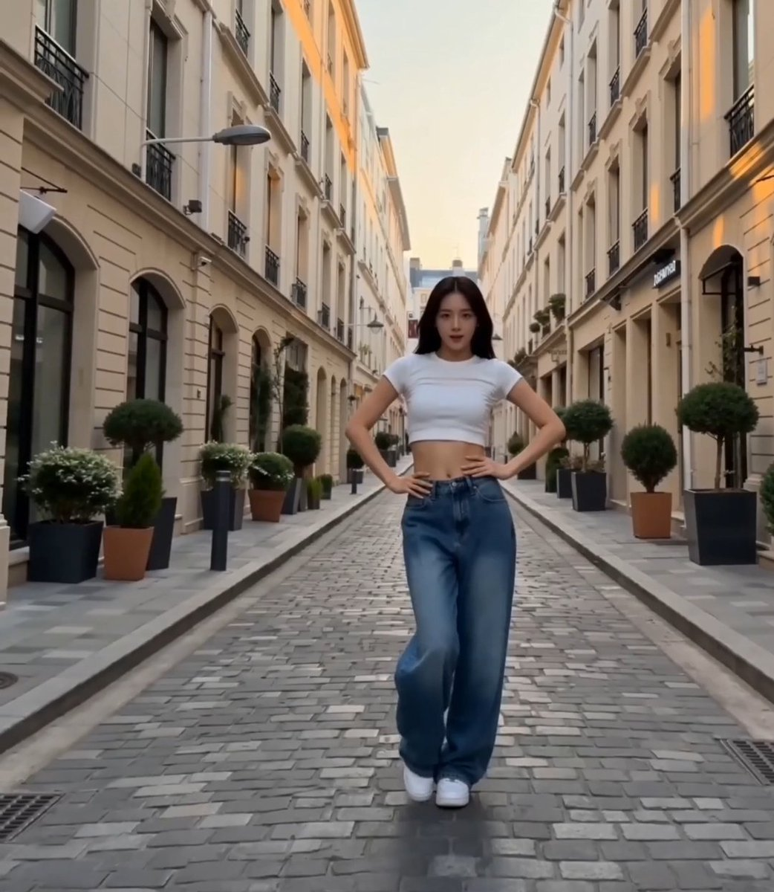</a></td>
<td align="center"><video src="https://github.com/user-attachments/assets/1c088b5e-6305-4bf6-9377-97784d5f8fac" width="400" controls></video></td>
</tr></table>

**Adimlar:**

1. Detayli bir koreografi dizisi yazin (belirli dans hareketleriyle 16 adim)
2. GPT Image 2 ile her adimi gosteren bir referans izgarasi uretin
3. Izgara + tam koreografi aciklamasini Seedance 2.0'a verin
4. Model, akici gecislerle adim dizisini takip eder

**GPT Image 2 Prompt'u:**

```
Create a 4x4 grid (16 panels) showing a [character description] performing K-pop choreography:
Step 1: Starting Pose
Step 2: Step Touch Right
Step 3: Step Touch Left
[... list all 16 steps ...]
Step 16: Final Pose (hold)
Style: photorealistic, consistent character, clean background, full-body framing.
```

**Seedance 2.0 Prompt'u:**

```
K-pop dance video, [character description], performing the exact 16-step choreography
from the reference grid in order. Each step 2-3 seconds.
Movement style: mix of sharp hits and smooth transitions, clean isolations,
controlled spins, balanced footwork. No jitter.
Full-body framing, smooth tracking camera, continuous flow.
Tempo: 100-115 BPM feel. Final pose held 2-3 seconds.
```

> [!NOTE]
> Adim aciklamalariniz ne kadar spesifik olursa, Seedance koreografiyi o kadar iyi takip eder. Belirsiz tanimlar yerine gercek dans hareketlerini adlandirin (body roll, hair flip, chest pop). Bu teknik dovus sanatlari kata'si, yoga akislari veya herhangi bir ardisik hareket icin de isler.

<!-- Case 27: Character Intro Animation (by @0xbisc) -->
### Vaka 27: [Karakter Tanitim Animasyonu](https://x.com/0xbisc/status/2049496584283656690) (by [@0xbisc](https://x.com/0xbisc))

Siberpunk AAA oyun tarzinda bir karakter tanitim animasyonu olusturun. Herhangi bir karakter gorselini alin, GPT Image 2 ile oyun karakteri olarak yeniden tasarlayin, sinematik bir tanitim ekrani uretin, sonra Seedance 2.0 ile acilis animasyonunu canlandirin. Herhangi bir karakteri yerlestirebilirsiniz — is akisi karakterden bagimsizdir. 55 begeni / 3B gorunum.

<table><tr>
<td align="center"><a href="https://evolink.ai/gpt-image-2-prompts?utm_source=github&utm_medium=picture&utm_campaign=gptimage2-x-seedance2">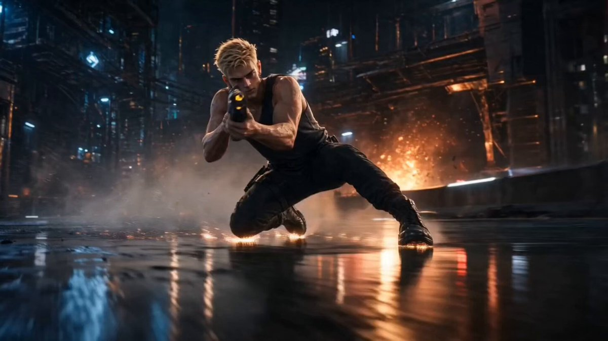</a></td>
<td align="center"><video src="https://github.com/user-attachments/assets/e52eaa0b-b2fa-4c35-b790-a92af05d0c82" width="400" controls></video></td>
</tr></table>

**Adimlar:**

1. Bir karakter gorseli ile baslayin (kendi cizdiginiz, fotograf veya AI ile uretilmis)
2. GPT Image 2 ile siberpunk AAA oyun karakteri olarak yeniden tasarlayin — yuz kimligini koruyun, stili yukselttin
3. Karakterle sinematik bir tanitim ekrani uretin (karanlik arka plan, dramatik isik, baslik karti duzeni)
4. Seedance 2.0'da tanitim acilis animasyonunu canlandirin

**GPT Image 2 Prompt'u — Karakter yeniden tasarimi:**

```
Based on the provided image, redesign as a cyberpunk AAA game character.
Keep face identity, keep original outfit.
Hyper-realistic game character, near-photoreal but still game-rendered.
Cinematic lighting, dark moody atmosphere, neon accent colors.
```

**GPT Image 2 Prompt'u — Tanitim ekrani:**

```
Cinematic game character introduction screen.
Character: [redesigned character] standing in [dramatic pose].
Background: dark, atmospheric, [genre-appropriate environment].
Layout: character centered, space for title text above, dramatic rim lighting.
Style: AAA game quality, Unreal Engine 5 look.
```

**Seedance 2.0 Prompt'u:**

```
Cinematic character reveal animation. Camera slowly pushes in on the character,
dramatic lighting builds, subtle particle effects, atmospheric fog,
character shifts weight slightly, eyes lock to camera.
AAA game intro quality, 24fps, 5 seconds.
```

> [!NOTE]
> Bu is akisi karakterden bagimsizdir — herhangi bir karakteri (anime, gercekci, stilize) yerlestirin ve pipeline uyum saglar. Anahtar nokta iki asamali GPT Image 2 sureci: once karakteri hedef stil icin yeniden tasarlayin, sonra tanitim ekrani duzenini olusturun.

## 📱 Uygulama & Urun Demosu

<!-- Case 5: App MVP Demo Video (by @Shin_Engineer) -->
### Vaka 5: [Uygulama MVP Demo Videosu](https://x.com/Shin_Engineer/status/2047182050323812381) (by [@Shin_Engineer](https://x.com/Shin_Engineer))

GPT Image 2 ile henuz var olmayan bir uygulamanin bitmis gibi gorunen arayuz ekran goruntulerini uretin, sonra bunlari Seedance 2.0 ile urun demosuna donusturun. Pazarin ilgisini olcmek icin TikTok veya sosyal medyada paylasin, sonra gelistirmeye karar verin.

| Cikti |
| :----: |
| <a href="https://evolink.ai/gpt-image-2-prompts?utm_source=github&utm_medium=picture&utm_campaign=gptimage2-x-seedance2"></a> |

<table><tr>
<td align="center"><a href="https://evolink.ai/gpt-image-2-prompts?utm_source=github&utm_medium=picture&utm_campaign=gptimage2-x-seedance2"></a></td>
<td align="center"><a href="https://evolink.ai/gpt-image-2-prompts?utm_source=github&utm_medium=picture&utm_campaign=gptimage2-x-seedance2"></a></td>
<td align="center"><a href="https://evolink.ai/gpt-image-2-prompts?utm_source=github&utm_medium=picture&utm_campaign=gptimage2-x-seedance2"></a></td>
</tr></table>

**Adimlar:**

1. Uygulama fikrinizi ve tasarim dilinizi GPT Image 2'ye tarif edin
2. 3-5 temel UI ekran goruntusu uretin (ana sayfa, ozellik, profil sayfalari)
3. Ekran goruntulerini kullanici akisi sirasina gore dizip Seedance 2.0'a aktarin
4. Demo videosunu disa aktarip piyasa tepkisini test etmek icin paylasin

**GPT Image 2 Prompt'u:**

```
Design [N] UI screenshots for a "[app concept]" app:
1. [Page 1 name and description]
2. [Page 2 name and description]
3. [Page 3 name and description]
Style: [iOS/Android] native design language, [primary color] accent, [light/dark] mode.
Output as realistic app screenshots, not wireframes or mockups.
```

**Seedance 2.0 Prompt'u:**

```
Smooth app UI transition animation, screen tap interaction, natural interface motion, clean and modern feel, 3 seconds.
```

> [!NOTE]
> **Kullanmadan once koseli parantezlerdeki yer tutuculari degistirin.** Video aciklamasinda bunu AI ile uretildi diye etiketlemeyin; urun demosu gibi yayinlayin ve yorumlardaki gercek kitle tepkisini gozlemleyin.

<!-- Case 6: 15-Second Commercial (by @ai_mitosan) -->
### Vaka 6: [15 Saniyelik Reklam](https://x.com/ai_mitosan/status/2047146600422846762) (by [@ai_mitosan](https://x.com/ai_mitosan))

Iki asamali is akisi: GPT Image 2 ana gorseli ve onunla eslesen storyboard'u uretir, ardindan Seedance 2.0 her klibi canlandirir. Basliklar ve muzikle birlestirerek tam bir 15 saniyelik reklam hazirlayin.

<table><tr>
<td align="center"><a href="https://evolink.ai/gpt-image-2-prompts?utm_source=github&utm_medium=picture&utm_campaign=gptimage2-x-seedance2"></a></td>
<td align="center"><video src="https://github.com/user-attachments/assets/09ae3c57-b8fb-4323-ba76-7777541fe4a3" width="400" controls></video></td>
</tr></table>

**Adimlar:**

1. GPT Image 2 ile ana gorseli (urun / karakter / sahne) uretin
2. Ana gorselden yola cikarak 4-5 panellik storyboard olusturun
3. Her paneli Seedance 2.0'da, klip basina 3-4 saniye hedefleyerek canlandirin
4. Klipleri birlestirip baslik ve muzik ekleyin

**Storyboard sayisi rehberi:**

| Video suresi | Panel | Klip basina sure |
| :---: | :---: | :---: |
| 15 saniye | 4-5 | 3-4 saniye |
| 30 saniye | 8-10 | 3 saniye |
| 60 saniye | 15-18 | 3-4 saniye |

**GPT Image 2 Prompt'u:**

```
Create a 5-panel storyboard for a 15-second commercial for [product/brand]:
Panel 1: [opening shot]
Panel 2: [product feature]
Panel 3: [emotional moment]
Panel 4: [call to action]
Panel 5: [closing brand shot]
Style: [brand aesthetic], 16:9 widescreen, cinematic.
```

**Seedance 2.0 Prompt'u:**

```
Cinematic commercial quality, [brand tone: premium / energetic / warm], [product name] centered in frame, slow camera push-in, [lighting direction] lighting highlights the product, clean background, no people, 3 seconds.
```

<!-- Case 15: Luxury Commercial — Storyboard to Film (by @insmind_com) -->
### Vaka 15: [Luks Reklam — Storyboard'dan Filme](https://x.com/insmind_com/status/2049481439285223785) (by [@insmind_com](https://x.com/insmind_com))

GPT Image 2 ile luks parfum reklami icin 3×4 storyboard izgarasi (12 kare) uretin, sonra Seedance 2.0 ile sinematik marka duzeyi bir filme donusturun. Yapilandirilmis akis — giris → rituel → donusum → cozum → marka kapanisi — tek bir uretimde tam bir anlati yayini olusturur. 371 begeni / 84B gorunum / 255 yer imi.

<table><tr>
<td align="center"><a href="https://evolink.ai/gpt-image-2-prompts?utm_source=github&utm_medium=picture&utm_campaign=gptimage2-x-seedance2">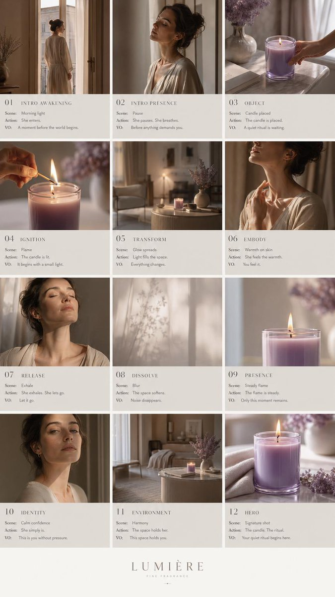</a></td>
<td align="center"><video src="https://github.com/user-attachments/assets/281fef1e-f42d-442c-b06e-44d7cff221ec" width="400" controls></video></td>
</tr></table>

**Adimlar:**

1. GPT Image 2 ile editoryal duzen ve luks marka estetigi kullanarak 12 kareli storyboard izgarasi (3×4) uretin
2. Storyboard izgarasini Seedance 2.0'a tek bir referans goruntu olarak aktarin
3. Seedance'e diziyi sinematik bir luks reklam olarak canlandirmasini soyleyin
4. Kurgu yaziliminizda muzik ve son renk duzeltmesi ekleyin

**GPT Image 2 Prompt'u:**

```
Create a high-end 9:16 luxury fragrance pitch deck storyboard in 3x4 grid (12 frames),
editorial layout, Aesop/Byredo style, beige + lavender palette.
Structured flow: intro → ritual → transformation → resolution → brand closure.
Each frame split: top = visual direction, bottom = scene.
Minimal text, elegant typography, soft lighting, product-centered compositions.
```

**Seedance 2.0 Prompt'u:**

```
Follow the storyboard sequence. Cinematic luxury fragrance commercial,
soft natural lighting, slow deliberate movements, shallow depth of field,
editorial pacing, premium brand aesthetic, smooth transitions between scenes.
```

> [!NOTE]
> Editoryal pitch-deck duzeni (her karede gorsel yon notlariyla) Seedance'e duz bir izgaradan daha guclu anlati ipuclari verir. Bu is akisi herhangi bir luks urun kategorisine olceklenir — cilt bakimi, saat, moda — paleti ve urun referanslarini degistirerek.

<!-- Case 26: Product Image → Short Video Ad (by @insmind_com) -->
### Vaka 26: [Urun Gorseli → Kisa Video Reklam](https://x.com/insmind_com/status/2049843814337306974) (by [@insmind_com](https://x.com/insmind_com))

Statik urun gorsellerini sosyal medyada dikkat ceken videolara donusturun. Mevcut urun fotograflarinizi GPT Image 2'ye referans olarak yukleyin, bir sahne kompozisyonu uretin, sonra Seedance 2.0 ile canlandirin. E-ticaret ve sosyal medya pazarlamasi icin tasarlanmistir — zaten sahip oldugunuz urun fotograflarindan TikTok/Reels'e hazir icerik uretin.

<table><tr>
<td align="center"><a href="https://evolink.ai/gpt-image-2-prompts?utm_source=github&utm_medium=picture&utm_campaign=gptimage2-x-seedance2"></a></td>
<td align="center"><video src="https://github.com/user-attachments/assets/880c0019-e45a-4eb9-be6f-638ff71a0e0f" width="400" controls></video></td>
</tr></table>

**Adimlar:**

1. Mevcut urun gorsellerinizi GPT Image 2'ye referans olarak girin
2. Urunleri baglamda sergileyen bir sahne kompozisyonu uretin
3. Olusturulan sahneyi Seedance 2.0'a aktarin
4. Dogal urun etkilesim hareketiyle canlandirin

**GPT Image 2 Prompt'u:**

```
Product A (ref image 1), Product B (ref image 2).
Fixed camera shot. [Describe the scene context — e.g., a phone playing a video,
hands interacting with products, lifestyle setting].
Style: commercial photography, soft lighting, clean composition.
9:16 vertical format for social media.
```

**Seedance 2.0 Prompt'u:**

```
Smooth product showcase animation, natural hand interaction,
subtle camera movement, soft lighting transitions,
commercial quality, clean and modern feel, 3-5 seconds.
```

> [!NOTE]
> Bu, Vaka 15'ten (luks reklam) farklidir cunku her seyi sifirdan uretmek yerine mevcut urun fotograflarindan baslar. Zaten urun gorselleri olan ve bunlari hizla video reklama donusturmek isteyen e-ticaret saticilari icin idealdir.

## 🎵 Yaratici Kombinasyonlar

<!-- Case 7: Music Video with Suno (by @fukaborichannel) -->
### Vaka 7: [Suno ile Muzik Videosu](https://x.com/fukaborichannel/status/2047206670020055317) (by [@fukaborichannel](https://x.com/fukaborichannel))

Uc aracli kombinasyon: gorseller icin GPT Image 2, hareket icin Seedance 2.0, muzik icin Suno. Tempoyu ve yapiyi sabitlemek icin once muzigi uretin, sonra ritme uygun storyboard tasarlayin.

<table><tr>
<td align="center"><a href="https://evolink.ai/gpt-image-2-prompts?utm_source=github&utm_medium=picture&utm_campaign=gptimage2-x-seedance2"></a></td>
<td align="center"><a href="https://evolink.ai/gpt-image-2-prompts?utm_source=github&utm_medium=picture&utm_campaign=gptimage2-x-seedance2"></a></td>
<td align="center"><video src="https://github.com/user-attachments/assets/fd4be5c7-cd02-4a77-ae07-6b80efeff201" width="280" controls></video></td>
</tr></table>

**Adimlar:**

1. Hedef tarzdaki muzigi Suno'da uretin ve sarki yapisini dogrulayin (intro / verse / chorus)
2. Sarkinin her bolumu icin GPT Image 2'de storyboard panelleri tasarlayin
3. Her paneli Seedance 2.0'da canlandirin ve klip suresini ritme uydurun
4. Kurgu yaziliminizda klipleri muzik parcasi ile senkronlayin

**GPT Image 2 Prompt'u:**

```
Create a [N]-panel storyboard for a music video in [style] style:
Intro: [visual concept]
Verse: [visual concept]
Chorus: [visual concept]
Style: [art style], [color palette], [mood].
```

**Seedance 2.0 Prompt'u — City Pop tarzi:**

```
Japanese city pop anime style, soft summer afternoon light, character walking lightly, Tokyo street background, blue sky, film grain texture, 24fps.
```

> [!NOTE]
> Once muzigi uretin. Storyboard'u tasarlamadan once tempoyu ve uzunlugu bilmek, panel zamanlamasini ritim kesmelerine tam oturtmanizi saglar.

<!-- Case 8: Cyberpunk Style Short Film (by @ponyodong) -->
### Vaka 8: [Siberpunk Tarzinda Kisa Film](https://x.com/ponyodong/status/2047210987263230133) (by [@ponyodong](https://x.com/ponyodong))

Tutarli bir gorsel stil sistemi kurmak icin GPT Image 2'yi kullanin (siberpunk, neon, fenerler, feminen estetik), sonra her goruntuyu Seedance 2.0 ile canlandirarak duvar kagidi, poster ve hikaye acilisi arasinda duran stilize bir kisa film uretin.

<table><tr>
<td align="center"><a href="https://evolink.ai/gpt-image-2-prompts?utm_source=github&utm_medium=picture&utm_campaign=gptimage2-x-seedance2"></a></td>
<td align="center"><a href="https://evolink.ai/gpt-image-2-prompts?utm_source=github&utm_medium=picture&utm_campaign=gptimage2-x-seedance2"></a></td>
<td align="center"><video src="https://github.com/user-attachments/assets/db6ebb63-90dc-47c5-96c5-ab2fa53ed56d" width="280" controls></video></td>
</tr></table>

**Adimlar:**

1. GPT Image 2'de gorsel stil sistemini tanimlayin; renkleri, isigi ve karakter gorunumunu sabitleyin
2. Ayni ruh halini tasiyan 4-6 goruntu uretin
3. Her goruntuyu Seedance 2.0'da yavas ve atmosferik hareket prompt'lariyla canlandirin
4. Klipleri arka arkaya dizerek kisa bir gorsel anlati kurun

**GPT Image 2 Prompt'u:**

```
Generate a [style] illustration:
Visual elements: [neon lights / lanterns / rain / specific props].
Character: [appearance description]. Keep this character design fixed across all images.
Color palette: [dominant colors].
Mood: [atmospheric, cinematic, etc.].
```

**Seedance 2.0 Prompt'u:**

```
Slow atmospheric camera drift, neon reflections on wet pavement, soft particle effects, cinematic color grade, 24fps, 4 seconds.
```

<!-- Case 9: Game & Interactive Content (by @AbleGPT) -->
### Vaka 9: [Oyun ve Etkilesimli Icerik](https://x.com/AbleGPT/status/2047149644778746020) (by [@AbleGPT](https://x.com/AbleGPT))

HUD ogeleri, yetenek cubuklari ve secim katmanlari iceren oyun tarzi UI goruntuleri uretmek icin GPT Image 2'yi kullanin; sonra bunlari Seedance 2.0'da canlandirarak etkilesimli oyun sekanslari hissi verin. Oyun ve ilustrasyon tarzlari, gercekci insan goruntulerine gore Seedance'te daha az icerik kisitlamasiyla karsilasir.

<table><tr>
<td align="center"><a href="https://evolink.ai/gpt-image-2-prompts?utm_source=github&utm_medium=picture&utm_campaign=gptimage2-x-seedance2"></a></td>
<td align="center"><video src="https://github.com/user-attachments/assets/fa3b3fed-21eb-417a-a6a6-7f98990368ce" width="400" controls></video></td>
</tr></table>

**Adimlar:**

1. HUD ogelerini de iceren ARPG veya oyun UI tarzinda goruntuleri GPT Image 2 ile uretin
2. Seedance 2.0'a aktarip etkilesimi veya savas dizisini tarif edin
3. Son dokunus icin post-prod effect'leri ekleyin (partikuller, parilti)

**GPT Image 2 Prompt'u:**

```
Generate a game UI screenshot in [Black Myth / ARPG / JRPG] style:
Theme: [Chinese mythology / fantasy / sci-fi].
UI elements: health bar, skill icons, choice panel with options A/B/C.
Art style: [realistic / painterly / anime], high detail rendering.
```

**Seedance 2.0 Prompt'u:**

```
Click option A, normal UI transition animation, then a reasonable combat sequence begins.
[Style: Black Myth style, Chinese mythological martial arts, realistic rendering, dynamic camera work.]
```

**Varyant — ARPG oyun simulasyonu (by [@0xbisc](https://x.com/0xbisc/status/2047315350862352715)):**

One Piece, Stranger Things, herhangi bir IP: var olmayan bir dunyanin oyun ekran goruntusunu uretin ve ardindan Seedance 2.0 ile gercek gameplay'e genisletin. 934 begeni / 125B gorunum.

<table><tr>
<td align="center"><video src="https://github.com/user-attachments/assets/983b433a-88ea-4843-9047-fc01396752fe" width="400" controls></video></td>
</tr></table>

**GPT Image 2 Prompt'u:**

```
Generate an ARPG dialogue game screenshot inspired by [film/series name]
```

**Seedance 2.0:** Image-to-Video modunu kullanin. Prompt gerekmez: Seedance HUD tasarimini okur ve otomatik olarak bir gameplay sekansina genisletir.

> [!NOTE]
> Seedance 2.0'in gercekci insan icerigi uzerinde kisitlamalari vardir. Oyun, anime ve ilustrasyon tarzlari bu sinirlamalarin cogunu asar ve daha genis yaratici alan sunar.
>
> **ARPG ipucu (via [@peter6759](https://x.com/peter6759/status/2047130834180903166)):** Etkilesimli film tarzi icin her iki adimi tek bir geciste birlestirebilirsiniz: GPT Image 2 prompt'u: `Interactive movie game, Black Myth style, Water Margin` → Seedance 2.0 prompt'u: `Click option A, normal UI shift, then reasonable combat happens`. Cift dilli yaklasim (GPT Image 2 icin Cince prompt, Seedance icin Ingilizce) kulturel sadakati genellikle arttirir.
>
> **Topluluk showcase'i:** [@markgadala](https://x.com/markgadala/status/2047825115631518115) bu is akisini var olmayan bir oyunun tam fragmanini uretmek icin kullandi. [@0xInk_](https://x.com/0xInk_/status/2048809000121360649) video oyun arayuzu animasyonu icin tam 4 adimli bir is akisi paylasti — Midjourney karakter sheet'i → GPT Image 2 ile 3D donusum ve UI tasarimi → Seedance 2.0 ile animasyon (2280 begeni / 208B gorunum / 2793 yer imi). [@0xbisc](https://x.com/0xbisc/status/2049496584283656690) siberpunk karakter tanitim animasyonu is akisini gosterdi (55 begeni / 3B gorunum).

<!-- Case 17: Game Interface Animation Full Pipeline (by @0xInk_) -->
### Vaka 17: [Oyun Arayuzu Animasyonu — Tam Pipeline](https://x.com/0xInk_/status/2048809000121360649) (by [@0xInk_](https://x.com/0xInk_))

Bu koleksiyondaki en viral is akisi: sifirdan eksiksiz bir video oyun arayuzu animasyonu olusturun. Midjourney'de 2D karakter ile baslayin, GPT Image 2 ile 3D oyun gorunumune donusturun, tam oyun UI'ini tasarlayin (HUD, yukleme ekranlari, menuler), sonra her seyi Seedance 2.0 ile canlandirin. GPT Image 2 burada one cikar cunku UI detayini isler ve kalite kaybi olmadan iteratif duzenlemeye izin verir. 2280 begeni / 208B gorunum / 2793 yer imi.

<table><tr>
<td align="center"><a href="https://evolink.ai/gpt-image-2-prompts?utm_source=github&utm_medium=picture&utm_campaign=gptimage2-x-seedance2">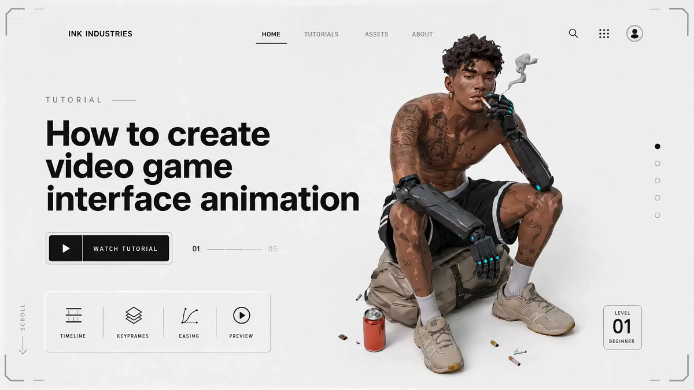</a></td>
<td align="center"><video src="https://github.com/user-attachments/assets/b83da8f3-3dd6-44a3-bb27-b0d59cab381a" width="400" controls></video></td>
</tr></table>

**Adimlar:**

1. Midjourney'de 2D karakter sheet'i olusturun (tam vucut, on gorunum, detayli gorunum)
2. GPT Image 2 ile 2D karakteri 3D oyun render gorunumune donusturun
3. GPT Image 2 ile oyun UI ekranlarini tasarlayin — karakter secimi, yukleme ekrani, HUD katmani
4. Her UI ekranini Seedance 2.0'a aktarip gecisleri canlandirin

**GPT Image 2 Prompt'u — 3D donusum:**

```
Based on the provided image, redesign as a [genre] AAA game character.
Keep face identity, keep original outfit.
Hyper-realistic game character, near-photoreal but still game-rendered.
Cinematic lighting, Unreal Engine 5 quality.
```

**GPT Image 2 Prompt'u — Oyun UI:**

```
Create a AAA game [screen type: character select / loading / HUD] screen.
Character: [description from previous step].
UI elements: [health bar / skill icons / menu buttons / loading progress].
Style: [cyberpunk / fantasy / sci-fi], dark cinematic lighting, 16:9.
```

**Seedance 2.0 Prompt'u:**

```
Game UI animation sequence. Smooth transition from [screen A] to [screen B],
cinematic camera movement, UI elements animate in with subtle glow effects,
AAA game quality, 24fps.
```

> [!NOTE]
> Temel fikir: GPT Image 2 bir goruntuyu kalite kaybi olmadan birden fazla kez yeniden islemenize izin verir — UI duzenleri uzerinde iterasyon yapmak icin mukemmeldir. Tam oyun arayuzunu bir dizi statik ekran olarak olusturun, sonra Seedance'in bunlari kesintisiz bir animasyona baglamasini saglayin.

<!-- Case 18: Single Agent Automated Workflow (by @venturetwins) -->
### Vaka 18: [Tek Agent Otomatik Is Akisi](https://x.com/venturetwins/status/2048526911056613586) (by [@venturetwins](https://x.com/venturetwins))

Sifir efor yaklasimi: tek bir AI agent'ina (Glif gibi) ne istediginizi soyleyin ve tum pipeline'i — GPT Image 2 ile storyboard uretimi ve Seedance 2.0 ile animasyon — tek bir konusmada halletsin. Manuel dosya transferi yok, adim basina prompt muhendisligi yok. 934 begeni / 70B gorunum.

<table><tr>
<td align="center"><a href="https://evolink.ai/gpt-image-2-prompts?utm_source=github&utm_medium=picture&utm_campaign=gptimage2-x-seedance2">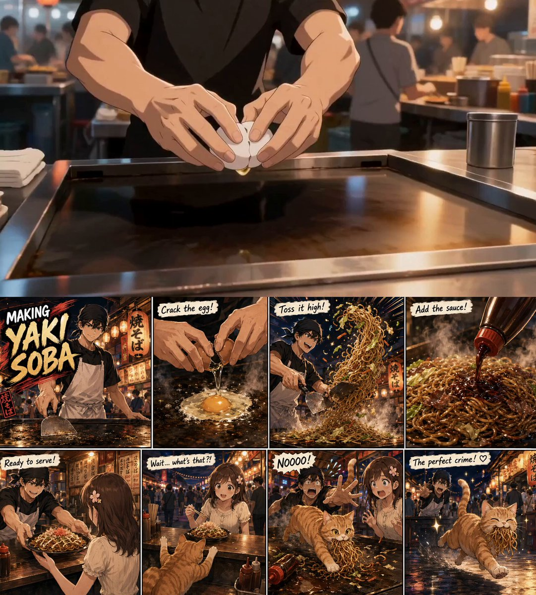</a></td>
<td align="center"><video src="https://github.com/user-attachments/assets/cc01849d-ee9b-47af-a7b0-d13250a001e0" width="400" controls></video></td>
</tr></table>

**Adimlar:**

1. Agent platformunuzu acin (Glif, Flowith veya benzeri)
2. Istediginiz videoyu sade bir dille tarif edin
3. Agent, GPT Image 2 ile storyboard'u otomatik olarak uretir
4. Agent, storyboard'u Seedance 2.0'a iletir ve son videoyu dondurur

**Agent'a ornek prompt:**

```
I want to create a [genre] anime short.
Scene: [describe the story in 2-3 sentences].
Style: [anime / cinematic / realistic].
Make it [duration] seconds.
```

> [!NOTE]
> Bu is akisi tum teknik surtumeyi ortadan kaldirir — prompt muhendisligi bilmenize veya araclar arasi dosya transferlerini yonetmenize gerek yoktur. Odun, bireysel cekimler uzerinde daha az kontroldur. Hizli prototipleme ve fikir dogrulama icin idealdir. [@heyglif](https://x.com/heyglif), [@flowith](https://x.com/flowith) ve benzeri agent platformlarinda calistigi dogrulanmistir.

<!-- Case 11: Japanese MV Full Toolchain (by @Tz_2022) -->
### Vaka 11: [Japon MV — Tam AI Toolchain](https://x.com/Tz_2022/status/2047684399404056609) (by [@Tz_2022](https://x.com/Tz_2022))

Tam Japon tarzinda bir muzik videosu uretmek icin dort aracli pipeline: GPT Image 2 gorseller icin → Seedance 2.0 hareket icin → Suno 5.5 muzik icin → CapCut son duzenleme icin. 742 begeni / 107B gorunum.

<table><tr>
<td align="center"><video src="https://github.com/user-attachments/assets/e5ce621c-7fa3-47b5-99a7-00df7741a651" width="400" controls></video></td>
</tr></table>

**Adimlar:**

1. Once Suno 5.5'te muzigi uretin: parcanin uzunlugunu, temposunu ve ruh halini belirleyin
2. GPT Image 2'de sarki bolumlerine gore senkronize storyboard panelleri tasarlayin
3. Her paneli Seedance 2.0'da canlandirin, klip suresini ritme uydurun
4. Video klipleri ve Suno parcasini CapCut'a aktarip senkronize edin ve disa aktarin

**GPT Image 2 Prompt'u:**

```
Create a [N]-panel storyboard for a Japanese-style music video:
Intro: [visual concept]
Verse: [visual concept]
Chorus: [visual concept]
Style: [anime illustration / painterly / film still], [color palette], [mood].
Character: [name and appearance]. Keep this character design fixed across all panels.
```

**Seedance 2.0 Prompt'u:**

```
Japanese anime style, [season] atmosphere, [lighting description], soft film grain, 24fps.
[Character name] [action description], [background description].
```

> [!NOTE]
> Once muzigi uretin: storyboard tasarlamadan once beat yapisini bilmek, panel zamanlamasini sarki kesmelerine tam oturtmanizi saglar. Bu vaka, Suno'yu donguye entegre ederek ve tum pipeline'i sonradan montaj yerine senkronize bir produksiyon olarak ele alarak Vaka 7'yi (City Pop MV) genisletir.

<!-- Case 16: Cinematic Food Video (by @kingofdairyque) -->
### Vaka 16: [Sinematik Yemek Videosu](https://x.com/kingofdairyque/status/2049812014596599834) (by [@kingofdairyque](https://x.com/kingofdairyque))

GPT Image 2 + Seedance 2.0 ile zaman damgali cekim aciklamalari kullanarak ultra-gercekci yemek hazirlama videolari olusturun. Her zaman damgasi segmenti (0-2s, 2-4s, vb.) belirli bir kamera acisi ve eylem tanimlar ve Seedance'e 15 saniyelik dizi uzerinde hassas kontrol verir. 55 begeni / 1B gorunum.

<table><tr>
<td align="center"><a href="https://evolink.ai/gpt-image-2-prompts?utm_source=github&utm_medium=picture&utm_campaign=gptimage2-x-seedance2">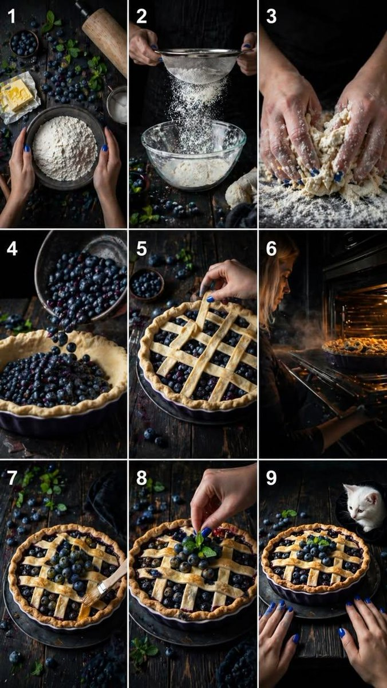</a></td>
<td align="center"><video src="https://github.com/user-attachments/assets/30a20e57-8384-4117-adf7-4f92faebeb33" width="400" controls></video></td>
</tr></table>

**Adimlar:**

1. Her 2 saniyelik segmenti tanimlayan detayli bir zaman damgali cekim listesi yazin
2. Cekim listesine dayanarak GPT Image 2 ile storyboard goruntusu uretin
3. Goruntu + tam zaman damgali prompt'u Seedance 2.0'a verin
4. Model, tutarli bir pisirme dizisi uretmek icin zaman damgasi yapisini takip eder

**GPT Image 2 Prompt'u:**

```
Ultra-realistic cinematic food photography storyboard, dark rustic wooden table,
soft dramatic lighting, shallow depth of field, natural textures.
[Describe the dish and key preparation moments across 6-8 panels.]
Style: editorial food photography, warm tones, no text.
```

**Seedance 2.0 Prompt'u:**

```
Ultra-realistic cinematic 15-second vertical video (9:16), 4K, dark rustic wooden table,
soft dramatic lighting, shallow depth of field, natural textures, no text, no subtitles, no music.
[0-2s] Top-down shot: hands gently touch a bowl of [ingredient]. Subtle ambient movement.
[2-4s] Side close shot: [preparation action] in slow motion, catching warm light.
[4-6s] Macro shot: hands [action]. Texture detail visible.
[6-8s] 45-degree angle: [ingredient] pours into [vessel]. Natural bounce and movement.
[8-10s] Top angled close-up: hands carefully [assembly action]. Precise controlled motion.
[10-12s] Side shot: oven door opens. Warm golden light spills out with gentle steam.
[12-14s] Close-up: [finishing touch]. Surface becomes glossy, light reflecting softly.
[14-15s] Final frontal shot: finished [dish] on rustic table. Hands enter frame softly.
```

> [!NOTE]
> Zaman damgali prompt teknigi Seedance'e hassas bir cekim cekim zaman cizelgesi verir. Bu, herhangi bir urun veya surec videosu icin isler — kutu acma, el isi, kokteyl yapimi. En iyi sonuc icin her segmenti 2 saniyede tutun ve hem kamera acisini hem de eylemi tarif edin.

<!-- Case 20: Claude Shotlist → MV (by @CoffeeVectors) -->
### Vaka 20: [Claude Cekim Listesi → Muzik Videosu](https://x.com/CoffeeVectors/status/2049592150581485757) (by [@CoffeeVectors](https://x.com/CoffeeVectors))

Claude'u detayli bir cekim listesi (farkli kamera acilari ve eylemlerle 15 bir saniyelik klip) olusturmak icin kullanin, GPT Image 2 ile tek bir portre uretin, sonra her cekimi Seedance 2.0 ile uretin. Klipleri kendi Suno muziginizle birlestirerek eksiksiz bir MV elde edin. AI yaratici yonlendirmeyi yazar — siz sadece uygularsiniz.

<table><tr>
<td align="center"><a href="https://evolink.ai/gpt-image-2-prompts?utm_source=github&utm_medium=picture&utm_campaign=gptimage2-x-seedance2">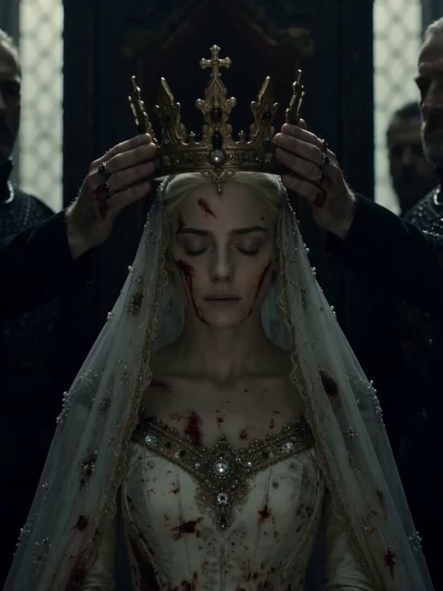</a></td>
<td align="center"><video src="https://github.com/user-attachments/assets/d6ba86c4-65c3-4b1d-aa3c-846667f53b5e" width="400" controls></video></td>
</tr></table>

**Adimlar:**

1. GPT Image 2 ile gorsel capa olarak tek bir karakter portresi uretin
2. Claude'dan cesitli aci ve eylemlerle 15 cekimlik bir cekim listesi (saniyede bir cekim) yazmasini isteyin
3. Portre + her cekim aciklamasini ayri ayri Seedance 2.0'a verin
4. Tum klipleri birlestirip muzik parcanizla senkronlayin

**Cekim listesi icin Claude prompt'u:**

```
Write a 15-second prestige-TV sequence, one shot per second.
Character: [describe the character from your GPT Image 2 portrait].
Mood: [apocalyptic / romantic / action / ethereal].
Each shot should specify: camera angle, character action, lighting, and visual effect.
Format as a numbered list, one line per shot.
```

**Seedance 2.0 Prompt'u (cekim basina):**

```
[Paste individual shot description from Claude's list.]
Reference image: the character portrait.
Style: cinematic, [mood], dramatic lighting, 24fps.
```

> [!NOTE]
> Bu is akisi yaratici yonlendirmeyi (Claude) gorsel uygulamadan (GPT Image 2 + Seedance) ayirir. Ayni karakterin bircok farkli cekimine ihtiyac duydugunuz muzik videolari icin ozellikle etkilidir. Capa olarak tek portre, tum 15 klip boyunca tutarliligi korur.

<!-- Case 21: Casting Grid Actor Audition (by @8fstudioz) -->
### Vaka 21: [Oyuncu Secimi Izgarasi — Oyuncu Audition](https://x.com/8fstudioz/status/2049547426198151627) (by [@8fstudioz](https://x.com/8fstudioz))

Tek bir uretimden 4 oyuncuyu deneyerek kredi tasarrufu yapin. GPT Image 2 ile ayni rol icin farkli oyunculari gosteren 4 panellik bir secim izgarasi uretin, sonra her birini Seedance 2.0'da ayni diyalog satiryla test edin. Tam bir videoya kredi harcamadan once hangi oyuncunun daha fazla yatirim yapmaya deger oldugunu ogrenin.

<table><tr>
<td align="center"><a href="https://evolink.ai/gpt-image-2-prompts?utm_source=github&utm_medium=picture&utm_campaign=gptimage2-x-seedance2"></a></td>
<td align="center"><video src="https://github.com/user-attachments/assets/dcdd958f-70cd-43f6-b191-4e0715fe2472" width="400" controls></video></td>
</tr></table>

**Adimlar:**

1. GPT Image 2 ile 4 panellik bir secim izgarasi uretin — ayni rol, 4 farkli oyuncu
2. Her oyuncuyu Seedance 2.0'da ayni diyalog ve eylemle tek tek test edin
3. Performans kalitesini karsilastirin (goz temasi, ifade, hareket)
4. Kalan kredileri yalnizca kazanan oyuncuya yatirin

**GPT Image 2 Prompt'u:**

```
Create a 16:9 horizontal cinematic casting board showing 4 different actor candidates for the same role.
Style: [CGI AAA video game cinematic / photorealistic / anime / stylized 3D].
Role brief: [describe the character type, age, build, personality].
Each actor should look distinct but fit the role requirements.
Layout: 4 panels side by side, each showing the actor in the same pose and framing.
```

**Seedance 2.0 Prompt'u (oyuncu basina):**

```
[Actor description from panel N] delivers the line: "[dialogue]".
Natural eye contact with camera, subtle facial expressions,
[emotional tone: confident / vulnerable / menacing].
Medium close-up, soft cinematic lighting, 3 seconds.
```

> [!NOTE]
> Bir karakter duragan goruntude harika gorunebilir ama diyalog, goz temasi ve performansi test ettiginizde rolu tamamen kaybedebilir. Bu is akisi, tam sahnelere kredi harcamadan once oyuncu secimi kararini one alir.

<!-- Case 22: 3D Sculpt → AI Render → Animation (by @_DAntunes_) -->
### Vaka 22: [3D Heykel → AI Render → Animasyon](https://x.com/_DAntunes_/status/2049142166232904078) (by [@_DAntunes_](https://x.com/_DAntunes_))

Geleneksel 3D modellemeyi AI video ile kopruleyin: Nomad Sculpt'ta (veya herhangi bir heykel uygulamasinda) kaba bir 3D kil modeli olusturun, GPT Image 2 ile cilali bir ilustrasyona donusturun, sonra ComfyUI uzerinden Seedance 2.0 ile canlandirin. Bu, saf metin prompt'larinin saglayamayacagi poz ve kompozisyon uzerinde hassas kontrol verir.

<table><tr>
<td align="center"><a href="https://evolink.ai/gpt-image-2-prompts?utm_source=github&utm_medium=picture&utm_campaign=gptimage2-x-seedance2">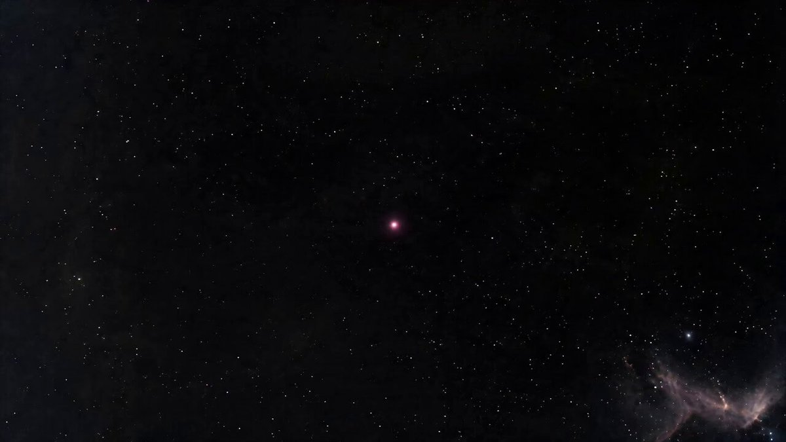</a></td>
<td align="center"><video src="https://github.com/user-attachments/assets/f5ecdb0c-d1ca-4291-91bc-eb88de91cd82" width="400" controls></video></td>
</tr></table>

**Adimlar:**

1. Nomad Sculpt'ta (veya Blender, ZBrush, vb.) kaba bir 3D model heykel yapin
2. Istediginiz kamera acisindan modelin ekran goruntusunu disa aktarin
3. GPT Image 2 ile 3D modeli cilali bir ilustrasyon veya gercekci goruntuye donusturun
4. Render edilmis goruntuyu Seedance 2.0'a (ComfyUI veya dogrudan) aktarip canlandirin

**GPT Image 2 Prompt'u:**

```
Based on this 3D clay model reference, create a fully rendered [style] illustration.
Maintain the exact pose, proportions, and camera angle from the reference.
Style: [anime / realistic / painterly / game art].
Add: [lighting, textures, background, clothing details].
```

**Seedance 2.0 Prompt'u:**

```
[Character description] in [action], maintaining the pose from the reference.
[Style] animation, smooth natural movement, cinematic lighting, 24fps.
```

> [!NOTE]
> 3D model, hicbir metin prompt'unun saglayamayacagi bir sey verir: vucut pozu, el pozisyonu ve kamera acisi uzerinde kesin kontrol. Kaba bir kil modeli bile yeterlidir — GPT Image 2 tum render ve detay isini halleder. Bu pipeline, zaten 3D araclar kullanan ve is akislarina AI animasyon eklemek isteyen ureticiler icin idealdir.

<!-- Case 23: IP Cyberpunk Remake (by @AYi_AInotes) -->
### Vaka 23: [IP Siberpunk Yeniden Yapim — Konsept Film](https://x.com/AYi_AInotes/status/2048745866538647912) (by [@AYi_AInotes](https://x.com/AYi_AInotes))

Mevcut herhangi bir film/dizi IP'sini alin ve GPT Image 2 + Seedance 2.0 kullanarak tamamen farkli bir ortamda yeniden hayal edin. Bu ornek Game of Thrones'u 2048 siberpunk distopyasinda yeniden insa eder — Demir Taht altin AK-47'lerden dovulmustur, ejderhalar plazma nefesli mekaniklerdir ve Gece Krali parlayan bir siber-olmustur. Her kare film afisi kalitesindedir. 181 begeni / 43B gorunum.

<table><tr>
<td align="center"><a href="https://evolink.ai/gpt-image-2-prompts?utm_source=github&utm_medium=picture&utm_campaign=gptimage2-x-seedance2">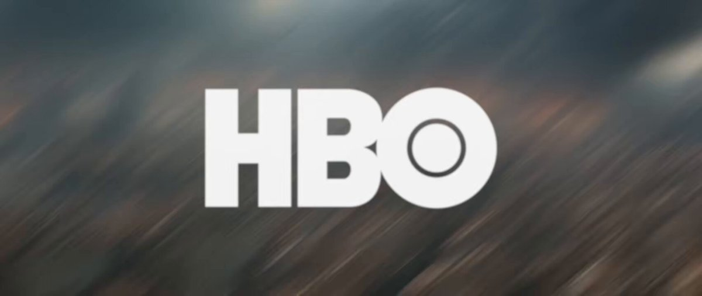</a></td>
<td align="center"><video src="https://github.com/user-attachments/assets/ac605d02-6871-47dc-9b58-414356872def" width="400" controls></video></td>
</tr></table>

**Adimlar:**

1. Mevcut bir IP secin ve remix konseptini tanimlayin (orn. "2048 siberpunk'ta Game of Thrones")
2. GPT Image 2 ile temel karakter yeniden tasarimlarini uretin — her karakterin ikonik ozelliklerini yeni ortama ceviririn
3. Orijinalden ikonik anlari yansitan sahne kompozisyonlari uretin
4. Her sahneyi Seedance 2.0'da sinematik hareketle canlandirin

**GPT Image 2 Prompt'u:**

```
Reimagine [character name] from [IP] in a [new setting] aesthetic:
Original traits: [list iconic visual elements].
New interpretation: [how each trait translates to the new setting].
Style: cinematic concept art, [new setting] visual language, movie poster quality.
Lighting: [neon / holographic / dystopian glow].
```

**Seedance 2.0 Prompt'u:**

```
Cinematic [new setting] sequence, epic scale, dramatic camera movement,
[character] in [iconic action reimagined for new setting],
atmospheric particles, volumetric lighting, 24fps.
```

> [!NOTE]
> Bu is akisi herhangi bir IP × ortam kombinasyonu icin isler: feodal Japonya'da Star Wars, Art Deco'da Marvel, siberpunk'ta Harry Potter. Anahtar, her karakterin ikonik gorsel ozelliklerini tanimlabilir tutarak yeni estetik dile cevirmektir.

<!-- Case 24: GTA-Style City Game Concept (by @markgadala) -->
### Vaka 24: [GTA Tarzi Sehir Oyun Konsepti](https://x.com/markgadala/status/2048560337960489385) (by [@markgadala](https://x.com/markgadala))

5 dakikada istediginiz herhangi bir GTA versiyonunu olusturun. GPT Image 2 ile herhangi bir sehirde (Tokyo, Lagos, Mumbai) gecen oyun UI ekran goruntuleri uretin, sonra Seedance 2.0 ile gameplay goruntulerine donusturun. Sonuc, var olmayan bir oyunun gercek oyun fragmani gibi gorunur. 99 begeni / 8.7B gorunum.

<table><tr>
<td align="center"><a href="https://evolink.ai/gpt-image-2-prompts?utm_source=github&utm_medium=picture&utm_campaign=gptimage2-x-seedance2">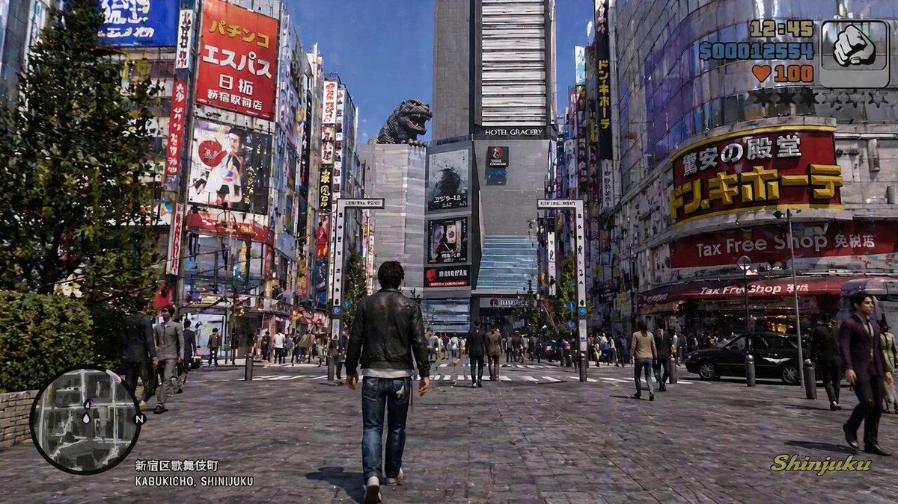</a></td>
<td align="center"><video src="https://github.com/user-attachments/assets/d3b0a7b9-827a-47f6-b24e-eabfacf3e892" width="400" controls></video></td>
</tr></table>

**Adimlar:**

1. GTA varyantinizi tanimlayin — sehir, donem, gorsel stil
2. GPT Image 2 ile oyun ekran goruntuleri uretin: ucuncu sahis gorunum, HUD katmani, sehir ortami
3. Seedance 2.0'a aktarip gameplay goruntusu olarak canlandirin
4. Klipleri bir fragmanda birlestirin

**GPT Image 2 Prompt'u:**

```
GTA-style open world game screenshot set in [city], [time period].
Third-person camera behind the player character.
Character: [description], walking/driving through [specific street scene].
HUD elements: minimap bottom-left, health bar, wanted stars.
Style: photorealistic AAA game, ray-traced lighting, [time of day].
16:9 widescreen, 4K quality.
```

**Seedance 2.0 Prompt'u:**

```
Third-person gameplay footage, character walking through [city] streets,
natural pedestrian movement, dynamic camera following behind,
neon signs and city lights, AAA game quality, smooth 24fps.
```

> [!NOTE]
> Bu, Vaka 9'un oyun konsepti yaklasimini ozellikle acik dunya sehir oyunlarina genisletir. HUD ogeleri (mini harita, saglik cubugu, aranan yildizlari) "gercek oyun" yanilsamasini satan seydir. Herhangi bir sehir icin isler — sokak duzeyindeki detaylariniz ne kadar spesifik olursa sonuc o kadar inandirici olur.

## 💡 Ipuclari & Teknikler

### Tutarlilik Rehberi

GPT Image 2 ciktilari ile Seedance 2.0 animasyonu arasinda gorsel tutarlilik saglamak en yaygin zorluktur. Asagidaki yaklasimlar bunun farkli katmanlarini ele alir.

**Urun goruntusu tutarliligi**

Seedance'te urun bozulmasinin temel nedeni, hareket interpolasyonunun ince detaylari yeniden yazmasidir; logolar, dokular ve yuzey desenleri degisir.

Cozumler:
- Seedance prompt'unuza `keep the product appearance completely unchanged, camera movement only, no rotation` ekleyin
- Ozne hareketi yerine kamera hareketi secin (push-in, pull-out); urunu sabit tutup kamerayi hareket ettirin
- Klip suresini 3 saniyenin altinda tutun; kisa kliplerde bozulma daha az birikir

**Karakter tutarliligi**

- Once uc gorunumlu bir karakter sheet'i uretin ve sonraki tum storyboard kareleri icin bunu gorsel capaya cevirin
- Her storyboard panel prompt'una kisa bir karakter tanimi ekleyin (sac rengi, kiyafet, vucut yapisi)
- Tek bir klip icinde karakter perspektifini degistirmekten kacinin

**Sahne tutarliligi**

GPT Image 2'de birden fazla storyboard paneli uretirken prompt'un basinda sahne parametrelerini sabitleyin:

```
Scene setting: [location], [time of day], [lighting direction], [fixed background elements].
Maintain this scene setting unchanged across all panels.
```

---

### Prompt Sablonlari

**GPT Image 2 → Storyboard sablonu**

```
Create a [N]-panel storyboard for [subject]:
- Style: [realistic / anime / illustration / cinematic]
- Aspect ratio: 16:9 widescreen
- Each panel: include shot type (wide / medium / close-up) + action description
- Character: [fixed appearance description]
- Scene tone: [color palette / lighting / mood]
Output as a single image with [N] panels separated by thin lines.
```

**GPT Image 2 → 3×3 izgara sablonu**

```
Output a single 3×3 grid storyboard image showing the following continuous action:
[describe the action sequence]
Requirements:
- 9 panels arranged left-to-right, top-to-bottom showing continuous motion
- Character position and scale consistent across all panels
- Background consistent throughout
- No text, labels, or content outside the panel borders
```

**Seedance 2.0 → Anime tarzi sablon**

```
Japanese full-color animation, high-speed editing, high frame count, 24fps.
[Scene description]. [Character description]. [Action description].
Strong camera work, high visual impact.
```

**Seedance 2.0 → Reklam tarzi sablon**

```
Cinematic commercial quality, [brand tone: premium / energetic / warm],
[product] centered in frame, slow camera push-in,
[lighting direction] highlights the product, clean background, no people.
Duration: 3 seconds.
```

**Prompt uzunlugu — kisa genellikle kazanir**

[@Iancu_ai](https://x.com/Iancu_ai/status/2047882924679168083) tarafindan yapilan topluluk deneyi: 1500 kelimelik sinema kalitesinde bir Seedance prompt'u tek bir cumleye kaybetti. Ayni karakter, ayni 15 saniye. Kisa prompt kazandi. Seedance, sahnenin her detayini degil hareket niyetini odulendirir — yon netligini yazin, sahnenin her detayini degil.

---

### Sorun Giderme

**Seedance icerik moderasyon engeli**

Neden: goruntude hassas olarak isaretlenen icerik vardir (gercekci siddet, belirli pozlardaki insan yuzleri).
Cozum: anime veya ilustrasyon tarzina gecin ya da prompt'tan insan figuru tanimlarini cikarin.

**Cikti hareketi kaotik**

Neden: storyboard goruntusu cok karmasiktir; Seedance ana hareket yonunu belirleyemez.
Cozum: storyboard panelini tek bir ana ozne ve tek bir net eylem olacak sekilde sadelestirin. Arka plan ogelerini azaltin.

**Urun goruntusu bozuluyor**

Yukaridaki Tutarlilik Rehberi → Urun goruntusu tutarliligi bolumune bakin.

**Platform giris format gereksinimleri**

| Platform | Onerilen giris boyutu | Desteklenen formatlar | Maks dosya boyutu |
| :---: | :---: | :---: | :---: |
| Hailuo | 1280×720 veya 720×1280 | JPG / PNG | 10 MB |
| Higgsfield | 1920×1080 | PNG | 20 MB |
| HitPaw | Her oran | JPG / PNG / WEBP | 15 MB |

## 🚀 Evolink Uzerinde Deneyin

Evolink, GPT Image 2 ve Seedance 2.0'i tek yerde calistirmanizi saglar; platform degistirmeniz veya dosyalari yeniden yuklemeniz gerekmez.

**Neden Evolink**

- GPT Image 2 ve Seedance 2.0 icin tek API anahtari
- Ayni arayuzde dogrudan image-to-video aktarimi; goruntu olusturup indirmeden "Send to Video" tiklayabilirsiniz
- Toplu isleme; birden fazla storyboard panelini sirali video uretimi icin kuyruga alabilirsiniz

**Nasil kullanilir**

```
Step 1: Open Evolink → select GPT Image 2 → generate your storyboard image
Step 2: Click "Generate Video" → Seedance 2.0 receives the image automatically
Step 3: Add your Seedance prompt → generate
```

<a href='https://evolink.ai/signup?utm_source=github&utm_medium=readme&utm_campaign=gptimage2-x-seedance2'></a>


## 🙏 Tesekkur

Bu depo, acik is akisi koleksiyonlarindan ve topluluk tarafindan paylasilan deneylerden ilham almistir.

Calismalarini acik bicimde paylasan ve bu vaka incelemelerini mumkun kilan ureticilere ve katki saglayanlara tesekkurler:
[@szounft](https://x.com/szounft) · [@Toshi_nyaruo_AI](https://x.com/Toshi_nyaruo_AI) · [@ponyodong](https://x.com/ponyodong) · [@servasyy_ai](https://x.com/servasyy_ai) · [@YaReYaRu30Life](https://x.com/YaReYaRu30Life) · [@fukaborichannel](https://x.com/fukaborichannel) · [@Shin_Engineer](https://x.com/Shin_Engineer) · [@ai_mitosan](https://x.com/ai_mitosan) · [@kiyoshi_shin](https://x.com/kiyoshi_shin) · [@AbleGPT](https://x.com/AbleGPT) · [@patata1216](https://x.com/patata1216) · [@peter6759](https://x.com/peter6759) · [@hibi_ai__](https://x.com/hibi_ai__) · [@heygentlewhale](https://x.com/heygentlewhale) · [@ai_gezgini](https://x.com/ai_gezgini) · [@Tz_2022](https://x.com/Tz_2022) · [@old_pgmrs_will](https://x.com/old_pgmrs_will) · [@0xbisc](https://x.com/0xbisc) · [@Iancu_ai](https://x.com/Iancu_ai) · [@Jake_Joseph](https://x.com/Jake_Joseph) · [@venturetwins](https://x.com/venturetwins) · [@0xInk_](https://x.com/0xInk_) · [@markgadala](https://x.com/markgadala) · [@Ankit_patel211](https://x.com/Ankit_patel211) · [@Ciri_ai](https://x.com/Ciri_ai) · [@nimentrix](https://x.com/nimentrix) · [@insmind_com](https://x.com/insmind_com) · [@kingofdairyque](https://x.com/kingofdairyque) · [@Kashberg_0](https://x.com/Kashberg_0) · [@airina_xyz](https://x.com/airina_xyz) · [@CoffeeVectors](https://x.com/CoffeeVectors) · [@mdmadeit](https://x.com/mdmadeit) · [@Morph_VGart](https://x.com/Morph_VGart) · [@MEnesKirca](https://x.com/MEnesKirca) · [@MrLarus](https://x.com/MrLarus) · [@AYi_AInotes](https://x.com/AYi_AInotes) · [@8fstudioz](https://x.com/8fstudioz) · [@_DAntunes_](https://x.com/_DAntunes_)

*Her vakanin orijinal ureticisine kesin olarak atfedildigini garanti edemiyoruz. Duzenlenmesi gereken bir sey varsa bizimle iletisime gecin, guncelleriz.*

Paylasmak istediginiz daha ilginc is akisi vakalari varsa bize ulasabilir ve Evolink is akisi kutuphanesini birlikte genisletebilirsiniz.

[](https://www.star-history.com/#EvoLinkAI/GPT-Image-2-Seedance2-Workflow&Date)
